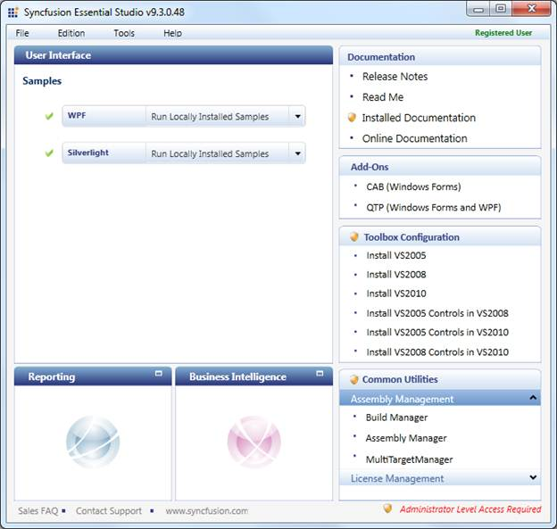
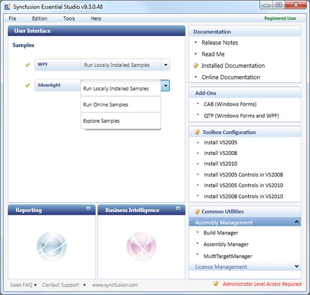
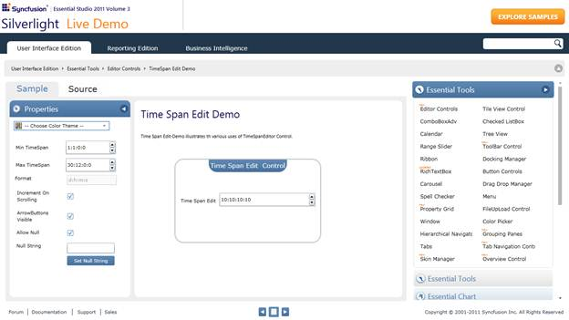

::: {style="DISPLAY: none"}
{#d2h_url_template}{#d2h_package_url style="WIDTH: 0px; DISPLAY: none; HEIGHT: 0px"}
:::

::: {.d2h_secondary_topic style="PADDING-BOTTOM: 10pt; MARGIN: 0pt; PADDING-LEFT: 0pt; PADDING-RIGHT: 0pt; PADDING-TOP: 0pt"}
#### Samples Link

     To view samples:

1.   Click Start\--\>All Programs\--\>Syncfusion\--\>Essential Studio \<x.x.x.x.\> \--\>Dashboard.

 

The Essential Studio Enterprise Edition window is displayed.

{border="0"}

Figure 299: Essential Studio Enterprise Edition Window

 

The **User Interface** edition panel is displayed by default.

2.   Select **Silverlight** from the samples listed. The following options will be displayed. You can view the samples in the following three ways:

[·      ]{style="FONT-FAMILY: Symbol"}**Run Locally Installed Samples**-View the locally installed Tools samples for Silverlight using the sample browser

[·      ]{style="FONT-FAMILY: Symbol"}**Run Online Samples**-View the online samples for Silverlight

[·      ]{style="FONT-FAMILY: Symbol"}**Explore Samples**-Locate the **Silverlight** samples on the disk

 

{border="0"}

Figure 300: Silverlight samples listed in three ways

 

3.   3. Select **Run Locally Installed Samples**. The Silverlight Sample Browser displays.

{border="0"}

Figure 301: Silverlight Sample Browser

 

4.   On the right pane, go to Editor Controls -\>Time Span Edit Demo.

[]{#related-topics}
:::
