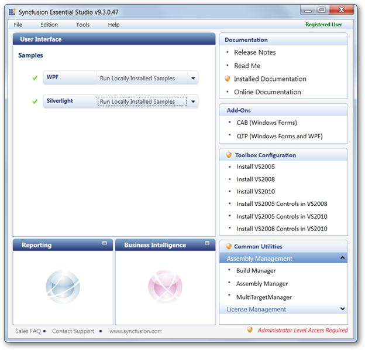
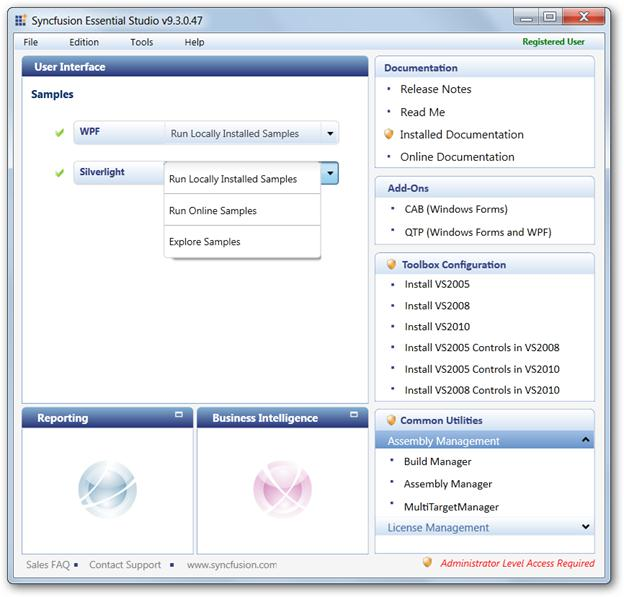
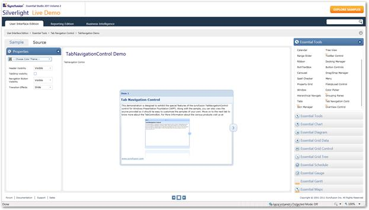

::: {style="DISPLAY: none"}
{#d2h_url_template}{#d2h_package_url style="WIDTH: 0px; DISPLAY: none; HEIGHT: 0px"}
:::

::::: {#nsbanner .d2h_main_nsbanner style="BORDER-BOTTOM: #999999 1px solid; POSITION: relative; PADDING-BOTTOM: 0px; BACKGROUND-COLOR: transparent; PADDING-LEFT: 0px; PADDING-RIGHT: 0px; DISPLAY: none; BORDER-TOP: #999999 1px solid; PADDING-TOP: 0px; LEFT: 0px"}
:::: {#TitleRow .d2h_main_titlerow style="PADDING-BOTTOM: 4px; BACKGROUND-COLOR: transparent; PADDING-LEFT: 22px; WIDTH: 100%; PADDING-RIGHT: 10px; DISPLAY: none; PADDING-TOP: 4px"}
::: {#ienav .d2h_main_ienav style="DISPLAY: none"}
{#D2HPrevious .D2HPreviousEnabled}  {#D2HNext .D2HNextEnabled}
:::
::::
:::::

::: {#nstext .d2h_main_nstext style="PADDING-BOTTOM: 10px; BACKGROUND-COLOR: transparent; PADDING-LEFT: 22px; PADDING-RIGHT: 10px; HEIGHT: 100%; OVERFLOW: auto; PADDING-TOP: 5px" hasuserbackground="true" valign="bottom"}
### Samples Link

To view samples:

1.   Click **Start**\--\>**All Programs**\--\>**Syncfusion\--\>Essential Studio \<version number\>** \--\>**Dashboard**.

 

The **Essential Studio Enterprise Edition** window is displayed.

{border="0"}

Figure 833: Essential Studio Dashboard

The **User Interface** edition panel is displayed by default.

2.   Select **Silverlight** from the samples listed. The following options will be displayed. You can view the samples in the following three ways:

[·      ]{style="FONT-FAMILY: Symbol"}**Run Locally Installed Samples**-View the locally installed Tools samples for  Silverlight using the sample browser

[·      ]{style="FONT-FAMILY: Symbol"}**Run Online Samples**-View the online samples for  Silverlight

[·      ]{style="FONT-FAMILY: Symbol"}**Explore Samples**-Locate the Silverlight  samples on the disk

 

{border="0"}

Figure 834: Essential Studio Dashboard Displaying Optionsfor Viewing Samples

3.   Click **Run Locally Installed Samples**. The Silverlight Sample Browser displays.

4.   Go to **Tab Navigation** -\>**Tab Navigation Demo**.

 

{border="0"}

Figure 835: Silverlight  Tab Navigation Control Demo

 

[]{#related-topics}
:::
