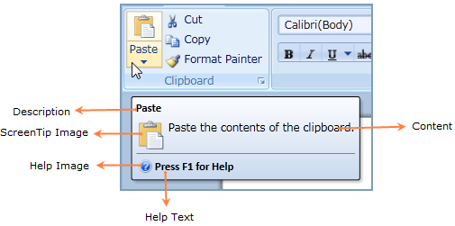

::: {style="DISPLAY: none"}
{#d2h_url_template}{#d2h_package_url style="WIDTH: 0px; DISPLAY: none; HEIGHT: 0px"}
:::

::: {.d2h_secondary_topic style="PADDING-BOTTOM: 10pt; MARGIN: 0pt; PADDING-LEFT: 0pt; PADDING-RIGHT: 0pt; PADDING-TOP: 0pt"}
#### Screen Tip

A popup appears when the mouse cursor is hovered over an icon or a ribbon element (command), which is called as Screen Tip. The popup will provide the details that explain the command\'s function. When the mouse is moved away from the ribbon element, the Screen Tip will disappear from View.

{border="0"}

Figure 632: Screen Tip

***[]{style="FONT-FAMILY: 'Calibri','sans-serif'; COLOR: #4f81bd"}*** 

 

The screen tip consists of five parts namely:

[·      ]{style="FONT-FAMILY: Symbol"}**Description** -- Specifies the header of the Screen tip.

[·      ]{style="FONT-FAMILY: Symbol"}**Content** -- Specifies the actual content of the Screen tip.

[·      ]{style="FONT-FAMILY: Symbol"}**Image** -- Specifies the Image for the Screen tip.

[·      ]{style="FONT-FAMILY: Symbol"}**Help Text** -- Specifies the text for help information.

[·      ]{style="FONT-FAMILY: Symbol"}**Help Image** -- Specifies the image for help information[.]{style="FONT-FAMILY: 'Calibri','sans-serif'"}

More:

[ ]{#related-topics}

[{border="0" align="absMiddle"}Members](ms-xhelp:///?Id=2935c9ef-9ea9-4955-b678-bfb059773129){style="TEXT-DECORATION: none"}

[{border="0" align="absMiddle"}Declaring ScreenTip](ms-xhelp:///?Id=e55fe076-d574-4dfc-a852-038ed1a204f5){style="TEXT-DECORATION: none"}
:::
