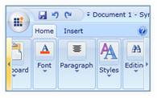

::: {style="DISPLAY: none"}
{#d2h_url_template}{#d2h_package_url style="WIDTH: 0px; DISPLAY: none; HEIGHT: 0px"}
:::

::: {.d2h_secondary_topic style="PADDING-BOTTOM: 10pt; MARGIN: 0pt; PADDING-LEFT: 0pt; PADDING-RIGHT: 0pt; PADDING-TOP: 0pt"}
#### Scrolling Support

With the Ribbon instance, the user can use the Ribbon tab and Ribbon Bar to scroll to and fro, in order to navigate through the controls in the Ribbon Bar and the RibbonTab. This support adds quality to the application created by using a Ribbon instance[.]{style="FONT-FAMILY: 'Calibri','sans-serif'; COLOR: black"}

{border="0"}[]{style="COLOR: black"}

Figure 648: Ribbon Scroll bars

[]{#related-topics}
:::
