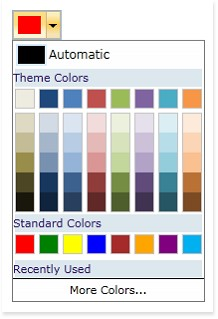

::: {style="DISPLAY: none"}
{#d2h_url_template}{#d2h_package_url style="WIDTH: 0px; DISPLAY: none; HEIGHT: 0px"}
:::

::: {.d2h_secondary_topic style="PADDING-BOTTOM: 10pt; MARGIN: 0pt; PADDING-LEFT: 0pt; PADDING-RIGHT: 0pt; PADDING-TOP: 0pt"}
#### []{#_Selecting_a_Color}Selecting a Color

[]{#p431} 

The user can set the foreground or background by selecting a color. The **SelectedColor** property allows the user to set the color chosen in color palette.

 

The following is the code snippet for setting SelectedColor.

 

+-----------------------------------------------------------------------------------------------------------------------------------------------------------------------------------------------------------------------------------------------------------------------------------------------------------------------------------------------------------------------------------------------------------------------------------------------------------------------------------------------------------------------------------------------------------------------------------------------------------------+
| **[\[XAML\]]{style="FONT-FAMILY: 'Courier New'; COLOR: black"}**                                                                                                                                                                                                                                                                                                                                                                                                                                                                                                                                                |
|                                                                                                                                                                                                                                                                                                                                                                                                                                                                                                                                                                                                                 |
| []{style="FONT-FAMILY: 'Courier New'; COLOR: #a31515"}                                                                                                                                                                                                                                                                                                                                                                                                                                                                                                                                                          |
|                                                                                                                                                                                                                                                                                                                                                                                                                                                                                                                                                                                                                 |
| [\<]{style="FONT-FAMILY: 'Courier New'; COLOR: blue"}[Syncfusion]{style="FONT-FAMILY: 'Courier New'; COLOR: #a31515"}[:]{style="FONT-FAMILY: 'Courier New'; COLOR: blue"}[ColorPickerPalette]{style="FONT-FAMILY: 'Courier New'; COLOR: #a31515"}[ SelectedColor]{style="FONT-FAMILY: 'Courier New'; COLOR: red"}[=\"Red   ]{style="FONT-FAMILY: 'Courier New'; COLOR: blue"}[x]{style="FONT-FAMILY: 'Courier New'; COLOR: red"}[:]{style="FONT-FAMILY: 'Courier New'; COLOR: blue"}[Name]{style="FONT-FAMILY: 'Courier New'; COLOR: red"}[=\"ColorPicker\"\>]{style="FONT-FAMILY: 'Courier New'; COLOR: blue"} |
|                                                                                                                                                                                                                                                                                                                                                                                                                                                                                                                                                                                                                 |
| [\</]{style="FONT-FAMILY: 'Courier New'; COLOR: blue"}[Syncfusion]{style="FONT-FAMILY: 'Courier New'; COLOR: #a31515"}[:]{style="FONT-FAMILY: 'Courier New'; COLOR: blue"}[ColorPickerPalette]{style="FONT-FAMILY: 'Courier New'; COLOR: #a31515"}[\>]{style="FONT-FAMILY: 'Courier New'; COLOR: blue"}                                                                                                                                                                                                                                                                                                         |
+-----------------------------------------------------------------------------------------------------------------------------------------------------------------------------------------------------------------------------------------------------------------------------------------------------------------------------------------------------------------------------------------------------------------------------------------------------------------------------------------------------------------------------------------------------------------------------------------------------------------+

 

+---------------------------------------------------------------------------------------------------------------------------------------------------------------------------------------------------------+
| **[\[C#\]]{style="FONT-FAMILY: 'Courier New'; COLOR: black"}**                                                                                                                                          |
|                                                                                                                                                                                                         |
| **[]{style="FONT-FAMILY: 'Courier New'; COLOR: black"}**                                                                                                                                                |
|                                                                                                                                                                                                         |
| [ColorPickerPalette]{style="FONT-FAMILY: 'Courier New'; COLOR: #2b91af"}[ colorPicker = [new]{style="COLOR: blue"} [ColorPickerPalette]{style="COLOR: #2b91af"}();]{style="FONT-FAMILY: 'Courier New'"} |
|                                                                                                                                                                                                         |
| [colorPicker.SelectedColor = [new]{style="COLOR: blue"} [SolidColorBrush]{style="COLOR: #2b91af"}([Colors]{style="COLOR: #2b91af"}.Red);]{style="FONT-FAMILY: 'Courier New'"}                           |
+---------------------------------------------------------------------------------------------------------------------------------------------------------------------------------------------------------+

 

{border="0"}

**** 

Figure 965: Color Picker with Selected Color set to Red

[]{#related-topics}
:::
