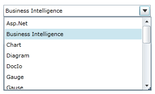
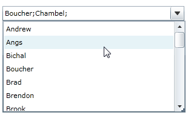

::: {style="DISPLAY: none"}
{#d2h_url_template}{#d2h_package_url style="WIDTH: 0px; DISPLAY: none; HEIGHT: 0px"}
:::

::: {.d2h_secondary_topic style="PADDING-BOTTOM: 10pt; MARGIN: 0pt; PADDING-LEFT: 0pt; PADDING-RIGHT: 0pt; PADDING-TOP: 0pt"}
#### Selection Mode Support

AutoComplete supports two kinds of Selection Mode namely Single and Multiple. You can select the Mode using the **SelectionMode** property.

When the SelectionMode property is set as Single, only one item can be selected at a time. The following image illustrates the Single selection mode.

{border="0"}

Figure 32: SelectionMode-Single

 

When the SelectionMode is set as Multiple, you can select multiple items by using the **SeparatorChar** property to separate the selected items. By default the SeparatorChar is ";". This allows you to select multiple items by using the **SelectionMode** property. Once an item is selected the Separatorchar is to be entered in the text box to select the next item. The following image illustrates the Multiple selection mode.

 

{border="0"}

Figure 33: SelectionMode-Multiple

 

Adding Multiple Selection Support to an Application

The **Selectionmode** property is used to attain these functionalities by setting its value as Single or Multiple. By default, its value is Single. The following code snippet is used to set the **SelectionMode** property.

 

+---------------------------------------------------------------------------------------------------------------------------------------------------------------------------------------------------------------------------------------------------------------------------------------------------------------------------------------------------------------------------------------------------------------------------------------------------------------------------------------------------------------------------------------------------------------------------------------------------------------------------------------------------------+
| **[\[XAML\]]{style="FONT-FAMILY: 'Courier New'"}**                                                                                                                                                                                                                                                                                                                                                                                                                                                                                                                                                                                                      |
|                                                                                                                                                                                                                                                                                                                                                                                                                                                                                                                                                                                                                                                         |
| [\<]{style="FONT-FAMILY: 'Courier New'; COLOR: blue"}[syncfusion]{style="FONT-FAMILY: 'Courier New'; COLOR: #a31515"}[:]{style="FONT-FAMILY: 'Courier New'; COLOR: blue"}[AutoComplete]{style="FONT-FAMILY: 'Courier New'; COLOR: #a31515"}[ x]{style="FONT-FAMILY: 'Courier New'; COLOR: red"}[:]{style="FONT-FAMILY: 'Courier New'; COLOR: blue"}[Name]{style="FONT-FAMILY: 'Courier New'; COLOR: red"}[=\"AutoComplete1\"]{style="FONT-FAMILY: 'Courier New'; COLOR: blue"}[ SelectionMode]{style="FONT-FAMILY: 'Courier New'; COLOR: red"}[=\"Multiple\"/\>]{style="FONT-FAMILY: 'Courier New'; COLOR: blue"}[]{style="FONT-FAMILY: 'Courier New'"} |
+---------------------------------------------------------------------------------------------------------------------------------------------------------------------------------------------------------------------------------------------------------------------------------------------------------------------------------------------------------------------------------------------------------------------------------------------------------------------------------------------------------------------------------------------------------------------------------------------------------------------------------------------------------+

 

+--------------------------------------------------------------------------------------------------------------------------------------------------------------------------------------------------------------------------------------------------------------------------------------------------------------+
| **[\[C#\]]{style="FONT-FAMILY: 'Courier New'"}**                                                                                                                                                                                                                                                             |
|                                                                                                                                                                                                                                                                                                              |
| [AutoComplete]{style="FONT-FAMILY: 'Courier New'; COLOR: teal"}[ autoComplete1 = [new]{style="COLOR: blue"} [AutoComplete]{style="COLOR: teal"}();]{style="FONT-FAMILY: 'Courier New'"}                                                                                                                      |
|                                                                                                                                                                                                                                                                                                              |
| [this]{style="FONT-FAMILY: 'Courier New'; COLOR: blue"}[.]{style="FONT-FAMILY: 'Courier New'"}[autoComplete1]{style="FONT-FAMILY: 'Courier New'"}[.SelectionMode = [SelectionMode]{style="COLOR: #2b91af"}.Multiple;]{style="FONT-FAMILY: 'Courier New'"}[]{style="FONT-FAMILY: Consolas; FONT-SIZE: 9.5pt"} |
+--------------------------------------------------------------------------------------------------------------------------------------------------------------------------------------------------------------------------------------------------------------------------------------------------------------+

 

Tables for property, and Event

Property

Table 5: Property Table for Multiple Selection

  --------------- ----------------------------------------------------- -------------------- ----------------------- -----------------
  Property        Description                                           Type                 Data Type               Reference links
  SelectionMode   Gets or sets the SelectionMode of the AutoComplete.   DependencyProperty   SelectionMode(Single)   
  --------------- ----------------------------------------------------- -------------------- ----------------------- -----------------

 

 

Events

Table 6: Event Table for Multiple Selection

+----------------------+----------------------------------------------------------------------------------+------------------------------------+-------------------+---------------------------------+
| **Event**            | **Description**                                                                  | **Arguments**                      | **Type**          | **Reference links**             |
+----------------------+----------------------------------------------------------------------------------+------------------------------------+-------------------+-------------------+-------------+
| SelectionModeChanged |  When the SelectionMode property value is changed, this event will be triggered. | DependencyObject,                  | DependencyPropertyChangedCallBack     |             |
|                      |                                                                                  |                                    |                                       |             |
|                      | It cannot be cancelled.                                                          | DependencyPropertyChangedEventArgs |                                       |             |
+======================+==================================================================================+====================================+===================+===================+=============+
|                      |                                                                                  |                                    |                   |                   |             |
+----------------------+----------------------------------------------------------------------------------+------------------------------------+-------------------+-------------------+-------------+

 

Sample Link

SilverlightSampleBrowser-\> Tools -\> Editors -\> AutoComplete Demo

[]{#related-topics}
:::
