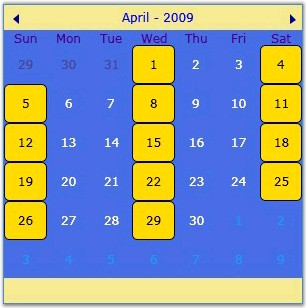
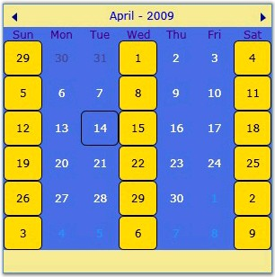

::: {style="DISPLAY: none"}
{#d2h_url_template}{#d2h_package_url style="WIDTH: 0px; DISPLAY: none; HEIGHT: 0px"}
:::

:::: {.d2h_secondary_topic style="PADDING-BOTTOM: 10pt; MARGIN: 0pt; PADDING-LEFT: 0pt; PADDING-RIGHT: 0pt; PADDING-TOP: 0pt"}
#### []{#_Selection_Range_Mode}Selection Range Mode

[]{#p240} 

The **SelectionRangeMode** property enables you to select all the dates that are displayed under a particular day, when you move the mouse pointer over the day. This property has the following modes.

 

[·      ]{style="FONT-FAMILY: Symbol"}**CurrentMonth**: selects only dates that belong to the current month from the column

[·      ]{style="FONT-FAMILY: Symbol"}**WholeColumn**: selects the dates that belong to the current month, next month and previous month

 

::: {style="BORDER-BOTTOM: windowtext 1pt solid; BORDER-LEFT: medium none; PADDING-BOTTOM: 1pt; MARGIN-TOP: 9pt; PADDING-LEFT: 0pt; PADDING-RIGHT: 0pt; MARGIN-BOTTOM: 9pt; BORDER-TOP: windowtext 1pt solid; BORDER-RIGHT: medium none; PADDING-TOP: 1pt"}
{border="0"}Note: This property takes effect only when the AllowMultipleSelection property is enabled.
:::

 

The following code example illustrates how to set this property.

 

+------------------------------------------------------------------------------------------------------------------------------------------------------------------------------------------------------------------------------------------------------------------------------------------------------------------------------------------------------------------------------------------------------------------------------------------------------------------------------------------------------------------------+
| **[\[XAML\]]{style="FONT-FAMILY: 'Courier New'; COLOR: black"}**                                                                                                                                                                                                                                                                                                                                                                                                                                                       |
|                                                                                                                                                                                                                                                                                                                                                                                                                                                                                                                        |
| []{style="FONT-FAMILY: 'Courier New'; COLOR: black"}                                                                                                                                                                                                                                                                                                                                                                                                                                                                   |
|                                                                                                                                                                                                                                                                                                                                                                                                                                                                                                                        |
| [\<]{style="FONT-FAMILY: 'Courier New'; COLOR: blue"}[Syncfusion]{style="FONT-FAMILY: 'Courier New'; COLOR: maroon"}[:]{style="FONT-FAMILY: 'Courier New'; COLOR: blue"}[CalendarControl]{style="FONT-FAMILY: 'Courier New'; COLOR: maroon"}[ [x]{style="COLOR: maroon"}[:]{style="COLOR: blue"}[Name]{style="COLOR: red"}[=\"calendarcontrol\"]{style="COLOR: blue"} [SelectionRangeMode]{style="COLOR: red"}[=\"CurrentMonth\"]{style="COLOR: blue"} [/\>]{style="COLOR: blue"}]{style="FONT-FAMILY: 'Courier New'"} |
+------------------------------------------------------------------------------------------------------------------------------------------------------------------------------------------------------------------------------------------------------------------------------------------------------------------------------------------------------------------------------------------------------------------------------------------------------------------------------------------------------------------------+

 

+-----------------------------------------------------------------------------------------------------------------------+
| **[\[C#\]]{style="FONT-FAMILY: 'Courier New'; COLOR: black"}**                                                        |
|                                                                                                                       |
| []{style="FONT-FAMILY: 'Courier New'"}                                                                                |
|                                                                                                                       |
| [CalendarControl calendarcontrol = [new]{style="COLOR: blue"} CalendarControl();]{style="FONT-FAMILY: 'Courier New'"} |
|                                                                                                                       |
| [calendarcontrol.SelectionRangeMode = SelectionRangeMode.CurrentMonth;]{style="FONT-FAMILY: 'Courier New'"}           |
+-----------------------------------------------------------------------------------------------------------------------+

 

{border="0"}

 

Figure 463 : SelectionRangeMode = \"CurrentMonth\"

 

{border="0"}

 

Figure 464: SelectionRangeMode = \"WholeColumn\"

[]{#related-topics}
::::
