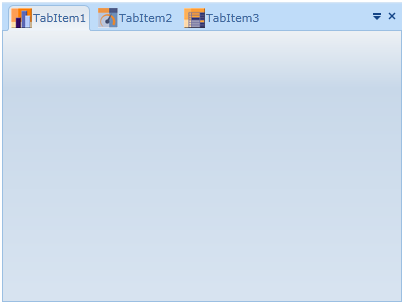

::: {style="DISPLAY: none"}
{#d2h_url_template}{#d2h_package_url style="WIDTH: 0px; DISPLAY: none; HEIGHT: 0px"}
:::

::: {.d2h_secondary_topic style="PADDING-BOTTOM: 10pt; MARGIN: 0pt; PADDING-LEFT: 0pt; PADDING-RIGHT: 0pt; PADDING-TOP: 0pt"}
#### []{#_How_to_set}Setting an Image in Tab Item Header

            In this control, the Tab item header allows you to add an image with header content. We can set the image of the Tab header through xaml and code behind. When creating TabItem in xaml, refer the following code for adding image with the header.

+---------------------------------------------------------------------------------------------------------------------------------------------------------------------------------------------------------------------------------------------------------------------------------------------------------------------------------------------------------------------------------------------------------------------------------------------------------------------------------------------------------------------------------------------------------+
| [ ]{style="FONT-FAMILY: 'Courier New'; COLOR: blue"}**[\[Xaml\]]{style="FONT-FAMILY: 'Courier New'"}**                                                                                                                                                                                                                                                                                                                                                                                                                                                  |
|                                                                                                                                                                                                                                                                                                                                                                                                                                                                                                                                                         |
| [ ]{style="FONT-FAMILY: 'Courier New'; COLOR: #a31515"}[\<]{style="FONT-FAMILY: 'Courier New'; COLOR: blue"}[syncfusion]{style="FONT-FAMILY: 'Courier New'; COLOR: #a31515"}[:]{style="FONT-FAMILY: 'Courier New'; COLOR: blue"}[TabControlAdv]{style="FONT-FAMILY: 'Courier New'; COLOR: #a31515"}[ Name]{style="FONT-FAMILY: 'Courier New'; COLOR: red"}[=\"MyTabCtrl\"]{style="FONT-FAMILY: 'Courier New'; COLOR: blue"}[ [ Height]{style="COLOR: red"}[=\"300\"]{style="COLOR: blue"}[ Width]{style="COLOR: red"}[=\"400\"\>]{style="COLOR: blue"}\ |
| [            ]{style="COLOR: #a31515"}[\<]{style="COLOR: blue"}[syncfusion]{style="COLOR: #a31515"}[:]{style="COLOR: blue"}[TabItemAdv]{style="COLOR: #a31515"}[ Header]{style="COLOR: red"}[=\"TabItem1\"]{style="COLOR: blue"}[ Image]{style="COLOR: red"}[=\"/TabControl;component/Images/chart.png\"]{style="COLOR: blue"} [ /\>]{style="COLOR: blue"}\                                                                                                                                                                                             |
| [            ]{style="COLOR: #a31515"}[\<]{style="COLOR: blue"}[syncfusion]{style="COLOR: #a31515"}[:]{style="COLOR: blue"}[TabItemAdv]{style="COLOR: #a31515"}[ Header]{style="COLOR: red"}[=\"TabItem2\"]{style="COLOR: blue"}[ Image]{style="COLOR: red"}[=\"/TabControl;component/Images/gauge.png\"/\>]{style="COLOR: blue"}\                                                                                                                                                                                                                      |
| [            ]{style="COLOR: #a31515"}[\<]{style="COLOR: blue"}[syncfusion]{style="COLOR: #a31515"}[:]{style="COLOR: blue"}[TabItemAdv]{style="COLOR: #a31515"}[ Header]{style="COLOR: red"}[=\"TabItem3\"]{style="COLOR: blue"}[ Image]{style="COLOR: red"}[=\"/TabControl;component/Images/grid.png\" /\>]{style="COLOR: blue"}[            ]{style="COLOR: #a31515"}\                                                                                                                                                                                |
| [        ]{style="COLOR: #a31515"}[\</]{style="COLOR: blue"}[syncfusion]{style="COLOR: #a31515"}[:]{style="COLOR: blue"}[TabControlAdv]{style="COLOR: #a31515"}[\>]{style="COLOR: blue"}]{style="FONT-FAMILY: 'Courier New'"}                                                                                                                                                                                                                                                                                                                           |
|                                                                                                                                                                                                                                                                                                                                                                                                                                                                                                                                                         |
| []{style="FONT-FAMILY: 'Courier New'"}                                                                                                                                                                                                                                                                                                                                                                                                                                                                                                                  |
+---------------------------------------------------------------------------------------------------------------------------------------------------------------------------------------------------------------------------------------------------------------------------------------------------------------------------------------------------------------------------------------------------------------------------------------------------------------------------------------------------------------------------------------------------------+

[]{style="FONT-FAMILY: 'Calibri','sans-serif'; FONT-SIZE: 12pt"} 

{border="0"}

Figure 823: TabHeader with Images

[                                    ** **]{style="FONT-FAMILY: 'Calibri','sans-serif'; FONT-SIZE: 12pt"}

[]{#related-topics}
:::
