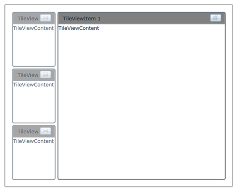

::: {style="DISPLAY: none"}
{#d2h_url_template}{#d2h_package_url style="WIDTH: 0px; DISPLAY: none; HEIGHT: 0px"}
:::

::: {.d2h_secondary_topic style="PADDING-BOTTOM: 10pt; MARGIN: 0pt; PADDING-LEFT: 0pt; PADDING-RIGHT: 0pt; PADDING-TOP: 0pt"}
#### Setting Orientation for Minimizing Items.

You can change the orientation of the minimized items by setting the **MinimizedItemsOrientation** property to a required value. The available minimized orientations are Left, Top, Right and Bottom. When the maximize button of an item is clicked, the other items of the TileViewControl are minimized in the required positions.

**For Example**: When the MinimizedOrientation property is set to *Left*, the minimized items will be placed on the left side of the maximized item and so on.

 

Adding Orientation for Minimizing Items to an Application

The orientation for minimizing items can be added to an application by using either XAML or C# code.

Adding through XAML

 

The following code example illustrates how to add the Orientation for Minimizing Items to an application through XAML.

 

+------------------------------------------------------------------------------------------------------------------------------------------------------------------------------------------------------------------------------------------------------------------------------------------------------------------------------------------------------------------------------------------------------------------------------------------------------------------------------------------------------------------------------------------------------------------------------------------------------------------------------------------------------------+
| **[\[XAML\]]{style="FONT-FAMILY: 'Courier New'"}**                                                                                                                                                                                                                                                                                                                                                                                                                                                                                                                                                                                                         |
|                                                                                                                                                                                                                                                                                                                                                                                                                                                                                                                                                                                                                                                            |
| **[]{style="FONT-FAMILY: 'Courier New'"}**                                                                                                                                                                                                                                                                                                                                                                                                                                                                                                                                                                                                                 |
|                                                                                                                                                                                                                                                                                                                                                                                                                                                                                                                                                                                                                                                            |
| [\<]{style="FONT-FAMILY: 'Courier New'; COLOR: blue"}[syncfusion]{style="FONT-FAMILY: 'Courier New'; COLOR: #a31515"}[:]{style="FONT-FAMILY: 'Courier New'; COLOR: blue"}[TileViewControl]{style="FONT-FAMILY: 'Courier New'; COLOR: #a31515"}[ x]{style="FONT-FAMILY: 'Courier New'; COLOR: red"}[:]{style="FONT-FAMILY: 'Courier New'; COLOR: blue"}[Name]{style="FONT-FAMILY: 'Courier New'; COLOR: red"}[=\"TileView1\"]{style="FONT-FAMILY: 'Courier New'; COLOR: blue"}[ Background]{style="FONT-FAMILY: 'Courier New'; COLOR: red"}[=\"White\"]{style="FONT-FAMILY: 'Courier New'; COLOR: blue"}[ ]{style="FONT-FAMILY: 'Courier New'; COLOR: red"} |
|                                                                                                                                                                                                                                                                                                                                                                                                                                                                                                                                                                                                                                                            |
| [                            MinimizedItemsOrientation]{style="FONT-FAMILY: 'Courier New'; COLOR: red"}[=\"Left\"\>]{style="FONT-FAMILY: 'Courier New'; COLOR: blue"}[]{style="FONT-FAMILY: 'Courier New'"}                                                                                                                                                                                                                                                                                                                                                                                                                                                |
|                                                                                                                                                                                                                                                                                                                                                                                                                                                                                                                                                                                                                                                            |
| [    ]{style="FONT-FAMILY: 'Courier New'; COLOR: #a31515"}[\<]{style="FONT-FAMILY: 'Courier New'; COLOR: blue"}[syncfusion]{style="FONT-FAMILY: 'Courier New'; COLOR: #a31515"}[:]{style="FONT-FAMILY: 'Courier New'; COLOR: blue"}[TileViewItem]{style="FONT-FAMILY: 'Courier New'; COLOR: #a31515"}[ BorderThickness]{style="FONT-FAMILY: 'Courier New'; COLOR: red"}[=\"2\"]{style="FONT-FAMILY: 'Courier New'; COLOR: blue"}[ Header]{style="FONT-FAMILY: 'Courier New'; COLOR: red"}[=\"TileViewItem 1\"]{style="FONT-FAMILY: 'Courier New'; COLOR: blue"}[                                         ]{style="FONT-FAMILY: 'Courier New'"}             |
|                                                                                                                                                                                                                                                                                                                                                                                                                                                                                                                                                                                                                                                            |
| [                             [Content]{style="COLOR: red"}[=\"TileViewContent\" ]{style="COLOR: blue"}[Margin]{style="COLOR: red"}[=\"2\"]{style="COLOR: blue"}[ ]{style="COLOR: red"} ]{style="FONT-FAMILY: 'Courier New'"}                                                                                                                                                                                                                                                                                                                                                                                                                              |
|                                                                                                                                                                                                                                                                                                                                                                                                                                                                                                                                                                                                                                                            |
| [                             [HeaderBackground]{style="COLOR: red"}[=\"Gray\"]{style="COLOR: blue"}[ CornerRadius]{style="COLOR: red"}[=\"3\"/\>]{style="COLOR: blue"}]{style="FONT-FAMILY: 'Courier New'"}                                                                                                                                                                                                                                                                                                                                                                                                                                               |
|                                                                                                                                                                                                                                                                                                                                                                                                                                                                                                                                                                                                                                                            |
| [    ]{style="FONT-FAMILY: 'Courier New'; COLOR: #a31515"}[\<]{style="FONT-FAMILY: 'Courier New'; COLOR: blue"}[syncfusion]{style="FONT-FAMILY: 'Courier New'; COLOR: #a31515"}[:]{style="FONT-FAMILY: 'Courier New'; COLOR: blue"}[TileViewItem]{style="FONT-FAMILY: 'Courier New'; COLOR: #a31515"}[ BorderThickness]{style="FONT-FAMILY: 'Courier New'; COLOR: red"}[=\"2\"]{style="FONT-FAMILY: 'Courier New'; COLOR: blue"}[ Header]{style="FONT-FAMILY: 'Courier New'; COLOR: red"}[=\"TileViewItem 2\"]{style="FONT-FAMILY: 'Courier New'; COLOR: blue"}[                                          ]{style="FONT-FAMILY: 'Courier New'"}            |
|                                                                                                                                                                                                                                                                                                                                                                                                                                                                                                                                                                                                                                                            |
| [                             [Content]{style="COLOR: red"}[=\"TileViewContent\"]{style="COLOR: blue"} [Margin]{style="COLOR: red"}[=\"2\"]{style="COLOR: blue"}]{style="FONT-FAMILY: 'Courier New'"}                                                                                                                                                                                                                                                                                                                                                                                                                                                      |
|                                                                                                                                                                                                                                                                                                                                                                                                                                                                                                                                                                                                                                                            |
| [                             [HeaderBackground]{style="COLOR: red"}[=\"Gray\"]{style="COLOR: blue"}[ CornerRadius]{style="COLOR: red"}[=\"3\"/\>]{style="COLOR: blue"}]{style="FONT-FAMILY: 'Courier New'"}                                                                                                                                                                                                                                                                                                                                                                                                                                               |
|                                                                                                                                                                                                                                                                                                                                                                                                                                                                                                                                                                                                                                                            |
| [    ]{style="FONT-FAMILY: 'Courier New'; COLOR: #a31515"}[\<]{style="FONT-FAMILY: 'Courier New'; COLOR: blue"}[syncfusion]{style="FONT-FAMILY: 'Courier New'; COLOR: #a31515"}[:]{style="FONT-FAMILY: 'Courier New'; COLOR: blue"}[TileViewItem]{style="FONT-FAMILY: 'Courier New'; COLOR: #a31515"}[ BorderThickness]{style="FONT-FAMILY: 'Courier New'; COLOR: red"}[=\"2\"]{style="FONT-FAMILY: 'Courier New'; COLOR: blue"}[ Header]{style="FONT-FAMILY: 'Courier New'; COLOR: red"}[=\"TileViewItem 3\"]{style="FONT-FAMILY: 'Courier New'; COLOR: blue"}[ ]{style="FONT-FAMILY: 'Courier New'"}                                                     |
|                                                                                                                                                                                                                                                                                                                                                                                                                                                                                                                                                                                                                                                            |
| [                             [Content]{style="COLOR: red"}[=\"TileViewContent\"]{style="COLOR: blue"} [Margin]{style="COLOR: red"}[=\"2\"]{style="COLOR: blue"}]{style="FONT-FAMILY: 'Courier New'"}                                                                                                                                                                                                                                                                                                                                                                                                                                                      |
|                                                                                                                                                                                                                                                                                                                                                                                                                                                                                                                                                                                                                                                            |
| [                             [HeaderBackground]{style="COLOR: red"}[=\"Gray\"]{style="COLOR: blue"}[ CornerRadius]{style="COLOR: red"}[=\"3\"/\>]{style="COLOR: blue"}]{style="FONT-FAMILY: 'Courier New'"}                                                                                                                                                                                                                                                                                                                                                                                                                                               |
|                                                                                                                                                                                                                                                                                                                                                                                                                                                                                                                                                                                                                                                            |
| [    ]{style="FONT-FAMILY: 'Courier New'; COLOR: #a31515"}[\<]{style="FONT-FAMILY: 'Courier New'; COLOR: blue"}[syncfusion]{style="FONT-FAMILY: 'Courier New'; COLOR: #a31515"}[:]{style="FONT-FAMILY: 'Courier New'; COLOR: blue"}[TileViewItem]{style="FONT-FAMILY: 'Courier New'; COLOR: #a31515"}[ BorderThickness]{style="FONT-FAMILY: 'Courier New'; COLOR: red"}[=\"2\"]{style="FONT-FAMILY: 'Courier New'; COLOR: blue"}[ Header]{style="FONT-FAMILY: 'Courier New'; COLOR: red"}[=\"TileViewItem 4\"]{style="FONT-FAMILY: 'Courier New'; COLOR: blue"}[ ]{style="FONT-FAMILY: 'Courier New'"}                                                     |
|                                                                                                                                                                                                                                                                                                                                                                                                                                                                                                                                                                                                                                                            |
| [                             [Content]{style="COLOR: red"}[=\"TileViewContent\"]{style="COLOR: blue"} [Margin]{style="COLOR: red"}[=\"2\"]{style="COLOR: blue"}]{style="FONT-FAMILY: 'Courier New'"}                                                                                                                                                                                                                                                                                                                                                                                                                                                      |
|                                                                                                                                                                                                                                                                                                                                                                                                                                                                                                                                                                                                                                                            |
| [                             [HeaderBackground]{style="COLOR: red"}[=\"Gray\"]{style="COLOR: blue"}[ CornerRadius]{style="COLOR: red"}[=\"3\"/\>]{style="COLOR: blue"}]{style="FONT-FAMILY: 'Courier New'"}                                                                                                                                                                                                                                                                                                                                                                                                                                               |
|                                                                                                                                                                                                                                                                                                                                                                                                                                                                                                                                                                                                                                                            |
| [\</]{style="FONT-FAMILY: 'Courier New'; COLOR: blue"}[syncfusion]{style="FONT-FAMILY: 'Courier New'; COLOR: #a31515"}[:]{style="FONT-FAMILY: 'Courier New'; COLOR: blue"}[TileViewControl]{style="FONT-FAMILY: 'Courier New'; COLOR: #a31515"}[\>]{style="FONT-FAMILY: 'Courier New'; COLOR: blue"}                                                                                                                                                                                                                                                                                                                                                       |
|                                                                                                                                                                                                                                                                                                                                                                                                                                                                                                                                                                                                                                                            |
| [              ]{style="FONT-FAMILY: 'Courier New'"}                                                                                                                                                                                                                                                                                                                                                                                                                                                                                                                                                                                                       |
+------------------------------------------------------------------------------------------------------------------------------------------------------------------------------------------------------------------------------------------------------------------------------------------------------------------------------------------------------------------------------------------------------------------------------------------------------------------------------------------------------------------------------------------------------------------------------------------------------------------------------------------------------------+

 

Adding through C#

 

The following code example illustrates how to add the Orientation for Minimizing Items to an application through C#.

 

+--------------------------------------------------------------------------------------------------------------------------------------------------------------------------------------+
| **[\[C#\]]{style="FONT-FAMILY: 'Courier New'"}**                                                                                                                                     |
|                                                                                                                                                                                      |
| **[]{style="FONT-FAMILY: 'Courier New'"}**                                                                                                                                           |
|                                                                                                                                                                                      |
| [   [TileViewControl]{style="COLOR: #2b91af"} Tile = [new]{style="COLOR: blue"} [TileViewControl]{style="COLOR: #2b91af"}();]{style="FONT-FAMILY: 'Courier New'"}                    |
|                                                                                                                                                                                      |
| [   Tile.MinimizedItemsOrientation = [MinimizedItemsOrientation]{style="COLOR: #2b91af"}.Left;]{style="FONT-FAMILY: 'Courier New'"}                                                  |
|                                                                                                                                                                                      |
| [   Tile.Background = [new]{style="COLOR: blue"} [SolidColorBrush]{style="COLOR: #2b91af"}([Colors]{style="COLOR: #2b91af"}.White);]{style="FONT-FAMILY: 'Courier New'"}             |
|                                                                                                                                                                                      |
| [   [for]{style="COLOR: blue"} ([int]{style="COLOR: blue"} i = 1; i \<= 4; i++)]{style="FONT-FAMILY: 'Courier New'"}                                                                 |
|                                                                                                                                                                                      |
| [   {]{style="FONT-FAMILY: 'Courier New'"}                                                                                                                                           |
|                                                                                                                                                                                      |
| [         [TileViewItem]{style="COLOR: #2b91af"} item1 = [new]{style="COLOR: blue"} [TileViewItem]{style="COLOR: #2b91af"}();]{style="FONT-FAMILY: 'Courier New'"}                   |
|                                                                                                                                                                                      |
| [         item1.HeaderBackground = [new]{style="COLOR: blue"} [SolidColorBrush]{style="COLOR: #2b91af"}([Colors]{style="COLOR: #2b91af"}.Gray);]{style="FONT-FAMILY: 'Courier New'"} |
|                                                                                                                                                                                      |
| [         item1.Margin = [new]{style="COLOR: blue"} [Thickness]{style="COLOR: #2b91af"}(2d);]{style="FONT-FAMILY: 'Courier New'"}                                                    |
|                                                                                                                                                                                      |
| [         item1.Content = [\"TileViewContent\"]{style="COLOR: #a31515"};]{style="FONT-FAMILY: 'Courier New'"}                                                                        |
|                                                                                                                                                                                      |
| [         item1.Header = [\"TileViewItem - \"]{style="COLOR: #a31515"} + i;]{style="FONT-FAMILY: 'Courier New'"}                                                                     |
|                                                                                                                                                                                      |
| [         Tile.Items.Add(item1);]{style="FONT-FAMILY: 'Courier New'"}                                                                                                                |
|                                                                                                                                                                                      |
| [   }]{style="FONT-FAMILY: 'Courier New'"}                                                                                                                                           |
|                                                                                                                                                                                      |
| [   [this]{style="COLOR: blue"}.LayoutRoot.Children.Add(Tile);]{style="FONT-FAMILY: 'Courier New'"}                                                                                  |
|                                                                                                                                                                                      |
| [   ]{style="FONT-FAMILY: 'Courier New'"}                                                                                                                                            |
|                                                                                                                                                                                      |
| [           ]{style="FONT-FAMILY: 'Courier New'"}                                                                                                                                    |
+--------------------------------------------------------------------------------------------------------------------------------------------------------------------------------------+

 

 

{border="0"}

 

Figure 856: TileViewControl with MinimizedItemTemplate and MaximizedItemTemplate

 

Tables for properties, methods, and events

Properties

Table 28: MinimizedItemTemplate / MaximizedItemTemplate Properties Table

  --------------------------- ------------------------------------------------------------------------- -------------------- --------------------------------- -----------------
  Property                    Description                                                               Type                 Data Type                         Reference links
  MinimizedItemsOrientation   Specifies the orientation where the minimized TileViewItems are placed.   DependencyProperty   MinimizedItemsOrientation.Right   NA
  --------------------------- ------------------------------------------------------------------------- -------------------- --------------------------------- -----------------

 

Events

Table 29: EVENT Table

  Event                              Description                                                                                 Arguments   Type   Reference links
  ---------------------------------- ------------------------------------------------------------------------------------------- ----------- ------ -----------------
  MinimizedItemsOrientationChanged   The event gets fired when the minimized items orientation of the TileViewItems ischanged.   NA          NA     NA

 

Sample Link

To view samples:

 

1.   Select Start -\> Programs -\> Syncfusion -\> Essential Studio x.x.xx -\> Dashboard.

2.   Select   Run Locally Installed Samples in Silverlight Button.

3.   Now expand the DragAndDropManagerDemo tree-view item in the Sample Browser.

4.   Choose any one of the samples listed under it to launch.

[]{#related-topics}
:::
