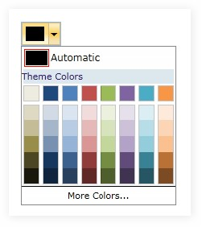

::: {style="DISPLAY: none"}
{#d2h_url_template}{#d2h_package_url style="WIDTH: 0px; DISPLAY: none; HEIGHT: 0px"}
:::

::: {.d2h_secondary_topic style="PADDING-BOTTOM: 10pt; MARGIN: 0pt; PADDING-LEFT: 0pt; PADDING-RIGHT: 0pt; PADDING-TOP: 0pt"}
#### []{#_Setting_Standard_Panel}Setting Standard Panel Visibility

[]{#p427} 

The Standard Color panel displays a palette of 8 preset colors in panel. The visibility of the Standard Colors Panel can be specified by enabling the **StandardPanelVisibility**. Setting this property to Visible, the user can view the Standard Colors Panel to select the required color to be applied.

 

The property is set to Visible by default.

 

The following code snippet illustrates setting this property to Collapsed:

 

+----------------------------------------------------------------------------------------------------------------------------------------------------------------------------------------------------------------------------------------------------------------------------------------------------------------------------------------------------------------------------------------------------------------------------------+
| **[\[XAML\]]{style="FONT-FAMILY: 'Courier New'; COLOR: black"}**                                                                                                                                                                                                                                                                                                                                                                 |
|                                                                                                                                                                                                                                                                                                                                                                                                                                  |
| []{style="FONT-FAMILY: 'Courier New'; COLOR: #a31515"}                                                                                                                                                                                                                                                                                                                                                                           |
|                                                                                                                                                                                                                                                                                                                                                                                                                                  |
| [\<]{style="FONT-FAMILY: 'Courier New'; COLOR: blue"}[Syncfusion]{style="FONT-FAMILY: 'Courier New'; COLOR: #a31515"}[:]{style="FONT-FAMILY: 'Courier New'; COLOR: blue"}[ColorPickerPalette]{style="FONT-FAMILY: 'Courier New'; COLOR: #a31515"}[ [ x]{style="COLOR: red"}[:]{style="COLOR: blue"}[Name]{style="COLOR: red"}[=\"ColorPicker\"]{style="COLOR: blue"}[ ]{style="COLOR: red"}]{style="FONT-FAMILY: 'Courier New'"} |
|                                                                                                                                                                                                                                                                                                                                                                                                                                  |
| [StandardPanelVisibility]{style="FONT-FAMILY: 'Courier New'; COLOR: red"}[=\"Collapsed\"\>\</]{style="FONT-FAMILY: 'Courier New'; COLOR: blue"}[Syncfusion]{style="FONT-FAMILY: 'Courier New'; COLOR: #a31515"}[:]{style="FONT-FAMILY: 'Courier New'; COLOR: blue"}[ColorPickerPalette]{style="FONT-FAMILY: 'Courier New'; COLOR: #a31515"}[\>]{style="FONT-FAMILY: 'Courier New'; COLOR: blue"}                                 |
+----------------------------------------------------------------------------------------------------------------------------------------------------------------------------------------------------------------------------------------------------------------------------------------------------------------------------------------------------------------------------------------------------------------------------------+

 

+------------------------------------------------------------------------------------------------------------------------------------------------------------------------------------------------------------+
| **[\[C#\]]{style="FONT-FAMILY: 'Courier New'; COLOR: black"}**                                                                                                                                             |
|                                                                                                                                                                                                            |
| []{style="FONT-FAMILY: 'Courier New'"}                                                                                                                                                                     |
|                                                                                                                                                                                                            |
| [ColorPickerPalette]{style="FONT-FAMILY: 'Courier New'; COLOR: #2b91af"}[ colorPicker = [new]{style="COLOR: blue"} [ColorPickerPalette]{style="COLOR: #2b91af"}();   ]{style="FONT-FAMILY: 'Courier New'"} |
|                                                                                                                                                                                                            |
| [colorPicker.StandardPanelVisibility = [Visibility]{style="COLOR: #2b91af"}.Collapsed;]{style="FONT-FAMILY: 'Courier New'"}                                                                                |
+------------------------------------------------------------------------------------------------------------------------------------------------------------------------------------------------------------+

 

Run the application. Following output is displayed.

 

{border="0"}

**** 

Figure 960: Color Picker with StandardPanelVisibility set to Collapsed

[]{#related-topics}
:::
