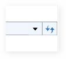

::: {style="DISPLAY: none"}
{#d2h_url_template}{#d2h_package_url style="WIDTH: 0px; DISPLAY: none; HEIGHT: 0px"}
:::

::: {.d2h_secondary_topic style="PADDING-BOTTOM: 10pt; MARGIN: 0pt; PADDING-LEFT: 0pt; PADDING-RIGHT: 0pt; PADDING-TOP: 0pt"}
#### Showing history

Whenever a user navigates to a different path, the previous paths will be saved. Those paths can be shown by clicking on the arrow near the Refresh Button. Doing so will display a drop-down box with a list of all the previous paths.

[{width="26" height="31"}]{style="Z-INDEX: 251796480; POSITION: absolute; MARGIN-TOP: 34px; WIDTH: 26px; HEIGHT: 31px; MARGIN-LEFT: 280px; LEFT: 0px"}{border="0"}

Figure 1030: History button

[]{style="FONT-FAMILY: 'Calibri','sans-serif'"} 

[]{#related-topics}
:::
