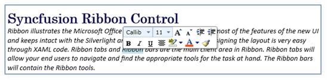

::: {style="DISPLAY: none"}
{#d2h_url_template}{#d2h_package_url style="WIDTH: 0px; DISPLAY: none; HEIGHT: 0px"}
:::

::: {.d2h_secondary_topic style="PADDING-BOTTOM: 10pt; MARGIN: 0pt; PADDING-LEFT: 0pt; PADDING-RIGHT: 0pt; PADDING-TOP: 0pt"}
#### []{#_Show_Mini_Toolbar}Show Mini Toolbar on Mouse Move

Usually, in Office Applications the mini toolbar is shown when the text in the Editor is selected. The scenario can be implemented as follows.

+------------------------------------------------------------------------------------------------------------------------------------------------------------------------------------------------------------------+
| [C#[ ]{style="COLOR: blue"}]{style="FONT-FAMILY: 'Courier New'"}                                                                                                                                                 |
|                                                                                                                                                                                                                  |
| []{style="FONT-FAMILY: 'Courier New'; COLOR: blue"}                                                                                                                                                              |
|                                                                                                                                                                                                                  |
| [Private void]{style="FONT-FAMILY: 'Courier New'; COLOR: blue"}[ Editor_MouseMove([object]{style="COLOR: blue"} sender, [MouseEventArgs]{style="COLOR: #2b91af"} e)]{style="FONT-FAMILY: 'Courier New'"}         |
|                                                                                                                                                                                                                  |
| [{]{style="FONT-FAMILY: 'Courier New'"}                                                                                                                                                                          |
|                                                                                                                                                                                                                  |
| [     \_mousepos = e.GetPosition(Editor);]{style="FONT-FAMILY: 'Courier New'"}                                                                                                                                   |
|                                                                                                                                                                                                                  |
| [     [if]{style="COLOR: blue"} (Editor.Selection.Text.Length == 0)]{style="FONT-FAMILY: 'Courier New'"}                                                                                                         |
|                                                                                                                                                                                                                  |
| [     {]{style="FONT-FAMILY: 'Courier New'"}                                                                                                                                                                     |
|                                                                                                                                                                                                                  |
| [          minitoolbar.IsOpen = [false]{style="COLOR: blue"};]{style="FONT-FAMILY: 'Courier New'"}                                                                                                               |
|                                                                                                                                                                                                                  |
| [     }]{style="FONT-FAMILY: 'Courier New'"}                                                                                                                                                                     |
|                                                                                                                                                                                                                  |
| [}]{style="FONT-FAMILY: 'Courier New'"}                                                                                                                                                                          |
|                                                                                                                                                                                                                  |
| []{style="FONT-FAMILY: 'Courier New'"}                                                                                                                                                                           |
|                                                                                                                                                                                                                  |
| [Private void]{style="FONT-FAMILY: 'Courier New'; COLOR: blue"}[ Editor_SelectionChanged([object]{style="COLOR: blue"} sender, [RoutedEventArgs]{style="COLOR: #2b91af"} e)]{style="FONT-FAMILY: 'Courier New'"} |
|                                                                                                                                                                                                                  |
| [{]{style="FONT-FAMILY: 'Courier New'"}                                                                                                                                                                          |
|                                                                                                                                                                                                                  |
| [     [if]{style="COLOR: blue"} (minitoolbar != [null]{style="COLOR: blue"})]{style="FONT-FAMILY: 'Courier New'"}                                                                                                |
|                                                                                                                                                                                                                  |
| [     {]{style="FONT-FAMILY: 'Courier New'"}                                                                                                                                                                     |
|                                                                                                                                                                                                                  |
| [         minitoolbar.Target = Editor;]{style="FONT-FAMILY: 'Courier New'"}                                                                                                                                      |
|                                                                                                                                                                                                                  |
| [         minitoolbar.HorizontalOffset = \_mousepos.X;]{style="FONT-FAMILY: 'Courier New'"}                                                                                                                      |
|                                                                                                                                                                                                                  |
| [         minitoolbar.VerticalOffset = \_mousepos.Y;]{style="FONT-FAMILY: 'Courier New'"}                                                                                                                        |
|                                                                                                                                                                                                                  |
| [         minitoolbar.IsOpen = [true]{style="COLOR: blue"};]{style="FONT-FAMILY: 'Courier New'"}                                                                                                                 |
|                                                                                                                                                                                                                  |
| [     } ]{style="FONT-FAMILY: 'Courier New'"}                                                                                                                                                                    |
|                                                                                                                                                                                                                  |
| [}]{style="FONT-FAMILY: 'Courier New'"}                                                                                                                                                                          |
+------------------------------------------------------------------------------------------------------------------------------------------------------------------------------------------------------------------+

[]{style="FONT-FAMILY: 'Calibri','sans-serif'"} 

The output will be as follows:

{border="0"}

Figure 700: ScreenTip

[]{#related-topics}
:::
