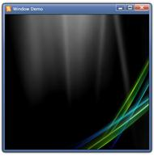
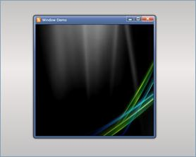

::: {style="DISPLAY: none"}
{#d2h_url_template}{#d2h_package_url style="WIDTH: 0px; DISPLAY: none; HEIGHT: 0px"}
:::

::: {.d2h_secondary_topic style="PADDING-BOTTOM: 10pt; MARGIN: 0pt; PADDING-LEFT: 0pt; PADDING-RIGHT: 0pt; PADDING-TOP: 0pt"}
##### []{#_Show_Window_Control_1}Show Window Control

 

The Window Control can be shown using two Methods namely Show() and ShowDialog().

[·      ]{style="FONT-FAMILY: Symbol"}Show() -- Shows the Window normally and

[·      ]{style="FONT-FAMILY: Symbol"}ShowDialog() -- Shows the Window as a Modal Dialog

 

+--------------------------------------------------------------------------------------------------------------------------------------------------------------------------------------------------------------------+
| C#                                                                                                                                                                                                                 |
+--------------------------------------------------------------------------------------------------------------------------------------------------------------------------------------------------------------------+
| [WindowControl]{style="FONT-FAMILY: Consolas; COLOR: #2b91af; FONT-SIZE: 9.5pt"}[ window = [new]{style="COLOR: blue"} [WindowControl]{style="COLOR: #2b91af"}();]{style="FONT-FAMILY: Consolas; FONT-SIZE: 9.5pt"} |
|                                                                                                                                                                                                                    |
| [window.Title = [\"Window Demo\"]{style="COLOR: #a31515"};]{style="FONT-FAMILY: Consolas; FONT-SIZE: 9.5pt"}                                                                                                       |
|                                                                                                                                                                                                                    |
| [window.Show();]{style="FONT-FAMILY: Consolas; FONT-SIZE: 9.5pt"}                                                                                                                                                  |
+--------------------------------------------------------------------------------------------------------------------------------------------------------------------------------------------------------------------+

 

{border="0"}

Figure 1086: A typical Window Control

+--------------------------------------------------------------------------------------------------------------------------------------------------------------------------------------------------------------------+
| C#                                                                                                                                                                                                                 |
+--------------------------------------------------------------------------------------------------------------------------------------------------------------------------------------------------------------------+
| [WindowControl]{style="FONT-FAMILY: Consolas; COLOR: #2b91af; FONT-SIZE: 9.5pt"}[ window = [new]{style="COLOR: blue"} [WindowControl]{style="COLOR: #2b91af"}();]{style="FONT-FAMILY: Consolas; FONT-SIZE: 9.5pt"} |
|                                                                                                                                                                                                                    |
| [window.Title = [\"Window Demo\"]{style="COLOR: #a31515"};]{style="FONT-FAMILY: Consolas; FONT-SIZE: 9.5pt"}                                                                                                       |
|                                                                                                                                                                                                                    |
| [window.OverlayBrush = [new]{style="COLOR: blue"} [SolidColorBrush]{style="COLOR: #2b91af"}([Colors]{style="COLOR: #2b91af"}.Gray);]{style="FONT-FAMILY: Consolas; FONT-SIZE: 9.5pt"}                              |
|                                                                                                                                                                                                                    |
| [window.ShowDialog();]{style="FONT-FAMILY: Consolas; FONT-SIZE: 9.5pt"}                                                                                                                                            |
+--------------------------------------------------------------------------------------------------------------------------------------------------------------------------------------------------------------------+

 

{border="0"}

Figure 1087: A typical Modal Dialog Window.

[]{#related-topics}
:::
