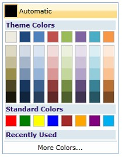

::: {style="DISPLAY: none"}
{#d2h_url_template}{#d2h_package_url style="WIDTH: 0px; DISPLAY: none; HEIGHT: 0px"}
:::

::: {.d2h_secondary_topic style="PADDING-BOTTOM: 10pt; MARGIN: 0pt; PADDING-LEFT: 0pt; PADDING-RIGHT: 0pt; PADDING-TOP: 0pt"}
#### Silverlight Color Picker / Expanded Mode      []{#p436}

 

Silverlight Color Picker now supports **Expanded Mode**. By enabling this feature the Color Picker will always be expanded.

[]{style="FONT-FAMILY: 'Calibri','sans-serif'; FONT-SIZE: 12pt"} 

Getting Expanded Mode

 

**IsExpanded** -- Gets or sets a value indicating whether the Color picker should be expanded mode or not. This is a dependency property. Set this property to **true**  enable expand mode.

 

Enable Expand Mode, by using the following code.

 

+----------------------------------------------------------------------------------------------------------------------------------------------+
| **[\[XAML\]]{style="FONT-FAMILY: 'Courier New'; COLOR: black"}**                                                                             |
|                                                                                                                                              |
| **[]{style="FONT-FAMILY: 'Courier New'; COLOR: black"}**                                                                                     |
|                                                                                                                                              |
| [\<syncfusion:ColorPickerPalette Width=\"200\" Name=\"ColorPicker\" IsExpanded=\"True\"/\>]{style="FONT-FAMILY: 'Courier New'; COLOR: blue"} |
+----------------------------------------------------------------------------------------------------------------------------------------------+

 

+---------------------------------------------------------------------------------------------------------------------------------------------------------------------------------------------------------------------------------------------------------------------------------------------------------------------------------------------------------------------------------------+
| **[\[C#\]]{style="FONT-FAMILY: 'Courier New'; COLOR: black"}**                                                                                                                                                                                                                                                                                                                        |
|                                                                                                                                                                                                                                                                                                                                                                                       |
| **[]{style="FONT-FAMILY: 'Courier New'; COLOR: black"}**                                                                                                                                                                                                                                                                                                                              |
|                                                                                                                                                                                                                                                                                                                                                                                       |
| [ColorPickerPalette colorpicker]{style="FONT-FAMILY: 'Courier New'; COLOR: #33cccc"}[ = ]{style="FONT-FAMILY: 'Courier New'; COLOR: black"}[new]{style="FONT-FAMILY: 'Courier New'; COLOR: blue"}[ ]{style="FONT-FAMILY: 'Courier New'; COLOR: black"}[ColorPickerPalette]{style="FONT-FAMILY: 'Courier New'; COLOR: #33cccc"}[();]{style="FONT-FAMILY: 'Courier New'; COLOR: black"} |
|                                                                                                                                                                                                                                                                                                                                                                                       |
| [colorpicker.IsExpanded = ]{style="FONT-FAMILY: 'Courier New'; COLOR: black"}[true]{style="FONT-FAMILY: 'Courier New'; COLOR: blue"}[;]{style="FONT-FAMILY: 'Courier New'; COLOR: black"}                                                                                                                                                                                             |
|                                                                                                                                                                                                                                                                                                                                                                                       |
| []{style="FONT-FAMILY: 'Courier New'; COLOR: blue"}                                                                                                                                                                                                                                                                                                                                   |
+---------------------------------------------------------------------------------------------------------------------------------------------------------------------------------------------------------------------------------------------------------------------------------------------------------------------------------------------------------------------------------------+

 

When the code runs the following output displays.

 

[]{style="FONT-FAMILY: 'Calibri','sans-serif'; FONT-SIZE: 12pt"} 

{border="0"}

Figure 973: Expanded Mode

[]{#related-topics}
:::
