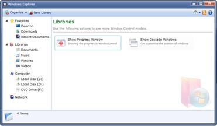

::: {style="DISPLAY: none"}
{#d2h_url_template}{#d2h_package_url style="WIDTH: 0px; DISPLAY: none; HEIGHT: 0px"}
:::

::::: {#nsbanner .d2h_main_nsbanner style="BORDER-BOTTOM: #999999 1px solid; POSITION: relative; PADDING-BOTTOM: 0px; BACKGROUND-COLOR: transparent; PADDING-LEFT: 0px; PADDING-RIGHT: 0px; DISPLAY: none; BORDER-TOP: #999999 1px solid; PADDING-TOP: 0px; LEFT: 0px"}
:::: {#TitleRow .d2h_main_titlerow style="PADDING-BOTTOM: 4px; BACKGROUND-COLOR: transparent; PADDING-LEFT: 22px; WIDTH: 100%; PADDING-RIGHT: 10px; DISPLAY: none; PADDING-TOP: 4px"}
::: {#ienav .d2h_main_ienav style="DISPLAY: none"}
{#D2HPrevious .D2HPreviousEnabled}  {#D2HNext .D2HNextEnabled}
:::
::::
:::::

::: {#nstext .d2h_main_nstext style="PADDING-BOTTOM: 10px; BACKGROUND-COLOR: transparent; PADDING-LEFT: 22px; PADDING-RIGHT: 10px; HEIGHT: 100%; OVERFLOW: auto; PADDING-TOP: 5px" hasuserbackground="true" valign="bottom"}
## Silverlight Window Control

The Syncfusion Window Control provides a highly customizable model and modeless dialogs around the application. The predefined dialogs (Alert and Prompt) replace the traditional dialog boxes with huge customizations. The window state and position can also easily configure in XAML or code behind.

{border="0"}

Figure 1082: Windows Explorer

More:

[ ]{#related-topics}

[{border="0" align="absMiddle"}Control Structure](ms-xhelp:///?Id=17a0ea65-6e54-4a75-84f1-bd8d14182bd9){style="TEXT-DECORATION: none"}

[{border="0" align="absMiddle"}Getting Started](ms-xhelp:///?Id=f082eefa-6b03-43f6-9ca9-4e4027755494){style="TEXT-DECORATION: none"}

[{border="0" align="absMiddle"}Concepts and Features](ms-xhelp:///?Id=ae6de66c-4431-4b7c-8297-071293110651){style="TEXT-DECORATION: none"}

[{border="0" align="absMiddle"}Events](ms-xhelp:///?Id=c51f41aa-f556-4ea3-aea1-d3166e1531ce){style="TEXT-DECORATION: none"}

[{border="0" align="absMiddle"}Localization](ms-xhelp:///?Id=0eb53638-99c1-4d41-bcae-97b15b01d494){style="TEXT-DECORATION: none"}

[{border="0" align="absMiddle"}How To](ms-xhelp:///?Id=28cb3aa4-0b0d-43b8-9802-539faac7489c){style="TEXT-DECORATION: none"}
:::
