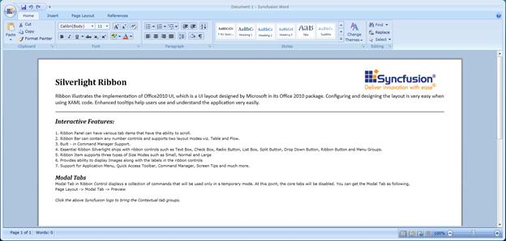
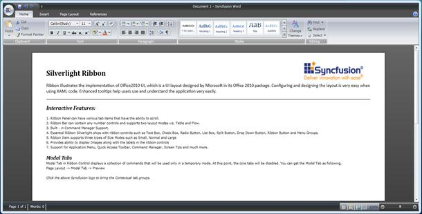
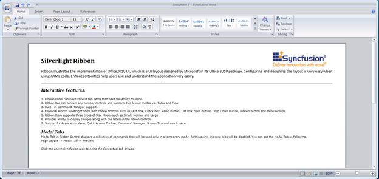
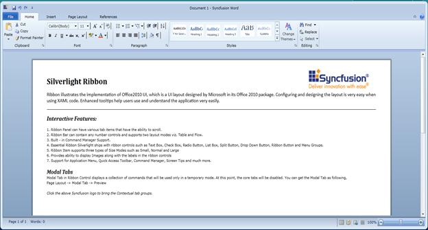
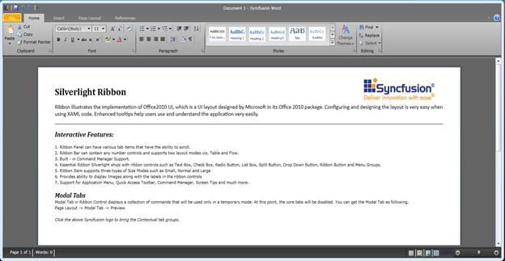
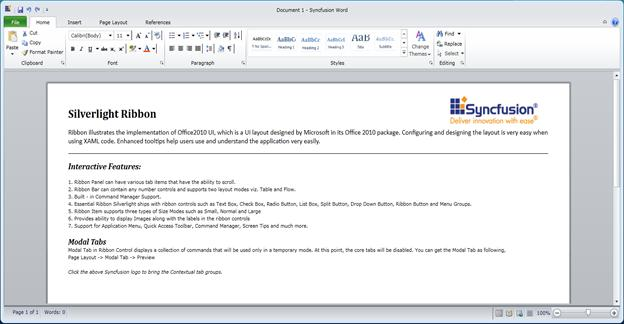
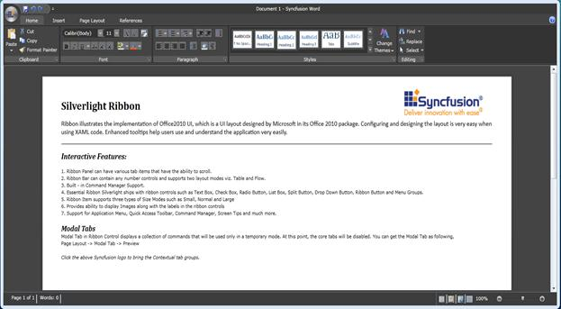
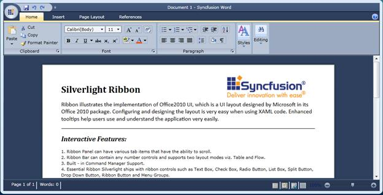

::: {style="DISPLAY: none"}
{#d2h_url_template}{#d2h_package_url style="WIDTH: 0px; DISPLAY: none; HEIGHT: 0px"}
:::

::: {.d2h_secondary_topic style="PADDING-BOTTOM: 10pt; MARGIN: 0pt; PADDING-LEFT: 0pt; PADDING-RIGHT: 0pt; PADDING-TOP: 0pt"}
#### []{#_Skins}Skins

 

The supported skins for Ribbon Control are mentioned below:

 

[·      ]{style="FONT-FAMILY: Symbol"}Office2007Blue

[·      ]{style="FONT-FAMILY: Symbol"}Office2007Black

[·      ]{style="FONT-FAMILY: Symbol"}Office2007Silver

[·      ]{style="FONT-FAMILY: Symbol"}Office2010Blue

[·      ]{style="FONT-FAMILY: Symbol"}Office2010Black

[·      ]{style="FONT-FAMILY: Symbol"}Office2010Silver

[·      ]{style="FONT-FAMILY: Symbol"}VS2010

[·      ]{style="FONT-FAMILY: Symbol"}Blend

Add the following assemblies to apply the corresponding theme for Ribbon Control:

 

[·      ]{style="FONT-FAMILY: Symbol"}Syncfusion.Theming.Office2007Blue.dll

[·      ]{style="FONT-FAMILY: Symbol"}Syncfusion.Theming.Office2007Black.dll

[·      ]{style="FONT-FAMILY: Symbol"}Syncfusion.Theming.Office2007Silver.dll

[·      ]{style="FONT-FAMILY: Symbol"}Syncfusion.Theming.Office2010Blue.dll

[·      ]{style="FONT-FAMILY: Symbol"}Syncfusion.Theming.Office2010Black.dll

[·      ]{style="FONT-FAMILY: Symbol"}Syncfusion.Theming.Office2010Silver.dll

[·      ]{style="FONT-FAMILY: Symbol"}Syncfusion.Theming.VS2010.dll

[·      ]{style="FONT-FAMILY: Symbol"}Syncfusion.Theming.Blend.dll

 

Use Case Scenario

This feature helps users to apply the supported skins for Ribbon Control. The supported Skins are:

[·      ]{style="FONT-FAMILY: Symbol"}Office2007Blue

[·      ]{style="FONT-FAMILY: Symbol"}Office2007Black

[·      ]{style="FONT-FAMILY: Symbol"}Office2007Silver

[·      ]{style="FONT-FAMILY: Symbol"}Office2010Blue

[·      ]{style="FONT-FAMILY: Symbol"}Office2010Black

[·      ]{style="FONT-FAMILY: Symbol"}Office2010Silver

[·      ]{style="FONT-FAMILY: Symbol"}VS2010

[·      ]{style="FONT-FAMILY: Symbol"}Blend

 

 

Sample Link

 

 To run the Ribbon sample:

 

[·      ]{style="FONT-FAMILY: Symbol"}Open Essential Studio dashboard.

[·      ]{style="FONT-FAMILY: Symbol"}Click **Run locally installed samples** from the **Silverlight** drop-down list.

[·      ]{style="FONT-FAMILY: Symbol"}Select **Tools** on the sample browser.

[·      ]{style="FONT-FAMILY: Symbol"}Select **Ribbon** -\> **Ribbon Instance Demo**.

 

How to Apply Skins?

We can apply skins for Ribbon control in code-behind using the following code snippet:

 

+-----------------------------------------------------------------------------------------------------------------------------------------------------------------------------------------------------------------------------+
| [\[C#\]]{style="FONT-FAMILY: 'Courier New'"}                                                                                                                                                                                |
|                                                                                                                                                                                                                             |
| [Ribbon]{style="FONT-FAMILY: 'Courier New'; COLOR: #2b91af"}[ myRibbon = [new]{style="COLOR: blue"} [Ribbon]{style="COLOR: #2b91af"}();[]{style="COLOR: #2b91af"}]{style="FONT-FAMILY: 'Courier New'"}                      |
|                                                                                                                                                                                                                             |
| [SkinManager]{style="FONT-FAMILY: 'Courier New'; COLOR: #2b91af"}[.SetVisualStyle(myRibbon, Syncfusion.Windows.Controls.Theming.[VisualStyle]{style="COLOR: #2b91af"}.Office2007Blue);]{style="FONT-FAMILY: 'Courier New'"} |
+-----------------------------------------------------------------------------------------------------------------------------------------------------------------------------------------------------------------------------+

 

We can apply skins in XAML using the following code snippet:

 

+--------------------------------------------------------------------------------------------------------------------------------------------------------------------------------------------------------------------------------------------------------------------------------------------------------------------------------------------------------------------------------------------------------------------------------------------------------------------------------------------------------------------------------------------------------------------------------------------------------------------------------------------+
| **[\[XAML\]]{style="FONT-FAMILY: 'Courier New'"}**                                                                                                                                                                                                                                                                                                                                                                                                                                                                                                                                                                                         |
|                                                                                                                                                                                                                                                                                                                                                                                                                                                                                                                                                                                                                                            |
| **[]{style="FONT-FAMILY: 'Courier New'"}**                                                                                                                                                                                                                                                                                                                                                                                                                                                                                                                                                                                                 |
|                                                                                                                                                                                                                                                                                                                                                                                                                                                                                                                                                                                                                                            |
| [ [\<]{style="COLOR: blue"}[syncfusion]{style="COLOR: #a31515"}[:]{style="COLOR: blue"}[Ribbon]{style="COLOR: #a31515"}[ x]{style="COLOR: red"}[:]{style="COLOR: blue"}[Name]{style="COLOR: red"}[=\"myRibbon\"   ]{style="COLOR: blue"}]{style="FONT-FAMILY: 'Courier New'"}[Syncfusion]{style="FONT-FAMILY: 'Courier New'; COLOR: red"}[:]{style="FONT-FAMILY: 'Courier New'; COLOR: blue"}[SkinManager.VisualStyle]{style="FONT-FAMILY: 'Courier New'; COLOR: red"}[=\"Office2007Blue\"]{style="FONT-FAMILY: 'Courier New'; COLOR: blue"}[  ]{style="FONT-FAMILY: 'Courier New'"}[/\>]{style="FONT-FAMILY: 'Courier New'; COLOR: blue"} |
+--------------------------------------------------------------------------------------------------------------------------------------------------------------------------------------------------------------------------------------------------------------------------------------------------------------------------------------------------------------------------------------------------------------------------------------------------------------------------------------------------------------------------------------------------------------------------------------------------------------------------------------------+

 

The output for the above code snippet is displayed in the following screenshot:

 

{border="0"}

Figure 656: Office2007Blue Theme for Ribbon

 

 

 

The various Themes of Ribbon control are displayed in the following screenshots:

 

{border="0"}

Figure 657: Office2007Black Theme for Ribbon

**** 

{border="0"}

Figure 658: Office2007Silver Theme for Ribbon

 

{border="0"}

Figure 659: Office2010Blue Theme for Ribbon

 

{border="0"}

Figure 660: Office2010Black Theme for Ribbon

 

{border="0"}

Figure 661: Office2010Silver Theme for Ribbon

 

 

{border="0"}

Figure 662: Blend Theme for Ribbon

 

{border="0"}

Figure 663: VS2010 Theme for Ribbon

 

See Also

[[·      ]{style="FONT-FAMILY: Symbol; TEXT-DECORATION: none; text-underline: none"}]{.UGHyperlink}[How to apply custom theme]{.UGHyperlink}[s]{.UGHyperlink}

[]{#related-topics}
:::
