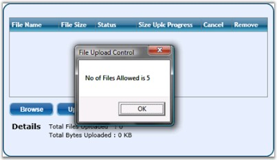

::: {style="DISPLAY: none"}
{#d2h_url_template}{#d2h_package_url style="WIDTH: 0px; DISPLAY: none; HEIGHT: 0px"}
:::

::: {.d2h_secondary_topic style="PADDING-BOTTOM: 10pt; MARGIN: 0pt; PADDING-LEFT: 0pt; PADDING-RIGHT: 0pt; PADDING-TOP: 0pt"}
#### []{#p176}[]{#_Specifying_Total_Number}Specifying Total Number of Files

 

You can make use of the **NoOfFilesAllowed** property to set the no of files that can be uploaded. This property can be used as follows.

 

+------------------------------------------------------------------------------------------------------------------------------------------------------------------------------------------------------------------------------------------------------------------------------------------------------------------------------------------------------------------------------------------------------------------------------------------------------------------------------------+
| **[\[XAML\]]{style="FONT-FAMILY: 'Courier New'; COLOR: black"}**                                                                                                                                                                                                                                                                                                                                                                                                                   |
|                                                                                                                                                                                                                                                                                                                                                                                                                                                                                    |
| []{style="FONT-FAMILY: 'Courier New'; COLOR: black"}                                                                                                                                                                                                                                                                                                                                                                                                                               |
|                                                                                                                                                                                                                                                                                                                                                                                                                                                                                    |
| [\<]{style="FONT-FAMILY: 'Courier New'; COLOR: blue"}[syncfusion]{style="FONT-FAMILY: 'Courier New'; COLOR: #a31515"}[:]{style="FONT-FAMILY: 'Courier New'; COLOR: blue"}[FileUploadControl]{style="FONT-FAMILY: 'Courier New'; COLOR: #a31515"}[ [x]{style="COLOR: #a31515"}[:]{style="COLOR: blue"}[Name]{style="COLOR: red"}[=\"FileUpload1\"]{style="COLOR: blue"} [NoOfFilesAllowed]{style="COLOR: red"}[=\"5\"/\>]{style="COLOR: blue"}]{style="FONT-FAMILY: 'Courier New'"} |
+------------------------------------------------------------------------------------------------------------------------------------------------------------------------------------------------------------------------------------------------------------------------------------------------------------------------------------------------------------------------------------------------------------------------------------------------------------------------------------+

 

+---------------------------------------------------------------------------------------------------------------------------------------------------------------------+
| **[\[C#\]]{style="FONT-FAMILY: 'Courier New'; COLOR: black"}**                                                                                                      |
|                                                                                                                                                                     |
| []{style="FONT-FAMILY: 'Courier New'"}                                                                                                                              |
|                                                                                                                                                                     |
| [FileUploadControl]{style="FONT-FAMILY: 'Courier New'; COLOR: teal"}[ fileupload = [FileUploadControl]{style="COLOR: teal"}();]{style="FONT-FAMILY: 'Courier New'"} |
|                                                                                                                                                                     |
| [fileupload.NoOfFilesAllowed = 5;]{style="FONT-FAMILY: 'Courier New'"}                                                                                              |
+---------------------------------------------------------------------------------------------------------------------------------------------------------------------+

[]{style="COLOR: black"} 

[{border="0"}]{style="COLOR: black"}[]{style="COLOR: black"}

 

Figure 371: NoOfFilesAllowed = \"5\"

[]{#related-topics}
:::
