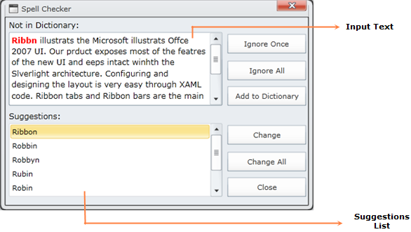

::: {style="DISPLAY: none"}
{#d2h_url_template}{#d2h_package_url style="WIDTH: 0px; DISPLAY: none; HEIGHT: 0px"}
:::

::::: {#nsbanner .d2h_main_nsbanner style="BORDER-BOTTOM: #999999 1px solid; POSITION: relative; PADDING-BOTTOM: 0px; BACKGROUND-COLOR: transparent; PADDING-LEFT: 0px; PADDING-RIGHT: 0px; DISPLAY: none; BORDER-TOP: #999999 1px solid; PADDING-TOP: 0px; LEFT: 0px"}
:::: {#TitleRow .d2h_main_titlerow style="PADDING-BOTTOM: 4px; BACKGROUND-COLOR: transparent; PADDING-LEFT: 22px; WIDTH: 100%; PADDING-RIGHT: 10px; DISPLAY: none; PADDING-TOP: 4px"}
::: {#ienav .d2h_main_ienav style="DISPLAY: none"}
{#D2HPrevious .D2HPreviousEnabled}  {#D2HNext .D2HNextEnabled}
:::
::::
:::::

::: {#nstext .d2h_main_nstext style="PADDING-BOTTOM: 10px; BACKGROUND-COLOR: transparent; PADDING-LEFT: 22px; PADDING-RIGHT: 10px; HEIGHT: 100%; OVERFLOW: auto; PADDING-TOP: 5px" hasuserbackground="true" valign="bottom"}
## Spell Checker

Spell Checking engine allows you to find misspelled words in any control's text values. Using SpellCheckingDialog, we can perform spell checking on any input control and it will also provide sugggestions for the misspelled words.

Use Case Scenarios[[]{style="FONT-SIZE: 16pt; FONT-WEIGHT: normal"}]{.Heading3Char}

You can use Spell Checker to correct spelling mistakes in any input text.

 

Appearance of the SpellCheckDialog

Spell Checking engine contains in-built dialog for checking spellings.

 

{border="0"}

Figure 35: Spell Checking Dialog

The Input Text is the text given as input to the spell checker for checking spellings. The word that is spell-checked will be highlighted in Red color

The Suggestions List is the list box, which will show the suggestions for the currently spell checked word.

Adding Spell Checker to an Application

SpellChecker is a spell checking engine. Using SpellCheck method, you can check spellings for any text. This method will return the suggestions available for the input text.  So for checking spellings for any input text, we need to use the following code snippet.

 

+---------------------------------------------------------------------------------------------------------------------+
| [\[C#\]]{style="FONT-FAMILY: 'Courier New'"}                                                                        |
|                                                                                                                     |
| [SpellChecker SpellCheck = new SpellChecker();]{style="FONT-FAMILY: 'Courier New'"}                                 |
|                                                                                                                     |
| [SpellCheck. SpellCheck("pass the input text that needs to be spell checked");]{style="FONT-FAMILY: 'Courier New'"} |
|                                                                                                                     |
| []{style="FONT-FAMILY: 'Courier New'; FONT-SIZE: 9.5pt"}                                                            |
+---------------------------------------------------------------------------------------------------------------------+

 

More:

[ ]{#related-topics}

[{border="0" align="absMiddle"}Features of Spell Checker](ms-xhelp:///?Id=dda1c997-5881-4192-bd0e-7bb6051a9ae7){style="TEXT-DECORATION: none"}
:::
