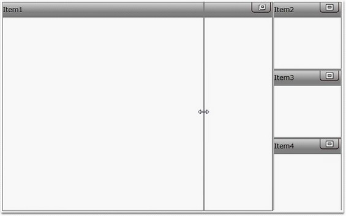
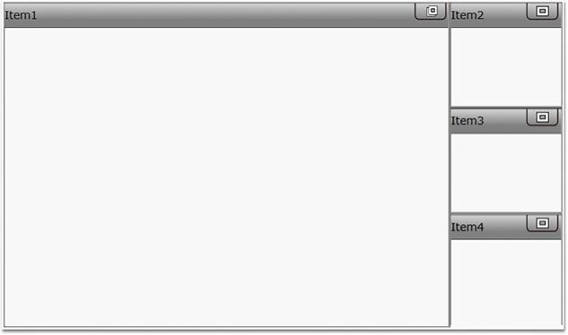
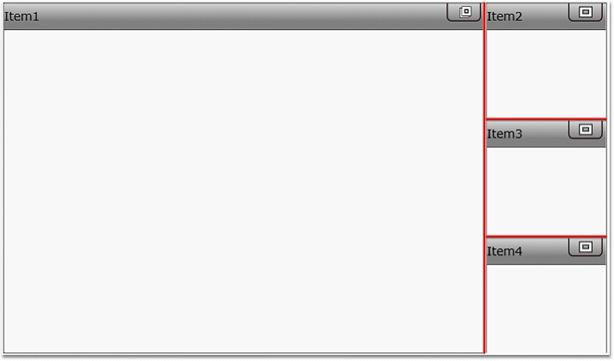
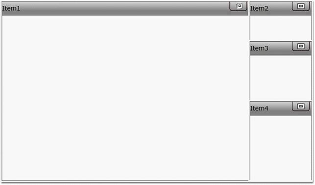
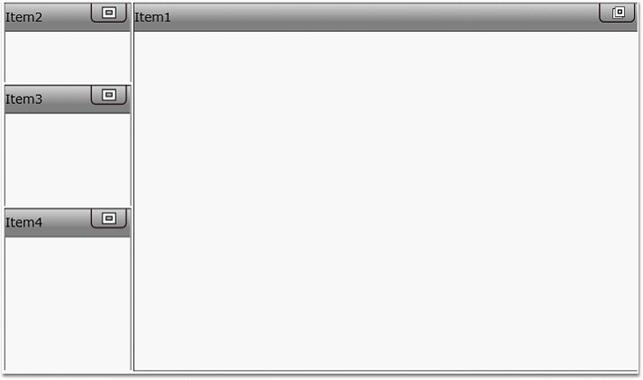
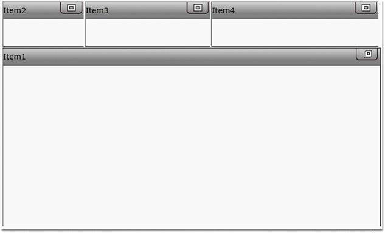
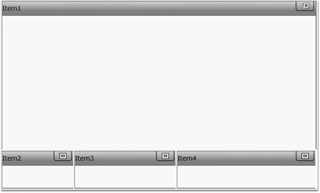

::: {style="DISPLAY: none"}
{#d2h_url_template}{#d2h_package_url style="WIDTH: 0px; DISPLAY: none; HEIGHT: 0px"}
:::

::::: {#nsbanner .d2h_main_nsbanner style="BORDER-BOTTOM: #999999 1px solid; POSITION: relative; PADDING-BOTTOM: 0px; BACKGROUND-COLOR: transparent; PADDING-LEFT: 0px; PADDING-RIGHT: 0px; DISPLAY: none; BORDER-TOP: #999999 1px solid; PADDING-TOP: 0px; LEFT: 0px"}
:::: {#TitleRow .d2h_main_titlerow style="PADDING-BOTTOM: 4px; BACKGROUND-COLOR: transparent; PADDING-LEFT: 22px; WIDTH: 100%; PADDING-RIGHT: 10px; DISPLAY: none; PADDING-TOP: 4px"}
::: {#ienav .d2h_main_ienav style="DISPLAY: none"}
{#D2HPrevious .D2HPreviousEnabled}  {#D2HNext .D2HNextEnabled}
:::
::::
:::::

:::::: {#nstext .d2h_main_nstext style="PADDING-BOTTOM: 10px; BACKGROUND-COLOR: transparent; PADDING-LEFT: 22px; PADDING-RIGHT: 10px; HEIGHT: 100%; OVERFLOW: auto; PADDING-TOP: 5px" hasuserbackground="true" valign="bottom"}
### []{#_Skin_Manager}Splitter

[]{#p439} 

Splitter is introduced in tile view control for resizing the **Tile view Items** dynamically.

 

By using this splitter users can resize the **Tile view Items** when it is in minimized and maximized state in order to make the control user-friendly.

 

Users can customize the color of the splitter by setting the **SplitterColor** property for **Tile view control**.

 

::: {style="BORDER-BOTTOM: windowtext 1pt solid; BORDER-LEFT: medium none; PADDING-BOTTOM: 1pt; MARGIN-TOP: 9pt; PADDING-LEFT: 0pt; PADDING-RIGHT: 0pt; MARGIN-BOTTOM: 9pt; BORDER-TOP: windowtext 1pt solid; BORDER-RIGHT: medium none; PADDING-TOP: 1pt"}
{border="0"}Note: Default value is gray.
:::

 

+-------------------------------------------------------------------------------------------------------------------------------------------------------------------------------------------------------------------------------------------------------------------------------------------------------------------------------------------------------------------------------------------------------------------------------------------------------------------------------------------------+
| **[\[XAML\]]{style="FONT-FAMILY: 'Calibri','sans-serif'; COLOR: black"}**                                                                                                                                                                                                                                                                                                                                                                                                                       |
|                                                                                                                                                                                                                                                                                                                                                                                                                                                                                                 |
| [\<]{style="FONT-FAMILY: Consolas; COLOR: blue"}[syncfusion]{style="FONT-FAMILY: Consolas; COLOR: #a31515"}[:]{style="FONT-FAMILY: Consolas; COLOR: blue"}[TileViewControl]{style="FONT-FAMILY: Consolas; COLOR: #a31515"}[ MinimizedItemsOrientation]{style="FONT-FAMILY: Consolas; COLOR: red"}[=\"Right\" ]{style="FONT-FAMILY: Consolas; COLOR: blue"}                                                                                                                                      |
|                                                                                                                                                                                                                                                                                                                                                                                                                                                                                                 |
| [SplitterVisibility]{style="FONT-FAMILY: Consolas; COLOR: red"}[=\"Visible\>]{style="FONT-FAMILY: Consolas; COLOR: blue"}                                                                                                                                                                                                                                                                                                                                                                       |
|                                                                                                                                                                                                                                                                                                                                                                                                                                                                                                 |
| [            ]{style="FONT-FAMILY: Consolas; COLOR: #a31515"}[\<]{style="FONT-FAMILY: Consolas; COLOR: blue"}[syncfusion]{style="FONT-FAMILY: Consolas; COLOR: #a31515"}[:]{style="FONT-FAMILY: Consolas; COLOR: blue"}[TileViewItem]{style="FONT-FAMILY: Consolas; COLOR: #a31515"}[ Header]{style="FONT-FAMILY: Consolas; COLOR: red"}[=\"Item1\"]{style="FONT-FAMILY: Consolas; COLOR: blue"}[ ]{style="FONT-FAMILY: Consolas; COLOR: red"}[/\>]{style="FONT-FAMILY: Consolas; COLOR: blue"} |
|                                                                                                                                                                                                                                                                                                                                                                                                                                                                                                 |
| [            ]{style="FONT-FAMILY: Consolas; COLOR: #a31515"}[\<]{style="FONT-FAMILY: Consolas; COLOR: blue"}[syncfusion]{style="FONT-FAMILY: Consolas; COLOR: #a31515"}[:]{style="FONT-FAMILY: Consolas; COLOR: blue"}[TileViewItem]{style="FONT-FAMILY: Consolas; COLOR: #a31515"}[ Header]{style="FONT-FAMILY: Consolas; COLOR: red"}[=\"Item2\"]{style="FONT-FAMILY: Consolas; COLOR: blue"}[ ]{style="FONT-FAMILY: Consolas; COLOR: red"}[/\>]{style="FONT-FAMILY: Consolas; COLOR: blue"} |
|                                                                                                                                                                                                                                                                                                                                                                                                                                                                                                 |
| [            ]{style="FONT-FAMILY: Consolas; COLOR: #a31515"}[\<]{style="FONT-FAMILY: Consolas; COLOR: blue"}[syncfusion]{style="FONT-FAMILY: Consolas; COLOR: #a31515"}[:]{style="FONT-FAMILY: Consolas; COLOR: blue"}[TileViewItem]{style="FONT-FAMILY: Consolas; COLOR: #a31515"}[ Header]{style="FONT-FAMILY: Consolas; COLOR: red"}[=\"Item3\"]{style="FONT-FAMILY: Consolas; COLOR: blue"}[ ]{style="FONT-FAMILY: Consolas; COLOR: red"}[/\>]{style="FONT-FAMILY: Consolas; COLOR: blue"} |
|                                                                                                                                                                                                                                                                                                                                                                                                                                                                                                 |
| [            ]{style="FONT-FAMILY: Consolas; COLOR: #a31515"}[\<]{style="FONT-FAMILY: Consolas; COLOR: blue"}[syncfusion]{style="FONT-FAMILY: Consolas; COLOR: #a31515"}[:]{style="FONT-FAMILY: Consolas; COLOR: blue"}[TileViewItem]{style="FONT-FAMILY: Consolas; COLOR: #a31515"}[ Header]{style="FONT-FAMILY: Consolas; COLOR: red"}[=\"Item4\"]{style="FONT-FAMILY: Consolas; COLOR: blue"}[ ]{style="FONT-FAMILY: Consolas; COLOR: red"}[/\>]{style="FONT-FAMILY: Consolas; COLOR: blue"} |
|                                                                                                                                                                                                                                                                                                                                                                                                                                                                                                 |
| [\</]{style="FONT-FAMILY: Consolas; COLOR: blue"}[syncfusion]{style="FONT-FAMILY: Consolas; COLOR: #a31515"}[:]{style="FONT-FAMILY: Consolas; COLOR: blue"}[TileViewControl]{style="FONT-FAMILY: Consolas; COLOR: #a31515"}[\>]{style="FONT-FAMILY: Consolas; COLOR: blue"}                                                                                                                                                                                                                     |
+-------------------------------------------------------------------------------------------------------------------------------------------------------------------------------------------------------------------------------------------------------------------------------------------------------------------------------------------------------------------------------------------------------------------------------------------------------------------------------------------------+

[]{style="FONT-FAMILY: 'Calibri','sans-serif'; COLOR: black"} 

When the code runs, the following output displays.

 

{border="0"}

Figure 981:  Splitter While Dragging

[]{style="FONT-FAMILY: 'Calibri','sans-serif'; COLOR: black"} 

Changing the Visibility of the Splitter

 

Users can change the visibility of the splitter for the control by setting the **SplitterVisibility** property.

**SplitterVisibility -** The Visibility of the splitter can be set in this property.

 

::: {style="BORDER-BOTTOM: windowtext 1pt solid; BORDER-LEFT: medium none; PADDING-BOTTOM: 1pt; MARGIN-TOP: 9pt; PADDING-LEFT: 0pt; PADDING-RIGHT: 0pt; MARGIN-BOTTOM: 9pt; BORDER-TOP: windowtext 1pt solid; BORDER-RIGHT: medium none; PADDING-TOP: 1pt"}
{border="0"}Note: By default the visibility is set to Collapsed.
:::

 

Set the splitter visible, by using the following code.

 

+------------------------------------------------------------------------------------------------------------------------------------------------------------------------------------------------------------------------------------------------------------------------------------------------------------------------------------------------------------------------------------------------------------------------------------------------------------------------------------------------------------------------------------------------------------------------------------------------------------------------------+
| [\<]{style="FONT-FAMILY: Consolas; COLOR: blue"}[syncfusion]{style="FONT-FAMILY: Consolas; COLOR: #a31515"}[:]{style="FONT-FAMILY: Consolas; COLOR: blue"}[TileViewControl]{style="FONT-FAMILY: Consolas; COLOR: #a31515"}[ SplitterVisibility]{style="FONT-FAMILY: Consolas; COLOR: red"}[=\"Visible\"\>]{style="FONT-FAMILY: Consolas; COLOR: blue"}                                                                                                                                                                                                                                                                       |
|                                                                                                                                                                                                                                                                                                                                                                                                                                                                                                                                                                                                                              |
| [            ]{style="FONT-FAMILY: Consolas; COLOR: #a31515"}[\<]{style="FONT-FAMILY: Consolas; COLOR: blue"}[syncfusion]{style="FONT-FAMILY: Consolas; COLOR: #a31515"}[:]{style="FONT-FAMILY: Consolas; COLOR: blue"}[TileViewItem]{style="FONT-FAMILY: Consolas; COLOR: #a31515"}[ Header]{style="FONT-FAMILY: Consolas; COLOR: red"}[=\"Item1\"\>\</]{style="FONT-FAMILY: Consolas; COLOR: blue"}[syncfusion]{style="FONT-FAMILY: Consolas; COLOR: #a31515"}[:]{style="FONT-FAMILY: Consolas; COLOR: blue"}[TileViewItem]{style="FONT-FAMILY: Consolas; COLOR: #a31515"}[\>]{style="FONT-FAMILY: Consolas; COLOR: blue"} |
|                                                                                                                                                                                                                                                                                                                                                                                                                                                                                                                                                                                                                              |
| [            ]{style="FONT-FAMILY: Consolas; COLOR: #a31515"}[\<]{style="FONT-FAMILY: Consolas; COLOR: blue"}[syncfusion]{style="FONT-FAMILY: Consolas; COLOR: #a31515"}[:]{style="FONT-FAMILY: Consolas; COLOR: blue"}[TileViewItem]{style="FONT-FAMILY: Consolas; COLOR: #a31515"}[ Header]{style="FONT-FAMILY: Consolas; COLOR: red"}[=\"Item2\"\>\</]{style="FONT-FAMILY: Consolas; COLOR: blue"}[syncfusion]{style="FONT-FAMILY: Consolas; COLOR: #a31515"}[:]{style="FONT-FAMILY: Consolas; COLOR: blue"}[TileViewItem]{style="FONT-FAMILY: Consolas; COLOR: #a31515"}[\>]{style="FONT-FAMILY: Consolas; COLOR: blue"} |
|                                                                                                                                                                                                                                                                                                                                                                                                                                                                                                                                                                                                                              |
| [            ]{style="FONT-FAMILY: Consolas; COLOR: #a31515"}[\<]{style="FONT-FAMILY: Consolas; COLOR: blue"}[syncfusion]{style="FONT-FAMILY: Consolas; COLOR: #a31515"}[:]{style="FONT-FAMILY: Consolas; COLOR: blue"}[TileViewItem]{style="FONT-FAMILY: Consolas; COLOR: #a31515"}[ Header]{style="FONT-FAMILY: Consolas; COLOR: red"}[=\"Item3\"\>\</]{style="FONT-FAMILY: Consolas; COLOR: blue"}[syncfusion]{style="FONT-FAMILY: Consolas; COLOR: #a31515"}[:]{style="FONT-FAMILY: Consolas; COLOR: blue"}[TileViewItem]{style="FONT-FAMILY: Consolas; COLOR: #a31515"}[\>]{style="FONT-FAMILY: Consolas; COLOR: blue"} |
|                                                                                                                                                                                                                                                                                                                                                                                                                                                                                                                                                                                                                              |
| [            ]{style="FONT-FAMILY: Consolas; COLOR: #a31515"}[\<]{style="FONT-FAMILY: Consolas; COLOR: blue"}[syncfusion]{style="FONT-FAMILY: Consolas; COLOR: #a31515"}[:]{style="FONT-FAMILY: Consolas; COLOR: blue"}[TileViewItem]{style="FONT-FAMILY: Consolas; COLOR: #a31515"}[ Header]{style="FONT-FAMILY: Consolas; COLOR: red"}[=\"Item4\"\>\</]{style="FONT-FAMILY: Consolas; COLOR: blue"}[syncfusion]{style="FONT-FAMILY: Consolas; COLOR: #a31515"}[:]{style="FONT-FAMILY: Consolas; COLOR: blue"}[TileViewItem]{style="FONT-FAMILY: Consolas; COLOR: #a31515"}[\>]{style="FONT-FAMILY: Consolas; COLOR: blue"} |
|                                                                                                                                                                                                                                                                                                                                                                                                                                                                                                                                                                                                                              |
| [        ]{style="FONT-FAMILY: Consolas; COLOR: #a31515"}[\</]{style="FONT-FAMILY: Consolas; COLOR: blue"}[syncfusion]{style="FONT-FAMILY: Consolas; COLOR: #a31515"}[:]{style="FONT-FAMILY: Consolas; COLOR: blue"}[TileViewControl]{style="FONT-FAMILY: Consolas; COLOR: #a31515"}[\>]{style="FONT-FAMILY: Consolas; COLOR: blue"}                                                                                                                                                                                                                                                                                         |
+------------------------------------------------------------------------------------------------------------------------------------------------------------------------------------------------------------------------------------------------------------------------------------------------------------------------------------------------------------------------------------------------------------------------------------------------------------------------------------------------------------------------------------------------------------------------------------------------------------------------------+

 

When the code runs, the following output displays[.]{style="FONT-FAMILY: 'Times New Roman','serif'"}

[]{style="FONT-FAMILY: 'Calibri','sans-serif'; COLOR: black"} 

{border="0"}

Figure 982: Splitter is Visible.

 

**Splitter Color:** The color of the splitter can be set by the user according to their desired UI.

 

The following code illustrates this.

 

+------------------------------------------------------------------------------------------------------------------------------------------------------------------------------------------------------------------------------------------------------------------------------------------------------------------------------------------------------------------------------------------------------------------------------------------------------------------------------------------------------------------------------------------------------------------------------------------------------------------------------+
| [\<]{style="FONT-FAMILY: Consolas; COLOR: blue"}[syncfusion]{style="FONT-FAMILY: Consolas; COLOR: #a31515"}[:]{style="FONT-FAMILY: Consolas; COLOR: blue"}[TileViewControl]{style="FONT-FAMILY: Consolas; COLOR: #a31515"}[ SplitterVisibility]{style="FONT-FAMILY: Consolas; COLOR: red"}[=\"Visible\"]{style="FONT-FAMILY: Consolas; COLOR: blue"}[ SplitterColor]{style="FONT-FAMILY: Consolas; COLOR: red"}[=\"Red\"\>]{style="FONT-FAMILY: Consolas; COLOR: blue"}                                                                                                                                                      |
|                                                                                                                                                                                                                                                                                                                                                                                                                                                                                                                                                                                                                              |
| [            ]{style="FONT-FAMILY: Consolas; COLOR: #a31515"}[\<]{style="FONT-FAMILY: Consolas; COLOR: blue"}[syncfusion]{style="FONT-FAMILY: Consolas; COLOR: #a31515"}[:]{style="FONT-FAMILY: Consolas; COLOR: blue"}[TileViewItem]{style="FONT-FAMILY: Consolas; COLOR: #a31515"}[ Header]{style="FONT-FAMILY: Consolas; COLOR: red"}[=\"Item1\"\>\</]{style="FONT-FAMILY: Consolas; COLOR: blue"}[syncfusion]{style="FONT-FAMILY: Consolas; COLOR: #a31515"}[:]{style="FONT-FAMILY: Consolas; COLOR: blue"}[TileViewItem]{style="FONT-FAMILY: Consolas; COLOR: #a31515"}[\>]{style="FONT-FAMILY: Consolas; COLOR: blue"} |
|                                                                                                                                                                                                                                                                                                                                                                                                                                                                                                                                                                                                                              |
| [            ]{style="FONT-FAMILY: Consolas; COLOR: #a31515"}[\<]{style="FONT-FAMILY: Consolas; COLOR: blue"}[syncfusion]{style="FONT-FAMILY: Consolas; COLOR: #a31515"}[:]{style="FONT-FAMILY: Consolas; COLOR: blue"}[TileViewItem]{style="FONT-FAMILY: Consolas; COLOR: #a31515"}[ Header]{style="FONT-FAMILY: Consolas; COLOR: red"}[=\"Item2\"\>\</]{style="FONT-FAMILY: Consolas; COLOR: blue"}[syncfusion]{style="FONT-FAMILY: Consolas; COLOR: #a31515"}[:]{style="FONT-FAMILY: Consolas; COLOR: blue"}[TileViewItem]{style="FONT-FAMILY: Consolas; COLOR: #a31515"}[\>]{style="FONT-FAMILY: Consolas; COLOR: blue"} |
|                                                                                                                                                                                                                                                                                                                                                                                                                                                                                                                                                                                                                              |
| [            ]{style="FONT-FAMILY: Consolas; COLOR: #a31515"}[\<]{style="FONT-FAMILY: Consolas; COLOR: blue"}[syncfusion]{style="FONT-FAMILY: Consolas; COLOR: #a31515"}[:]{style="FONT-FAMILY: Consolas; COLOR: blue"}[TileViewItem]{style="FONT-FAMILY: Consolas; COLOR: #a31515"}[ Header]{style="FONT-FAMILY: Consolas; COLOR: red"}[=\"Item3\"\>\</]{style="FONT-FAMILY: Consolas; COLOR: blue"}[syncfusion]{style="FONT-FAMILY: Consolas; COLOR: #a31515"}[:]{style="FONT-FAMILY: Consolas; COLOR: blue"}[TileViewItem]{style="FONT-FAMILY: Consolas; COLOR: #a31515"}[\>]{style="FONT-FAMILY: Consolas; COLOR: blue"} |
|                                                                                                                                                                                                                                                                                                                                                                                                                                                                                                                                                                                                                              |
| [            ]{style="FONT-FAMILY: Consolas; COLOR: #a31515"}[\<]{style="FONT-FAMILY: Consolas; COLOR: blue"}[syncfusion]{style="FONT-FAMILY: Consolas; COLOR: #a31515"}[:]{style="FONT-FAMILY: Consolas; COLOR: blue"}[TileViewItem]{style="FONT-FAMILY: Consolas; COLOR: #a31515"}[ Header]{style="FONT-FAMILY: Consolas; COLOR: red"}[=\"Item4\"\>\</]{style="FONT-FAMILY: Consolas; COLOR: blue"}[syncfusion]{style="FONT-FAMILY: Consolas; COLOR: #a31515"}[:]{style="FONT-FAMILY: Consolas; COLOR: blue"}[TileViewItem]{style="FONT-FAMILY: Consolas; COLOR: #a31515"}[\>]{style="FONT-FAMILY: Consolas; COLOR: blue"} |
|                                                                                                                                                                                                                                                                                                                                                                                                                                                                                                                                                                                                                              |
| [        ]{style="FONT-FAMILY: Consolas; COLOR: #a31515"}[\</]{style="FONT-FAMILY: Consolas; COLOR: blue"}[syncfusion]{style="FONT-FAMILY: Consolas; COLOR: #a31515"}[:]{style="FONT-FAMILY: Consolas; COLOR: blue"}[TileViewControl]{style="FONT-FAMILY: Consolas; COLOR: #a31515"}[\>]{style="FONT-FAMILY: Consolas; COLOR: blue"}                                                                                                                                                                                                                                                                                         |
+------------------------------------------------------------------------------------------------------------------------------------------------------------------------------------------------------------------------------------------------------------------------------------------------------------------------------------------------------------------------------------------------------------------------------------------------------------------------------------------------------------------------------------------------------------------------------------------------------------------------------+

[            ]{style="FONT-FAMILY: Consolas; COLOR: #a31515"}

When the code runs, the following code displays.

 

{border="0"}

Figure 983: Splitter in Red Color.

 

Setting Height to Minimized items

 

The sizes of the minimized items can be given by the user in the units of **Gridlength**. If the Orientation of the **Tile view Item** is **Right** or **Left** then the Property **OnMinimizedHeight** works for aligning the minimized items. If the Orientation of the **Tile View Item** is **Top** or **Bottom** then the Property **OnMinimizedWidth** works for aligning the minimized items.

 

The following code illustrates **Right** Orientation of the **Tile view Item**.

 

+--------------------------------------------------------------------------------------------------------------------------------------------------------------------------------------------------------------------------------------------------------------------------------------------------------------------------------------------------------------------------------------------------------------------------------------------------------------------------------------------------------------------------+
| [\<]{style="FONT-FAMILY: Consolas; COLOR: blue"}[syncfusion]{style="FONT-FAMILY: Consolas; COLOR: #a31515"}[:]{style="FONT-FAMILY: Consolas; COLOR: blue"}[TileViewControl]{style="FONT-FAMILY: Consolas; COLOR: #a31515"}[ MinimizedItemsOrientation]{style="FONT-FAMILY: Consolas; COLOR: red"}[=\"Right\"\>]{style="FONT-FAMILY: Consolas; COLOR: blue"}                                                                                                                                                              |
|                                                                                                                                                                                                                                                                                                                                                                                                                                                                                                                          |
| [            ]{style="FONT-FAMILY: Consolas; COLOR: #a31515"}[\<]{style="FONT-FAMILY: Consolas; COLOR: blue"}[syncfusion]{style="FONT-FAMILY: Consolas; COLOR: #a31515"}[:]{style="FONT-FAMILY: Consolas; COLOR: blue"}[TileViewItem]{style="FONT-FAMILY: Consolas; COLOR: #a31515"}[ Header]{style="FONT-FAMILY: Consolas; COLOR: red"}[=\"Item1\"/\>]{style="FONT-FAMILY: Consolas; COLOR: blue"}                                                                                                                      |
|                                                                                                                                                                                                                                                                                                                                                                                                                                                                                                                          |
| [            ]{style="FONT-FAMILY: Consolas; COLOR: #a31515"}[\<]{style="FONT-FAMILY: Consolas; COLOR: blue"}[syncfusion]{style="FONT-FAMILY: Consolas; COLOR: #a31515"}[:]{style="FONT-FAMILY: Consolas; COLOR: blue"}[TileViewItem]{style="FONT-FAMILY: Consolas; COLOR: #a31515"}[ Header]{style="FONT-FAMILY: Consolas; COLOR: red"}[=\"Item2\"]{style="FONT-FAMILY: Consolas; COLOR: blue"}[ OnMinimizedHeight]{style="FONT-FAMILY: Consolas; COLOR: red"}[=\"2\*\"/\>]{style="FONT-FAMILY: Consolas; COLOR: blue"} |
|                                                                                                                                                                                                                                                                                                                                                                                                                                                                                                                          |
| [            ]{style="FONT-FAMILY: Consolas; COLOR: #a31515"}[\<]{style="FONT-FAMILY: Consolas; COLOR: blue"}[syncfusion]{style="FONT-FAMILY: Consolas; COLOR: #a31515"}[:]{style="FONT-FAMILY: Consolas; COLOR: blue"}[TileViewItem]{style="FONT-FAMILY: Consolas; COLOR: #a31515"}[ Header]{style="FONT-FAMILY: Consolas; COLOR: red"}[=\"Item3\"]{style="FONT-FAMILY: Consolas; COLOR: blue"}[ OnMinimizedHeight]{style="FONT-FAMILY: Consolas; COLOR: red"}[=\"3\*\"/\>]{style="FONT-FAMILY: Consolas; COLOR: blue"} |
|                                                                                                                                                                                                                                                                                                                                                                                                                                                                                                                          |
| [            ]{style="FONT-FAMILY: Consolas; COLOR: #a31515"}[\<]{style="FONT-FAMILY: Consolas; COLOR: blue"}[syncfusion]{style="FONT-FAMILY: Consolas; COLOR: #a31515"}[:]{style="FONT-FAMILY: Consolas; COLOR: blue"}[TileViewItem]{style="FONT-FAMILY: Consolas; COLOR: #a31515"}[ Header]{style="FONT-FAMILY: Consolas; COLOR: red"}[=\"Item4\"]{style="FONT-FAMILY: Consolas; COLOR: blue"}[ OnMinimizedHeight]{style="FONT-FAMILY: Consolas; COLOR: red"}[=\"4\*\"/\>]{style="FONT-FAMILY: Consolas; COLOR: blue"} |
|                                                                                                                                                                                                                                                                                                                                                                                                                                                                                                                          |
| [ ]{style="FONT-FAMILY: Consolas; COLOR: #a31515"}[\</]{style="FONT-FAMILY: Consolas; COLOR: blue"}[syncfusion]{style="FONT-FAMILY: Consolas; COLOR: #a31515"}[:]{style="FONT-FAMILY: Consolas; COLOR: blue"}[TileViewControl]{style="FONT-FAMILY: Consolas; COLOR: #a31515"}[\>]{style="FONT-FAMILY: Consolas; COLOR: blue"}                                                                                                                                                                                            |
+--------------------------------------------------------------------------------------------------------------------------------------------------------------------------------------------------------------------------------------------------------------------------------------------------------------------------------------------------------------------------------------------------------------------------------------------------------------------------------------------------------------------------+

[]{style="FONT-FAMILY: 'Calibri','sans-serif'; COLOR: black"} 

When the code runs, the following output displays.

 

{border="0"}

Figure 984: Minimized Items Arranged in Mentioned Sizes on Right Orientation

 

The following code illustrates **Left** Orientation of the **Tile view Item**.

+--------------------------------------------------------------------------------------------------------------------------------------------------------------------------------------------------------------------------------------------------------------------------------------------------------------------------------------------------------------------------------------------------------------------------------------------------------------------------------------------------------------------------+
| [\<]{style="FONT-FAMILY: Consolas; COLOR: blue"}[syncfusion]{style="FONT-FAMILY: Consolas; COLOR: #a31515"}[:]{style="FONT-FAMILY: Consolas; COLOR: blue"}[TileViewControl]{style="FONT-FAMILY: Consolas; COLOR: #a31515"}[ MinimizedItemsOrientation]{style="FONT-FAMILY: Consolas; COLOR: red"}[=\"Left\"\>]{style="FONT-FAMILY: Consolas; COLOR: blue"}                                                                                                                                                               |
|                                                                                                                                                                                                                                                                                                                                                                                                                                                                                                                          |
| [            ]{style="FONT-FAMILY: Consolas; COLOR: #a31515"}[\<]{style="FONT-FAMILY: Consolas; COLOR: blue"}[syncfusion]{style="FONT-FAMILY: Consolas; COLOR: #a31515"}[:]{style="FONT-FAMILY: Consolas; COLOR: blue"}[TileViewItem]{style="FONT-FAMILY: Consolas; COLOR: #a31515"}[ Header]{style="FONT-FAMILY: Consolas; COLOR: red"}[=\"Item1\"/\>]{style="FONT-FAMILY: Consolas; COLOR: blue"}                                                                                                                      |
|                                                                                                                                                                                                                                                                                                                                                                                                                                                                                                                          |
| [            ]{style="FONT-FAMILY: Consolas; COLOR: #a31515"}[\<]{style="FONT-FAMILY: Consolas; COLOR: blue"}[syncfusion]{style="FONT-FAMILY: Consolas; COLOR: #a31515"}[:]{style="FONT-FAMILY: Consolas; COLOR: blue"}[TileViewItem]{style="FONT-FAMILY: Consolas; COLOR: #a31515"}[ Header]{style="FONT-FAMILY: Consolas; COLOR: red"}[=\"Item2\"]{style="FONT-FAMILY: Consolas; COLOR: blue"}[ OnMinimizedHeight]{style="FONT-FAMILY: Consolas; COLOR: red"}[=\"2\*\"/\>]{style="FONT-FAMILY: Consolas; COLOR: blue"} |
|                                                                                                                                                                                                                                                                                                                                                                                                                                                                                                                          |
| [            ]{style="FONT-FAMILY: Consolas; COLOR: #a31515"}[\<]{style="FONT-FAMILY: Consolas; COLOR: blue"}[syncfusion]{style="FONT-FAMILY: Consolas; COLOR: #a31515"}[:]{style="FONT-FAMILY: Consolas; COLOR: blue"}[TileViewItem]{style="FONT-FAMILY: Consolas; COLOR: #a31515"}[ Header]{style="FONT-FAMILY: Consolas; COLOR: red"}[=\"Item3\"]{style="FONT-FAMILY: Consolas; COLOR: blue"}[ OnMinimizedHeight]{style="FONT-FAMILY: Consolas; COLOR: red"}[=\"3\*\"/\>]{style="FONT-FAMILY: Consolas; COLOR: blue"} |
|                                                                                                                                                                                                                                                                                                                                                                                                                                                                                                                          |
| [            ]{style="FONT-FAMILY: Consolas; COLOR: #a31515"}[\<]{style="FONT-FAMILY: Consolas; COLOR: blue"}[syncfusion]{style="FONT-FAMILY: Consolas; COLOR: #a31515"}[:]{style="FONT-FAMILY: Consolas; COLOR: blue"}[TileViewItem]{style="FONT-FAMILY: Consolas; COLOR: #a31515"}[ Header]{style="FONT-FAMILY: Consolas; COLOR: red"}[=\"Item4\"]{style="FONT-FAMILY: Consolas; COLOR: blue"}[ OnMinimizedHeight]{style="FONT-FAMILY: Consolas; COLOR: red"}[=\"4\*\"/\>]{style="FONT-FAMILY: Consolas; COLOR: blue"} |
|                                                                                                                                                                                                                                                                                                                                                                                                                                                                                                                          |
| [ ]{style="FONT-FAMILY: Consolas; COLOR: #a31515"}[\</]{style="FONT-FAMILY: Consolas; COLOR: blue"}[syncfusion]{style="FONT-FAMILY: Consolas; COLOR: #a31515"}[:]{style="FONT-FAMILY: Consolas; COLOR: blue"}[TileViewControl]{style="FONT-FAMILY: Consolas; COLOR: #a31515"}[\>]{style="FONT-FAMILY: Consolas; COLOR: blue"}                                                                                                                                                                                            |
+--------------------------------------------------------------------------------------------------------------------------------------------------------------------------------------------------------------------------------------------------------------------------------------------------------------------------------------------------------------------------------------------------------------------------------------------------------------------------------------------------------------------------+

 

When the code runs, the following output displays.

 

{border="0"}

Figure 985: Minimized Items Arranged in Mentioned Sizes on Left Orientation

 

 

The following code illustrates **Top** Orientation of the **Tile view Item**[.]{style="COLOR: black"}

+-------------------------------------------------------------------------------------------------------------------------------------------------------------------------------------------------------------------------------------------------------------------------------------------------------------------------------------------------------------------------------------------------------------------------------------------------------------------------------------------------------------------------+
| [\<]{style="FONT-FAMILY: Consolas; COLOR: blue"}[syncfusion]{style="FONT-FAMILY: Consolas; COLOR: #a31515"}[:]{style="FONT-FAMILY: Consolas; COLOR: blue"}[TileViewControl]{style="FONT-FAMILY: Consolas; COLOR: #a31515"}[ MinimizedItemsOrientation]{style="FONT-FAMILY: Consolas; COLOR: red"}[=\"Top\"\>]{style="FONT-FAMILY: Consolas; COLOR: blue"}                                                                                                                                                               |
|                                                                                                                                                                                                                                                                                                                                                                                                                                                                                                                         |
| [            ]{style="FONT-FAMILY: Consolas; COLOR: #a31515"}[\<]{style="FONT-FAMILY: Consolas; COLOR: blue"}[syncfusion]{style="FONT-FAMILY: Consolas; COLOR: #a31515"}[:]{style="FONT-FAMILY: Consolas; COLOR: blue"}[TileViewItem]{style="FONT-FAMILY: Consolas; COLOR: #a31515"}[ Header]{style="FONT-FAMILY: Consolas; COLOR: red"}[=\"Item1\"/\>]{style="FONT-FAMILY: Consolas; COLOR: blue"}                                                                                                                     |
|                                                                                                                                                                                                                                                                                                                                                                                                                                                                                                                         |
| [            ]{style="FONT-FAMILY: Consolas; COLOR: #a31515"}[\<]{style="FONT-FAMILY: Consolas; COLOR: blue"}[syncfusion]{style="FONT-FAMILY: Consolas; COLOR: #a31515"}[:]{style="FONT-FAMILY: Consolas; COLOR: blue"}[TileViewItem]{style="FONT-FAMILY: Consolas; COLOR: #a31515"}[ Header]{style="FONT-FAMILY: Consolas; COLOR: red"}[=\"Item2\"]{style="FONT-FAMILY: Consolas; COLOR: blue"}[ OnMinimizedWidth]{style="FONT-FAMILY: Consolas; COLOR: red"}[=\"2\*\"/\>]{style="FONT-FAMILY: Consolas; COLOR: blue"} |
|                                                                                                                                                                                                                                                                                                                                                                                                                                                                                                                         |
| [            ]{style="FONT-FAMILY: Consolas; COLOR: #a31515"}[\<]{style="FONT-FAMILY: Consolas; COLOR: blue"}[syncfusion]{style="FONT-FAMILY: Consolas; COLOR: #a31515"}[:]{style="FONT-FAMILY: Consolas; COLOR: blue"}[TileViewItem]{style="FONT-FAMILY: Consolas; COLOR: #a31515"}[ Header]{style="FONT-FAMILY: Consolas; COLOR: red"}[=\"Item3\"]{style="FONT-FAMILY: Consolas; COLOR: blue"}[ OnMinimizedWidth]{style="FONT-FAMILY: Consolas; COLOR: red"}[=\"3\*\"/\>]{style="FONT-FAMILY: Consolas; COLOR: blue"} |
|                                                                                                                                                                                                                                                                                                                                                                                                                                                                                                                         |
| [            ]{style="FONT-FAMILY: Consolas; COLOR: #a31515"}[\<]{style="FONT-FAMILY: Consolas; COLOR: blue"}[syncfusion]{style="FONT-FAMILY: Consolas; COLOR: #a31515"}[:]{style="FONT-FAMILY: Consolas; COLOR: blue"}[TileViewItem]{style="FONT-FAMILY: Consolas; COLOR: #a31515"}[ Header]{style="FONT-FAMILY: Consolas; COLOR: red"}[=\"Item4\"]{style="FONT-FAMILY: Consolas; COLOR: blue"}[ OnMinimizedWidth]{style="FONT-FAMILY: Consolas; COLOR: red"}[=\"4\*\"/\>]{style="FONT-FAMILY: Consolas; COLOR: blue"} |
|                                                                                                                                                                                                                                                                                                                                                                                                                                                                                                                         |
| [\</]{style="FONT-FAMILY: Consolas; COLOR: blue"}[syncfusion]{style="FONT-FAMILY: Consolas; COLOR: #a31515"}[:]{style="FONT-FAMILY: Consolas; COLOR: blue"}[TileViewControl]{style="FONT-FAMILY: Consolas; COLOR: #a31515"}[\>]{style="FONT-FAMILY: Consolas; COLOR: blue"}                                                                                                                                                                                                                                             |
+-------------------------------------------------------------------------------------------------------------------------------------------------------------------------------------------------------------------------------------------------------------------------------------------------------------------------------------------------------------------------------------------------------------------------------------------------------------------------------------------------------------------------+

[]{style="FONT-FAMILY: 'Calibri','sans-serif'; COLOR: black"} 

When the code runs, the following output displays.

 

{border="0"}

Figure 986: Minimized Items Arranged in Mentioned Sizes on Top Orientation

 

The following code illustrates **Bottom** Orientation of the **Tile view Item**.

 

+-------------------------------------------------------------------------------------------------------------------------------------------------------------------------------------------------------------------------------------------------------------------------------------------------------------------------------------------------------------------------------------------------------------------------------------------------------------------------------------------------------------------------+
| [\<]{style="FONT-FAMILY: Consolas; COLOR: blue"}[syncfusion]{style="FONT-FAMILY: Consolas; COLOR: #a31515"}[:]{style="FONT-FAMILY: Consolas; COLOR: blue"}[TileViewControl]{style="FONT-FAMILY: Consolas; COLOR: #a31515"}[ MinimizedItemsOrientation]{style="FONT-FAMILY: Consolas; COLOR: red"}[=\"Bottom\"\>]{style="FONT-FAMILY: Consolas; COLOR: blue"}                                                                                                                                                            |
|                                                                                                                                                                                                                                                                                                                                                                                                                                                                                                                         |
| [            ]{style="FONT-FAMILY: Consolas; COLOR: #a31515"}[\<]{style="FONT-FAMILY: Consolas; COLOR: blue"}[syncfusion]{style="FONT-FAMILY: Consolas; COLOR: #a31515"}[:]{style="FONT-FAMILY: Consolas; COLOR: blue"}[TileViewItem]{style="FONT-FAMILY: Consolas; COLOR: #a31515"}[ Header]{style="FONT-FAMILY: Consolas; COLOR: red"}[=\"Item1\"/\>]{style="FONT-FAMILY: Consolas; COLOR: blue"}                                                                                                                     |
|                                                                                                                                                                                                                                                                                                                                                                                                                                                                                                                         |
| [            ]{style="FONT-FAMILY: Consolas; COLOR: #a31515"}[\<]{style="FONT-FAMILY: Consolas; COLOR: blue"}[syncfusion]{style="FONT-FAMILY: Consolas; COLOR: #a31515"}[:]{style="FONT-FAMILY: Consolas; COLOR: blue"}[TileViewItem]{style="FONT-FAMILY: Consolas; COLOR: #a31515"}[ Header]{style="FONT-FAMILY: Consolas; COLOR: red"}[=\"Item2\"]{style="FONT-FAMILY: Consolas; COLOR: blue"}[ OnMinimizedWidth]{style="FONT-FAMILY: Consolas; COLOR: red"}[=\"2\*\"/\>]{style="FONT-FAMILY: Consolas; COLOR: blue"} |
|                                                                                                                                                                                                                                                                                                                                                                                                                                                                                                                         |
| [            ]{style="FONT-FAMILY: Consolas; COLOR: #a31515"}[\<]{style="FONT-FAMILY: Consolas; COLOR: blue"}[syncfusion]{style="FONT-FAMILY: Consolas; COLOR: #a31515"}[:]{style="FONT-FAMILY: Consolas; COLOR: blue"}[TileViewItem]{style="FONT-FAMILY: Consolas; COLOR: #a31515"}[ Header]{style="FONT-FAMILY: Consolas; COLOR: red"}[=\"Item3\"]{style="FONT-FAMILY: Consolas; COLOR: blue"}[ OnMinimizedWidth]{style="FONT-FAMILY: Consolas; COLOR: red"}[=\"3\*\"/\>]{style="FONT-FAMILY: Consolas; COLOR: blue"} |
|                                                                                                                                                                                                                                                                                                                                                                                                                                                                                                                         |
| [            ]{style="FONT-FAMILY: Consolas; COLOR: #a31515"}[\<]{style="FONT-FAMILY: Consolas; COLOR: blue"}[syncfusion]{style="FONT-FAMILY: Consolas; COLOR: #a31515"}[:]{style="FONT-FAMILY: Consolas; COLOR: blue"}[TileViewItem]{style="FONT-FAMILY: Consolas; COLOR: #a31515"}[ Header]{style="FONT-FAMILY: Consolas; COLOR: red"}[=\"Item4\"]{style="FONT-FAMILY: Consolas; COLOR: blue"}[ OnMinimizedWidth]{style="FONT-FAMILY: Consolas; COLOR: red"}[=\"4\*\"/\>]{style="FONT-FAMILY: Consolas; COLOR: blue"} |
|                                                                                                                                                                                                                                                                                                                                                                                                                                                                                                                         |
| [\</]{style="FONT-FAMILY: Consolas; COLOR: blue"}[syncfusion]{style="FONT-FAMILY: Consolas; COLOR: #a31515"}[:]{style="FONT-FAMILY: Consolas; COLOR: blue"}[TileViewControl]{style="FONT-FAMILY: Consolas; COLOR: #a31515"}[\>]{style="FONT-FAMILY: Consolas; COLOR: blue"}                                                                                                                                                                                                                                             |
+-------------------------------------------------------------------------------------------------------------------------------------------------------------------------------------------------------------------------------------------------------------------------------------------------------------------------------------------------------------------------------------------------------------------------------------------------------------------------------------------------------------------------+

[]{style="FONT-FAMILY: 'Calibri','sans-serif'; COLOR: black"} 

When the code runs, the following output displays.

 

{border="0"}

Figure 987: Minimized Items Arranged in Mentioned Sizes on ButtomOrientation

 

::: {style="BORDER-BOTTOM: windowtext 1pt solid; BORDER-LEFT: medium none; PADDING-BOTTOM: 1pt; MARGIN-TOP: 9pt; PADDING-LEFT: 0pt; PADDING-RIGHT: 0pt; MARGIN-BOTTOM: 9pt; BORDER-TOP: windowtext 1pt solid; BORDER-RIGHT: medium none; PADDING-TOP: 1pt"}
{border="0"}Note: By default the Value of OnMinimizedHeight and OnMinimizedWidth is set to Auto.
:::

 

[]{#related-topics}
::::::
