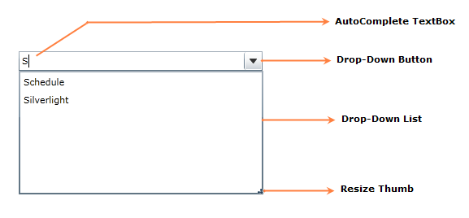

::: {style="DISPLAY: none"}
{#d2h_url_template}{#d2h_package_url style="WIDTH: 0px; DISPLAY: none; HEIGHT: 0px"}
:::

::::: {#nsbanner .d2h_main_nsbanner style="BORDER-BOTTOM: #999999 1px solid; POSITION: relative; PADDING-BOTTOM: 0px; BACKGROUND-COLOR: transparent; PADDING-LEFT: 0px; PADDING-RIGHT: 0px; DISPLAY: none; BORDER-TOP: #999999 1px solid; PADDING-TOP: 0px; LEFT: 0px"}
:::: {#TitleRow .d2h_main_titlerow style="PADDING-BOTTOM: 4px; BACKGROUND-COLOR: transparent; PADDING-LEFT: 22px; WIDTH: 100%; PADDING-RIGHT: 10px; DISPLAY: none; PADDING-TOP: 4px"}
::: {#ienav .d2h_main_ienav style="DISPLAY: none"}
{#D2HPrevious .D2HPreviousEnabled}  {#D2HNext .D2HNextEnabled}
:::
::::
:::::

::: {#nstext .d2h_main_nstext style="PADDING-BOTTOM: 10px; BACKGROUND-COLOR: transparent; PADDING-LEFT: 22px; PADDING-RIGHT: 10px; HEIGHT: 100%; OVERFLOW: auto; PADDING-TOP: 5px" hasuserbackground="true" valign="bottom"}
### Structure of the AutoComplete Control

{border="0"}

Figure 17: AutoComplete Control Structure

 

Following are the ways to deploy an AutoComplete control in a Silverlight application. The AutoComplete control can be created by using either c#, XAML code. It can also be created using Blend.

More:

[ ]{#related-topics}

[{border="0" align="absMiddle"}Creating AutoComplete using C#](ms-xhelp:///?Id=b19ea8ff-71ea-4ba9-8f44-3c45e612b920){style="TEXT-DECORATION: none"}

[{border="0" align="absMiddle"}Creating AutoComplete using XAML](ms-xhelp:///?Id=d26e7d96-e42c-4a6f-a088-5f34f85bee0f){style="TEXT-DECORATION: none"}

[{border="0" align="absMiddle"}Creating AutoComplete using Expression Blend](ms-xhelp:///?Id=c7175162-df71-45c2-b535-66d9a96314e2){style="TEXT-DECORATION: none"}
:::
