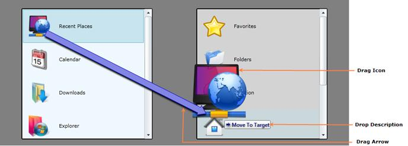

::: {style="DISPLAY: none"}
{#d2h_url_template}{#d2h_package_url style="WIDTH: 0px; DISPLAY: none; HEIGHT: 0px"}
:::

::: {.d2h_secondary_topic style="PADDING-BOTTOM: 10pt; MARGIN: 0pt; PADDING-LEFT: 0pt; PADDING-RIGHT: 0pt; PADDING-TOP: 0pt"}
#### Structure of the Control

 

{border="0"}

Figure 1139 : Structure of the Control

 

The following three main parts of the DragAndDropManager gives more visual clarity for the dragging process.

 

[·      ]{style="FONT-FAMILY: Symbol"}The **Drag Icon** is the image that shows the object that is being dragged. .

[·      ]{style="FONT-FAMILY: Symbol"}The **Drop Description** shows the drag mode and the name of the drop target.

[·      ]{style="FONT-FAMILY: Symbol"}The **Drag Arrow** will follow the Drag Icon. This is helpful to know the drag source of the object.

 

 

[]{#related-topics}
:::
