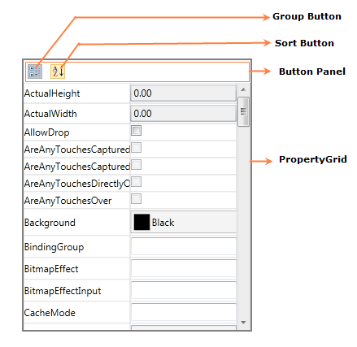

::: {style="DISPLAY: none"}
{#d2h_url_template}{#d2h_package_url style="WIDTH: 0px; DISPLAY: none; HEIGHT: 0px"}
:::

::::: {#nsbanner .d2h_main_nsbanner style="BORDER-BOTTOM: #999999 1px solid; POSITION: relative; PADDING-BOTTOM: 0px; BACKGROUND-COLOR: transparent; PADDING-LEFT: 0px; PADDING-RIGHT: 0px; DISPLAY: none; BORDER-TOP: #999999 1px solid; PADDING-TOP: 0px; LEFT: 0px"}
:::: {#TitleRow .d2h_main_titlerow style="PADDING-BOTTOM: 4px; BACKGROUND-COLOR: transparent; PADDING-LEFT: 22px; WIDTH: 100%; PADDING-RIGHT: 10px; DISPLAY: none; PADDING-TOP: 4px"}
::: {#ienav .d2h_main_ienav style="DISPLAY: none"}
{#D2HPrevious .D2HPreviousEnabled}  {#D2HNext .D2HNextEnabled}
:::
::::
:::::

::: {#nstext .d2h_main_nstext style="PADDING-BOTTOM: 10px; BACKGROUND-COLOR: transparent; PADDING-LEFT: 22px; PADDING-RIGHT: 10px; HEIGHT: 100%; OVERFLOW: auto; PADDING-TOP: 5px" hasuserbackground="true" valign="bottom"}
### Structure of the PropertyGrid Control

{border="0"}[]{style="COLOR: #c00000"}

Figure 1145: PropertyGrid

[]{style="COLOR: #c00000"} 

 

[·      ]{style="FONT-FAMILY: Symbol"}**Button panel** - Shows the GroupButton and SortButton to help the user at run time.

[·      ]{style="FONT-FAMILY: Symbol"}**GroupButton** - Groups the properties based on Category attribute of the property.

[·      ]{style="FONT-FAMILY: Symbol"}**SortButton**  - Displays the properties in sorting order in PropertyGrid.

[·      ]{style="FONT-FAMILY: Symbol"}**PropertyGrid** -  Lists all the properties

[]{#related-topics}
:::
