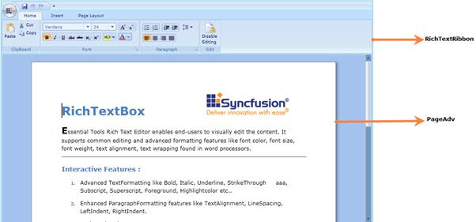

::: {style="DISPLAY: none"}
{#d2h_url_template}{#d2h_package_url style="WIDTH: 0px; DISPLAY: none; HEIGHT: 0px"}
:::

::::: {#nsbanner .d2h_main_nsbanner style="BORDER-BOTTOM: #999999 1px solid; POSITION: relative; PADDING-BOTTOM: 0px; BACKGROUND-COLOR: transparent; PADDING-LEFT: 0px; PADDING-RIGHT: 0px; DISPLAY: none; BORDER-TOP: #999999 1px solid; PADDING-TOP: 0px; LEFT: 0px"}
:::: {#TitleRow .d2h_main_titlerow style="PADDING-BOTTOM: 4px; BACKGROUND-COLOR: transparent; PADDING-LEFT: 22px; WIDTH: 100%; PADDING-RIGHT: 10px; DISPLAY: none; PADDING-TOP: 4px"}
::: {#ienav .d2h_main_ienav style="DISPLAY: none"}
{#D2HPrevious .D2HPreviousEnabled}  {#D2HNext .D2HNextEnabled}
:::
::::
:::::

::: {#nstext .d2h_main_nstext style="PADDING-BOTTOM: 10px; BACKGROUND-COLOR: transparent; PADDING-LEFT: 22px; PADDING-RIGHT: 10px; HEIGHT: 100%; OVERFLOW: auto; PADDING-TOP: 5px" hasuserbackground="true" valign="bottom"}
### Structure of the RichTextBoxAdv Control

 

The following screenshot displays the RichTextRibbon and PageAdv:

{border="0"}**[]{style="BACKGROUND: red; COLOR: white"}**

Figure 1167: Structure of the RichTextBoxAdv

**[]{style="BACKGROUND: red; COLOR: white"}** 

[·      ]{style="FONT-FAMILY: Symbol"}**RichTextRibbon --** RichTextBoxAdv comes with a pre-defined UI that is called RichTextRibbon. It exposes a full set of commands that is to be used in RichTextBoxAdv. It visually represents all the properties, which are available in RichTextBoxAdv. While dragging and dropping the RichTextRibbon from the Toolbox, if it detects the RichTextBoxAdv instance in  Xaml, it will automatically bind the RichTextBoxAdv to Data Context.

[·      ]{style="FONT-FAMILY: Symbol"}**PageAdv --** PageAdv is a part of RichTextBoxAdv where the content of RichTextBoxAdv will be displayed.

[·      ]{style="FONT-FAMILY: Symbol"}

[]{#related-topics}
:::
