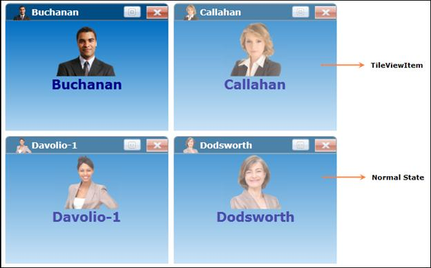
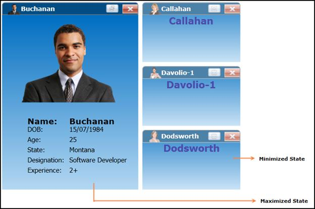
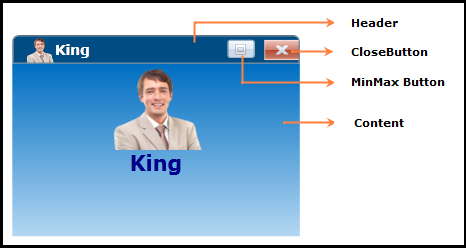

::: {style="DISPLAY: none"}
{#d2h_url_template}{#d2h_package_url style="WIDTH: 0px; DISPLAY: none; HEIGHT: 0px"}
:::

::::: {#nsbanner .d2h_main_nsbanner style="BORDER-BOTTOM: #999999 1px solid; POSITION: relative; PADDING-BOTTOM: 0px; BACKGROUND-COLOR: transparent; PADDING-LEFT: 0px; PADDING-RIGHT: 0px; DISPLAY: none; BORDER-TOP: #999999 1px solid; PADDING-TOP: 0px; LEFT: 0px"}
:::: {#TitleRow .d2h_main_titlerow style="PADDING-BOTTOM: 4px; BACKGROUND-COLOR: transparent; PADDING-LEFT: 22px; WIDTH: 100%; PADDING-RIGHT: 10px; DISPLAY: none; PADDING-TOP: 4px"}
::: {#ienav .d2h_main_ienav style="DISPLAY: none"}
{#D2HPrevious .D2HPreviousEnabled}  {#D2HNext .D2HNextEnabled}
:::
::::
:::::

::: {#nstext .d2h_main_nstext style="PADDING-BOTTOM: 10px; BACKGROUND-COLOR: transparent; PADDING-LEFT: 22px; PADDING-RIGHT: 10px; HEIGHT: 100%; OVERFLOW: auto; PADDING-TOP: 5px" hasuserbackground="true" valign="bottom"}
### Structure of the TileView Control

The various parts of the TileViewControl are shown in the below screen shot.

 

{border="0"}

Figure 849: TileViewControl Sample-1

 

[·      ]{style="FONT-FAMILY: Symbol"}The **TileViewItem** is an Item or Object that the TileViewControl will host inside it.

[·      ]{style="FONT-FAMILY: Symbol"}The **Normal State** is one of the three states of the TileViewItem.

[]{style="COLOR: #4f6228"} 

{border="0"}

[·      ]{style="FONT-FAMILY: Symbol; COLOR: #4f6228"}[]{style="COLOR: #4f6228"}

Figure 850: TileViewControl Sample-2

[]{style="COLOR: #4f6228"} 

[·      ]{style="FONT-FAMILY: Symbol"}The **Maximized State** depicts the TileViewItems Maximized state.

[·      ]{style="FONT-FAMILY: Symbol"}The **Minimized State** depicts the TileViewItems Minimized state.

 

{border="0"}

[]{style="COLOR: #4f6228"} 

Figure 851: TileViewControl Sample-3

 

[·      ]{style="FONT-FAMILY: Symbol"}The **Heade**r depicts the TileViewItem Header.

[·      ]{style="FONT-FAMILY: Symbol"}The **CloseButton** depicts the TileViewItem CloseButton.

[·      ]{style="FONT-FAMILY: Symbol"}The **MinMax Button** depicts the TileViewItem MinMax Button.

[·      ]{style="FONT-FAMILY: Symbol"}The **Content** depicts the content that will be displayed in TileViewItem.

[]{#related-topics}
:::
