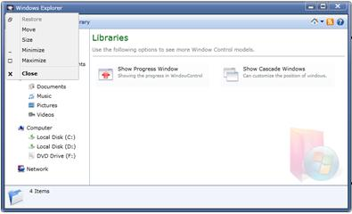

::: {style="DISPLAY: none"}
{#d2h_url_template}{#d2h_package_url style="WIDTH: 0px; DISPLAY: none; HEIGHT: 0px"}
:::

::: {.d2h_secondary_topic style="PADDING-BOTTOM: 10pt; MARGIN: 0pt; PADDING-LEFT: 0pt; PADDING-RIGHT: 0pt; PADDING-TOP: 0pt"}
#### System Menu Support

[]{style="COLOR: black"} 

The Silverlight WindowControl is shipped with built-in System Menu. The System Menu can be opened by clicking the top left corner of the window.

 

Use Case Scenarios

By using the System Menu, you can maximize, minimize, restore, close, move and size the WindowControl.[]{#_Enabling_System_Menu}

 

Enabling System Menu to an Application

The System Menu support can be enabled in a WindowControl by setting the property **IsSystemMenuEnabled** to True. The default value of this property is True.

 

The following code snippet explains how to set this property in XAML.

**** 

+-------------------------------------------------------------------------------------------------------------------------------------------------------------------------------------------------------------------------------------------------------------------------------------+
| **[\[XAML\]]{style="FONT-FAMILY: 'Courier New'"}**                                                                                                                                                                                                                                  |
|                                                                                                                                                                                                                                                                                     |
| [  [\<]{style="COLOR: blue"}[syncfusion]{style="COLOR: #a31515"}[:]{style="COLOR: blue"}[WindowControl]{style="COLOR: #a31515"}[ x]{style="COLOR: red"}[:]{style="COLOR: blue"}[Class]{style="COLOR: red"}[=\"SilverlightBrowserSample.SilverlightControl1\"]{style="COLOR: blue"}\ |
|    [ xmlns]{style="COLOR: red"}[=\"http://schemas.microsoft.com/winfx/2006/xaml/presentation\"]{style="COLOR: blue"}\                                                                                                                                                               |
|    [ xmlns]{style="COLOR: red"}[:]{style="COLOR: blue"}[x]{style="COLOR: red"}[=\"http://schemas.microsoft.com/winfx/2006/xaml\"]{style="COLOR: blue"}\                                                                                                                             |
|    [ xmlns]{style="COLOR: red"}[:]{style="COLOR: blue"}[d]{style="COLOR: red"}[=\"http://schemas.microsoft.com/expression/blend/2008\"]{style="COLOR: blue"}\                                                                                                                       |
|    [ **IsSystemMenuEnabled**]{style="COLOR: red"}**[=\"True\"]{style="COLOR: blue"}**\                                                                                                                                                                                              |
|    [ xmlns]{style="COLOR: red"}[:]{style="COLOR: blue"}[syncfusion]{style="COLOR: red"}[=\"clr-namespace:Syncfusion.Windows.Tools.Controls;assembly=Syncfusion.Shared.Silverlight\" \>]{style="COLOR: blue"}\                                                                       |
| [\</]{style="COLOR: blue"}[syncfusion]{style="COLOR: #a31515"}[:]{style="COLOR: blue"}[WindowControl]{style="COLOR: #a31515"}[\>]{style="COLOR: blue"}]{style="FONT-FAMILY: 'Courier New'"}                                                                                         |
|                                                                                                                                                                                                                                                                                     |
| []{style="FONT-FAMILY: Consolas"}                                                                                                                                                                                                                                                   |
+-------------------------------------------------------------------------------------------------------------------------------------------------------------------------------------------------------------------------------------------------------------------------------------+

**** 

The following code snippet explains how to use the property in C#.

**** 

+----------------------------------------------------------------------------------------------------------------------------+
| **[\[C#\]]{style="FONT-FAMILY: 'Courier New'"}**                                                                           |
|                                                                                                                            |
| **[]{style="FONT-FAMILY: 'Courier New'"}**                                                                                 |
|                                                                                                                            |
| [  [WindowControl]{style="COLOR: #2b91af"} window = [new]{style="COLOR: blue"} [WindowControl]{style="COLOR: #2b91af"}();\ |
|   window.IsSystemMenuEnabled = [true]{style="COLOR: blue"};]{style="FONT-FAMILY: 'Courier New'"}                           |
|                                                                                                                            |
|                                                                                                                            |
+----------------------------------------------------------------------------------------------------------------------------+

**** 

The System Menu can also be enabled by using **OpenSystemMenu()**.

 The following code snippet explains the usage of this method.

**** 

+----------------------------------------------------------------------------------------------------------------------------+
| **[\[C#\]]{style="FONT-FAMILY: 'Courier New'"}**                                                                           |
|                                                                                                                            |
| **[]{style="FONT-FAMILY: 'Courier New'"}**                                                                                 |
|                                                                                                                            |
| [  [WindowControl]{style="COLOR: #2b91af"} window = [new]{style="COLOR: blue"} [WindowControl]{style="COLOR: #2b91af"}();\ |
|   window.OpenSystemMenu();]{style="FONT-FAMILY: 'Courier New'"}                                                            |
|                                                                                                                            |
|                                                                                                                            |
+----------------------------------------------------------------------------------------------------------------------------+

{border="0"}****

Figure 1104: System Menu in Window Control

 

Tables for properties, methods, and events

Properties

Table 53: [IsSystemMenuEnabled]{style="COLOR: black"} Table

  Property              Description                                                                                              Type                 Data Type   Reference
  --------------------- -------------------------------------------------------------------------------------------------------- -------------------- ----------- ---------------------
  IsSystemMenuEnabled   Gets or sets a value indicating whether the System Menu has been enabled or disabled in WindowControl.   DependencyProperty   Boolean     IsSystemMenuEnabled

[]{style="FONT-FAMILY: 'Calibri','sans-serif'; COLOR: black"} 

 

Methods

Table 54: [OpenSystemMenu]{style="COLOR: black"} Table

  Method             Description                                                                                           Parameters   Type    Return Type   Reference 
  ------------------ ----------------------------------------------------------------------------------------------------- ------------ ------- ------------- ------------------
  OpenSystemMenu()   Opens the System Menu. The Context Menu will be opened at the top left corner of the WindowControl.   \-           **-**   \-            OpenSystemMenu()

[]{style="FONT-FAMILY: 'Calibri','sans-serif'; COLOR: black"} 

Events

Table 55: [SystemMenuOpening]{style="COLOR: black"} Table

  Event               Description                                                                                            Arguments                                      Type                            Reference links
  ------------------- ------------------------------------------------------------------------------------------------------ ---------------------------------------------- ------------------------------- -----------------
  SystemMenuOpening   The event will be triggered before the System Menu gets opened. This is a cancellable event handler.   Sender as object, SystemMenuOpeningEventArgs   SystemMenuOpeningEventhandler   

 Table 56: SystemMenuOpened Table

  Event              Description                                                           Arguments                           Type                 Reference links
  ------------------ --------------------------------------------------------------------- ----------------------------------- -------------------- -----------------
  SystemMenuOpened   The event will be triggered once after the System Menu gets opened.   Sender as object, RoutedEventArgs   RoutedEventHandler   

[]{style="FONT-FAMILY: 'Calibri','sans-serif'; COLOR: black"} 

Sample Link

A sample application that illustrates System Menu Support in WindowControl is distributed along with the Essential Tools installation and can be found at:

 

**\<Samples installed location\>\\Syncfusion\\EssentialStudio\\Version Number\\Silverlight\\Syncfusion.Tools.Silverlight.Samples**

**** 

[]{#related-topics}
:::
