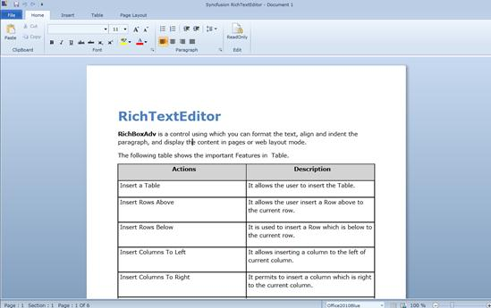
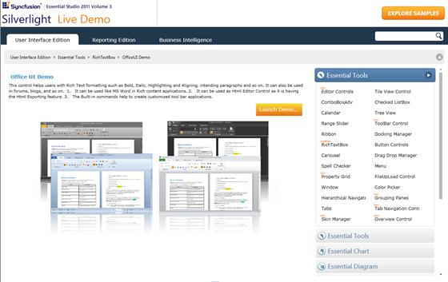

::: {style="DISPLAY: none"}
{#d2h_url_template}{#d2h_package_url style="WIDTH: 0px; DISPLAY: none; HEIGHT: 0px"}
:::

::: {.d2h_secondary_topic style="PADDING-BOTTOM: 10pt; MARGIN: 0pt; PADDING-LEFT: 0pt; PADDING-RIGHT: 0pt; PADDING-TOP: 0pt"}
#### Table Support for RichTextBoxAdv

Table support for RichTextBoxAdv has been implemented as in MS word. This is used to insert tables with user defined rows and columns and it also allows the user to insert multiple tables for every single cell.

 

+--------------------------------------------------------------------------------------+
|     <syncfusion:TableAdv>                                                            |
|                                                                                      |
|                               <syncfusion:TableRowAdv>                               |
|                                                                                      |
|                                   <syncfusion:TableCellAdv>                          |
|                                                                                      |
|                                       <syncfusion:ParagraphAdv>                      |
|                                                                                      |
|                                           <syncfusion:SpanAdv Text="Table support"/> |
|                                                                                      |
|                                       </syncfusion:ParagraphAdv>                     |
|                                                                                      |
|                                   </syncfusion:TableCellAdv>                         |
|                                                                                      |
|                               </syncfusion:TableRowAdv>                              |
|                                                                                      |
|                           </syncfusion:TableAdv>                                     |
|                                                                                      |
|                                                                                      |
+--------------------------------------------------------------------------------------+

 

Editing support

Editing will be done in the Table cell. Table width and height will be calculated for every change in the block of the cells. We can insert a Image, Hyperlink and UIElement in the table cells.

Selection support

Table, TableCell, TableRow and TableColumn has the separate selection behavior to select the corresponding element in the Blocks. TableCell selection can be achieved in the double click when inside the table cells. TableRow and TableColumnselection can be achieved by the SelectRowCommand, SelectCellCommand, and SelectTableCommand.

Insert n\*n tables

We can insert n\*n tables inside the single tablecell. It can be achieved by InsertTablecommand.

Insert n\*n columns

We can insert n\* n columns in the table. It can be achieved by the InsertColumnsCommand. This is possible only when the number cells are selected or current position inside the table.

Insert n\*n Rows

We can insert n\* n rows in the table. It can be achieved by the InsertRowsCommand. This is possible only when the number cells are selected or current position inside the table.

DeleteTable

We can delete the table from the Document. It can be achieved by DeleteTableCommand. This is possible only when the number cells are selected or current position inside the table.

Delete n\*n Rows

It allows to delete n\*n Rows at a single attempt. It can be achieved by the DeleteRowCommand. This is possible only when the number cells are selected or current position inside the table.

Delete n\*n Columns

It allows to delete n\*n Columns at a single attempt. It can be achieved by the DeleteColumnCommand. This is possible only when the number cells are selected or current position inside the table.

Merging

It allows the user to merge the n\*n cells into the single cell. It can be achieved by the MergeSelectedCellsCommand. This is possible only when the number cells are selected. RowSpan and ColumnSpan properties in the table cell are taking responsibility for this.

{border="0"}

Figure 1176: Table Support for RichTextEditor

 

Samples Link

To view samples:

1.   Click **Start**\--\>**All Programs**\--\>**Syncfusion**\--\>**Essential Studio** \<version number\> \--\>**Dashboard**. (Refer section 2.2)

2.    In the Dashboard window, click Run Locally Installed Samples for Silverlight under User Interface Edition panel.

 

{border="0"}

Figure 1177: Sample Browser

The Silverlight Sample Browser window is displayed.

 

Properties, Methods and Events tables

Methods

  Method                          Description                                                     Parameters          Type                            Return Type   Reference links
  ------------------------------- --------------------------------------------------------------- ------------------- ------------------------------- ------------- -----------------
  **InsertTable**                 It creates the new table with the specified rows and columns.   (Row, Column)       InsertTable(int,int)            void          NA
  **InsertColumn**                It inserts the single column to the table.                      (columnplacement)   InsertColumn(ColumnPlacement)   void          NA
  **InsertRow**                   It inserts the single row to the table.                         (rowplacement)      InsertRow(RowPlacement)         void          NA
  **DeleteTable**                 It deletes the table.                                           \--                 \_\_                            void          NA
  **DeleteRow**                   It deletes the Row.                                             \--                 \_\_                            void          NA
  **DeleteColumn**                It deletes the Column.                                          \--                 \_\_                            void          NA
  **MergeSelectedCellsCommand**   It merges the selected cells into single cell.                  \--                 \_\_                            void          NA

 

 

                                                                                         

[]{#related-topics}
:::
