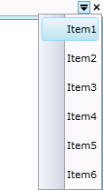

::: {style="DISPLAY: none"}
{#d2h_url_template}{#d2h_package_url style="WIDTH: 0px; DISPLAY: none; HEIGHT: 0px"}
:::

::: {.d2h_secondary_topic style="PADDING-BOTTOM: 10pt; MARGIN: 0pt; PADDING-LEFT: 0pt; PADDING-RIGHT: 0pt; PADDING-TOP: 0pt"}
##### []{#_TabPopUp_Menu}TabPopUp Menu

The Tab Control supports Drop down TabPopUp Menu for easy navigation between tab items. *TabPopup* menu is used for quick navigation when more tab items are in the control.

{border="0"}

Figure 789: TabPopUp Menu[]{style="FONT-FAMILY: 'Calibri','sans-serif'; FONT-SIZE: 12pt"}

[                                                ** **]{style="FONT-FAMILY: 'Calibri','sans-serif'; FONT-SIZE: 12pt"}

[]{#related-topics}
:::
