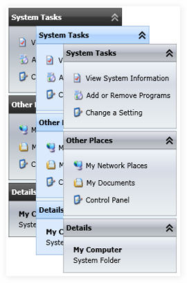

::: {style="DISPLAY: none"}
{#d2h_url_template}{#d2h_package_url style="WIDTH: 0px; DISPLAY: none; HEIGHT: 0px"}
:::

::::: {#nsbanner .d2h_main_nsbanner style="BORDER-BOTTOM: #999999 1px solid; POSITION: relative; PADDING-BOTTOM: 0px; BACKGROUND-COLOR: transparent; PADDING-LEFT: 0px; PADDING-RIGHT: 0px; DISPLAY: none; BORDER-TOP: #999999 1px solid; PADDING-TOP: 0px; LEFT: 0px"}
:::: {#TitleRow .d2h_main_titlerow style="PADDING-BOTTOM: 4px; BACKGROUND-COLOR: transparent; PADDING-LEFT: 22px; WIDTH: 100%; PADDING-RIGHT: 10px; DISPLAY: none; PADDING-TOP: 4px"}
::: {#ienav .d2h_main_ienav style="DISPLAY: none"}
{#D2HPrevious .D2HPreviousEnabled}  {#D2HNext .D2HNextEnabled}
:::
::::
:::::

::: {#nstext .d2h_main_nstext style="PADDING-BOTTOM: 10px; BACKGROUND-COLOR: transparent; PADDING-LEFT: 22px; PADDING-RIGHT: 10px; HEIGHT: 100%; OVERFLOW: auto; PADDING-TOP: 5px" hasuserbackground="true" valign="bottom"}
## []{#p185}TaskBar

 

 TaskBar control allows to create collapsible panels that can be used to host a collection of command items or snippets of information pertaining to the current context.

 

 

{border="0"}

Figure 393: TaskBar Control

 

Feature Summary

 

[·      ]{style="FONT-FAMILY: Symbol"}**FlowDirection**: specifies the flow direction of the control

[·      ]{style="FONT-FAMILY: Symbol"}**IsHeaderShown**: specifies whether the header part of the control is visible or not

[·      ]{style="FONT-FAMILY: Symbol"}**IsExpanded**: specifies whether content part of the control is expanded or not

[·      ]{style="FONT-FAMILY: Symbol"}**HeaderHeight**: specifies the height for the header part of the control

[·      ]{style="FONT-FAMILY: Symbol"}**Padding**: specifies the padding values for the control

[·      ]{style="FONT-FAMILY: Symbol"}**Arrow Style**: specifies the style for the arrows displayed in the header part of the control

[·      ]{style="FONT-FAMILY: Symbol"}**SkinManager**: specifies the visual style for the control

More:

[ ]{#related-topics}

[{border="0" align="absMiddle"}Getting Started](ms-xhelp:///?Id=7966950b-0545-4080-a9cf-db4459324177){style="TEXT-DECORATION: none"}

[{border="0" align="absMiddle"}Concepts and Features](ms-xhelp:///?Id=69116fc4-dba7-4341-b0c9-35b23ba8f9e3){style="TEXT-DECORATION: none"}
:::
