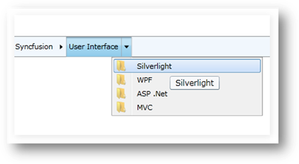

::: {style="DISPLAY: none"}
{#d2h_url_template}{#d2h_package_url style="WIDTH: 0px; DISPLAY: none; HEIGHT: 0px"}
:::

::: {.d2h_secondary_topic style="PADDING-BOTTOM: 10pt; MARGIN: 0pt; PADDING-LEFT: 0pt; PADDING-RIGHT: 0pt; PADDING-TOP: 0pt"}
#### ToolTip

A ToolTip can be displayed for each HierarchyNavigator item.

By setting the **ShowToolTip** Boolean property to **true** in the HierarchyNavigator control, ToolTips will be enabled for all items.

+------------------------------------------------------------------------------------------------------------------------------------------------------------------------------------------------------------------------------------------------------------------+
| **[C#]{style="FONT-FAMILY: 'Courier New'"}**[]{style="FONT-FAMILY: Consolas; COLOR: #2b91af; FONT-SIZE: 9.5pt"}                                                                                                                                                  |
|                                                                                                                                                                                                                                                                  |
| []{style="FONT-FAMILY: Consolas; COLOR: #2b91af; FONT-SIZE: 9.5pt"}                                                                                                                                                                                              |
|                                                                                                                                                                                                                                                                  |
| [HierarchyNavigator]{style="FONT-FAMILY: Consolas; COLOR: #2b91af; FONT-SIZE: 9.5pt"}[ hierarchyNavigatorControl1 = [new]{style="COLOR: blue"} [HierarchyNavigator]{style="COLOR: #2b91af"}() { Height = 30 };]{style="FONT-FAMILY: Consolas; FONT-SIZE: 9.5pt"} |
|                                                                                                                                                                                                                                                                  |
| [hierarchyNavigatorControl1.ShowToolTip = [true]{style="COLOR: blue"};]{style="FONT-FAMILY: Consolas; FONT-SIZE: 9.5pt"}[]{style="FONT-FAMILY: 'Calibri','sans-serif'"}                                                                                          |
+------------------------------------------------------------------------------------------------------------------------------------------------------------------------------------------------------------------------------------------------------------------+

[]{style="FONT-FAMILY: 'Calibri','sans-serif'"} 

{border="0"}

Figure 1028: ToolTip for an item

[]{#related-topics}
:::
