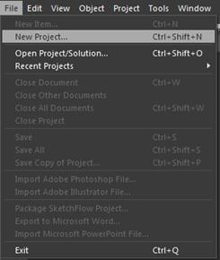
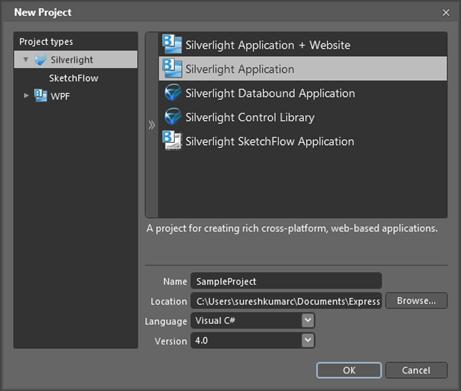
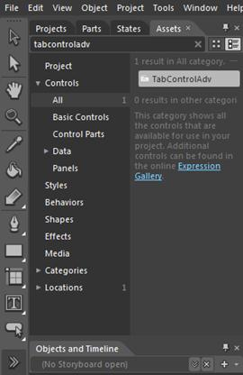
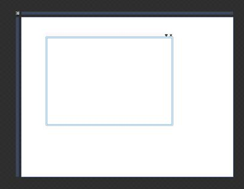
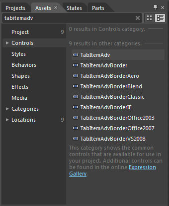
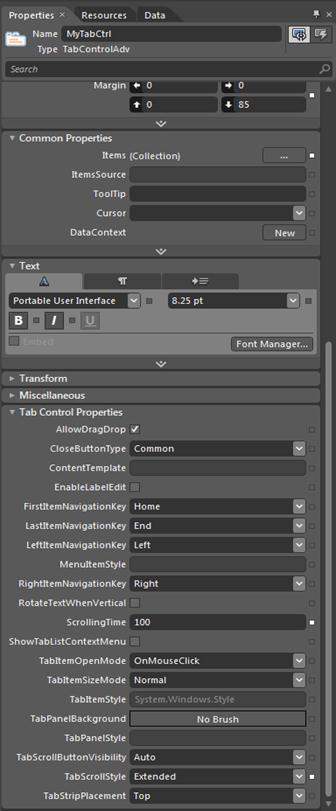
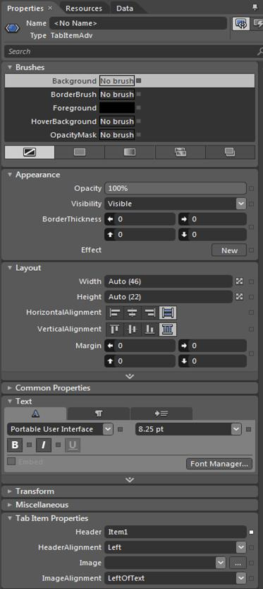

::: {style="DISPLAY: none"}
{#d2h_url_template}{#d2h_package_url style="WIDTH: 0px; DISPLAY: none; HEIGHT: 0px"}
:::

::: {.d2h_secondary_topic style="PADDING-BOTTOM: 10pt; MARGIN: 0pt; PADDING-LEFT: 0pt; PADDING-RIGHT: 0pt; PADDING-TOP: 0pt"}
##### Using Blend

The following steps explain the ways of creating *TabControlAdv* application in Expression Blend.

1.   Create a new Silverlight Application. *File -\> New Project***.**

2.   In the New Project dialog box, select the *Silverlight project* type on the left pane and, on the right-pane, select *Silverlight Application.*

3.   Enter a Name and Location for your project, select a Language (C#) in the drop-down box, and click *OK*.

4.   *Blend* creates a new application that opens with the *MainPage.xaml* file displayed in the *Design* view.

5.   Add Syncfusion *TabControl*  to your project by completing the following steps:

[]{style="FONT-FAMILY: 'Calibri','sans-serif'; FONT-SIZE: 12pt"} 

a.            On the menu, select **Assets** **Window** to open the *Assets* tab.

b.            Under the *Assets* tab, enter *TabControlAdv* into the *Search* bar.

c.            The *TabControlAdv* control\'s icon appears.

d.            Double-click the *TabControlAdv* icon to add the control to your project.

[]{style="FONT-FAMILY: 'Calibri','sans-serif'; FONT-SIZE: 12pt"} 

{border="0"}

Figure 779: Open New Project

**[            ]{style="FONT-FAMILY: 'Calibri','sans-serif'; FONT-SIZE: 12pt"}**

[]{style="FONT-FAMILY: 'Calibri','sans-serif'; FONT-SIZE: 12pt"} 

{border="0"}

Figure 780: Create New Project

**[]{style="FONT-FAMILY: 'Calibri','sans-serif'; FONT-SIZE: 12pt"}** 

{border="0"}

Figure 781: Search TabControlAdv

**[]{style="FONT-FAMILY: 'Calibri','sans-serif'; FONT-SIZE: 12pt"}** 

[]{style="FONT-FAMILY: 'Calibri','sans-serif'; FONT-SIZE: 12pt"} 

{border="0"}

Figure 782: TabControlAdv in Application

**[]{style="FONT-FAMILY: 'Calibri','sans-serif'; FONT-SIZE: 12pt"}** 

{border="0"}

Figure 783: Search and Add TabItemAdv[]{style="FONT-FAMILY: 'Calibri','sans-serif'; FONT-SIZE: 12pt"}

Tab Control Properties:

You can change the Tab *ControlAdv* properties also in blend. Syncfusion Tab Control properties are placed in the Tab Control *Properties* tab in the properties panel.

{border="0"}

Figure 784: TabControlAdv Properties

[                                                ]{style="FONT-FAMILY: 'Calibri','sans-serif'; FONT-SIZE: 12pt"}

Tab Item Properties:

            The user can edit the Tab Item properties in *Blend* also after selecting the Tab Item in *Objects* and *TimeLine* tab. The Tab Item properties are placed in Tab Item Properties tab in the *Properties* panel. The following snapshot describes Tab Item properties placed in Blend.

{border="0"}

Figure 785: TabItemAdv Properties

[]{#related-topics}
:::
