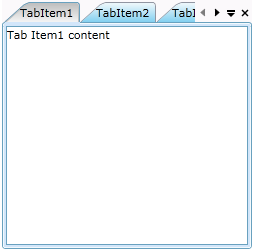

::: {style="DISPLAY: none"}
{#d2h_url_template}{#d2h_package_url style="WIDTH: 0px; DISPLAY: none; HEIGHT: 0px"}
:::

::: {.d2h_secondary_topic style="PADDING-BOTTOM: 10pt; MARGIN: 0pt; PADDING-LEFT: 0pt; PADDING-RIGHT: 0pt; PADDING-TOP: 0pt"}
##### Using C#

We can create an application with *TabControlAdv* by code behind also. We can create the application using the following steps:\
\

7.   Create a new project in Silverlight.

8.   Add the following Syncfusion libraries into project references:

5.         Syncfusion.Tools.Silverlight

6.   Syncfusion.Shared.Silverlight

9.   Add the following namespace:

[]{style="FONT-FAMILY: 'Calibri','sans-serif'; FONT-SIZE: 12pt"} 

  ----------------------------------------------------------------------------------------------------------------------------------
  [using]{style="FONT-FAMILY: 'Courier New'; COLOR: blue"}[ Syncfusion.Windows.Tools.Controls]{style="FONT-FAMILY: 'Courier New'"}
  ----------------------------------------------------------------------------------------------------------------------------------

[]{style="FONT-FAMILY: Consolas; FONT-SIZE: 12pt"} 

10.  By using the following lines, we can create TabControl through code behind.

+-----------------------------------------------------------------------------------------------------------------------------------------------------------------------------------------------------------------------------------------------------------------------------------------------------+
| [      TabControlAdv]{style="FONT-FAMILY: 'Courier New'; COLOR: #2b91af"}[ myTabCtrl = [new]{style="COLOR: blue"} [TabControlAdv]{style="COLOR: #2b91af"}();]{style="FONT-FAMILY: 'Courier New'"}                                                                                                   |
|                                                                                                                                                                                                                                                                                                     |
| [            myTabCtrl.Height = 250;]{style="FONT-FAMILY: 'Courier New'"}                                                                                                                                                                                                                           |
|                                                                                                                                                                                                                                                                                                     |
| [            myTabCtrl.Width  = 250;]{style="FONT-FAMILY: 'Courier New'"}                                                                                                                                                                                                                           |
|                                                                                                                                                                                                                                                                                                     |
| [       TabItemAdv]{style="FONT-FAMILY: 'Courier New'; COLOR: #2b91af"}[ item1 = [new]{style="COLOR: blue"} [TabItemAdv]{style="COLOR: #2b91af"} { Header = [\"TabItem1\"]{style="COLOR: #a31515"}, Content=[\"Tab Item1 content\"]{style="COLOR: #a31515"} };]{style="FONT-FAMILY: 'Courier New'"} |
|                                                                                                                                                                                                                                                                                                     |
| [       [TabItemAdv]{style="COLOR: #2b91af"} item2 = [new]{style="COLOR: blue"} [TabItemAdv]{style="COLOR: #2b91af"} { Header = [\"TabItem2\"]{style="COLOR: #a31515"} };]{style="FONT-FAMILY: 'Courier New'"}                                                                                      |
|                                                                                                                                                                                                                                                                                                     |
| [       [TabItemAdv]{style="COLOR: #2b91af"} item3 = [new]{style="COLOR: blue"} [TabItemAdv]{style="COLOR: #2b91af"} { Header = [\"TabItem3\"]{style="COLOR: #a31515"} };]{style="FONT-FAMILY: 'Courier New'"}                                                                                      |
|                                                                                                                                                                                                                                                                                                     |
| [       myTabCtrl.Items.Add(item1); myTabCtrl.Items.Add(item2);                  ]{style="FONT-FAMILY: 'Courier New'"}                                                                                                                                                                              |
|                                                                                                                                                                                                                                                                                                     |
| [       myTabCtrl.Items.Add(item3);]{style="FONT-FAMILY: 'Courier New'"}                                                                                                                                                                                                                            |
|                                                                                                                                                                                                                                                                                                     |
| [       [this]{style="COLOR: blue"}.LayoutRoot.Children.Add(myTabCtrl);]{style="FONT-FAMILY: 'Courier New'"}                                                                                                                                                                                        |
|                                                                                                                                                                                                                                                                                                     |
| []{style="FONT-FAMILY: 'Courier New'"}                                                                                                                                                                                                                                                              |
+-----------------------------------------------------------------------------------------------------------------------------------------------------------------------------------------------------------------------------------------------------------------------------------------------------+

[]{style="FONT-FAMILY: 'Calibri','sans-serif'; FONT-SIZE: 12pt"} 

The output of the above code is shown in the following screenshot:         

[]{style="FONT-FAMILY: 'Calibri','sans-serif'; FONT-SIZE: 12pt"} 

{border="0"}

Figure 778: TabControlAdv

[                                                                        ]{style="FONT-FAMILY: 'Calibri','sans-serif'; FONT-SIZE: 12pt"}

[]{#related-topics}
:::
