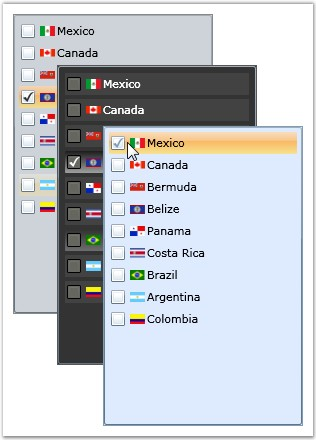

::: {style="DISPLAY: none"}
{#d2h_url_template}{#d2h_package_url style="WIDTH: 0px; DISPLAY: none; HEIGHT: 0px"}
:::

::: {.d2h_secondary_topic style="PADDING-BOTTOM: 10pt; MARGIN: 0pt; PADDING-LEFT: 0pt; PADDING-RIGHT: 0pt; PADDING-TOP: 0pt"}
##### []{#p154}Visual Style  

 

The appearance of the CheckedListBox control can be enhanced by customizing the visual style of the control. This is achieved by using the **VisualStyle** property.

 

The following are the visual styles supported by the CheckedListBox control.

 

[·      ]{style="FONT-FAMILY: Symbol"}Default

[·      ]{style="FONT-FAMILY: Symbol"}Blend

[·      ]{style="FONT-FAMILY: Symbol"}Office 2007 Silver

[·      ]{style="FONT-FAMILY: Symbol"}Office 2007 Blue

[·      ]{style="FONT-FAMILY: Symbol"}Office 2007 Black

[·      ]{style="FONT-FAMILY: Symbol"}Office 2003

[·      ]{style="FONT-FAMILY: Symbol"}Metro

 

{border="0"}

 

Figure 339 : Visual Styles applied to CheckedListBox

**** 

[]{#related-topics}
:::
