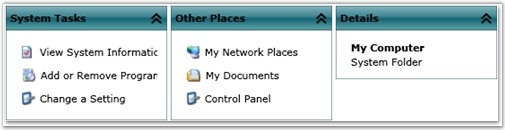
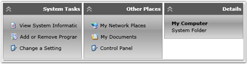
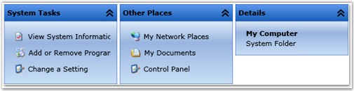
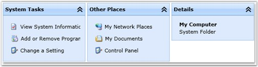
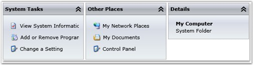
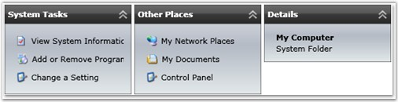
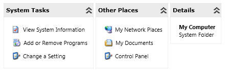

::: {style="DISPLAY: none"}
{#d2h_url_template}{#d2h_package_url style="WIDTH: 0px; DISPLAY: none; HEIGHT: 0px"}
:::

::: {.d2h_secondary_topic style="PADDING-BOTTOM: 10pt; MARGIN: 0pt; PADDING-LEFT: 0pt; PADDING-RIGHT: 0pt; PADDING-TOP: 0pt"}
##### Visual Style

[]{#p197} 

The Skin Manager specifies the visual style for the TaskBar control. The Skin Manager can be used only in Procedural code.

 

The following visual styles are supported by the TaskBar control.

 

[·      ]{style="FONT-FAMILY: Symbol"}Default

[·      ]{style="FONT-FAMILY: Symbol"}Blend

[·      ]{style="FONT-FAMILY: Symbol"}Office 2003

[·      ]{style="FONT-FAMILY: Symbol"}Office 2007 Blue

[·      ]{style="FONT-FAMILY: Symbol"}Office 2007 Silver

[·      ]{style="FONT-FAMILY: Symbol"}Office 2007 Black

[·      ]{style="FONT-FAMILY: Symbol"}Metro

 

The following code example illustrates how to set the visual style for the control.

 

+---------------------------------------------------------------------------------------------------------------------------------------------------------+
| **[\[C#\]]{style="FONT-FAMILY: 'Courier New'; COLOR: black"}**                                                                                          |
|                                                                                                                                                         |
| []{style="FONT-FAMILY: 'Courier New'"}                                                                                                                  |
|                                                                                                                                                         |
| [SkinManager.ApplyStyle(TaskBar, Syncfusion.Silverlight.Shared.[VisualStyle]{style="COLOR: teal"}.Office2007Blue);]{style="FONT-FAMILY: 'Courier New'"} |
+---------------------------------------------------------------------------------------------------------------------------------------------------------+

 

{border="0"}

 

Figure 408: FileUpload with \"Default\" Visual Style

**** 

{border="0"}

 

Figure 409 : FileUpload with \"Blend\" Visual Style

**** 

{border="0"}

 

Figure 410 : FileUpload with \"Office 2003\" Visual Style

 

{border="0"}

 

Figure 411 : FileUpload with \"Office 2007 Blue\" Visual Style

 

{border="0"}

**** 

Figure 412 : FileUpload with \"Office 2007 Silver\" Visual Style

**** 

{border="0"}

**** 

Figure 413 : FileUpload with \"Office 2007 Black\" Visual Style

**** 

{border="0"}

Figure 414 : FileUpload with \"Metro\" Visual Style

 

[]{#related-topics}
:::
