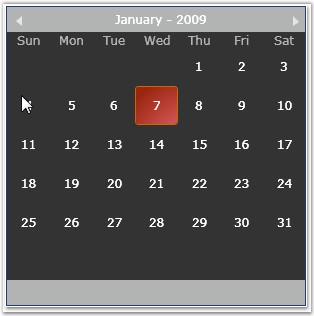
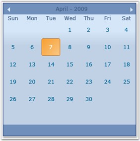
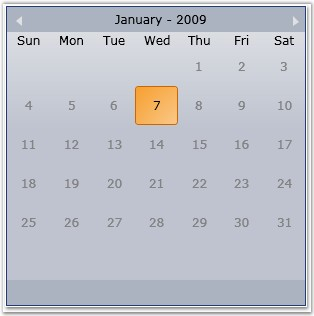
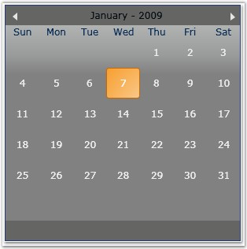
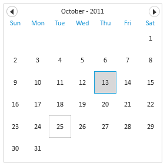

::: {style="DISPLAY: none"}
{#d2h_url_template}{#d2h_package_url style="WIDTH: 0px; DISPLAY: none; HEIGHT: 0px"}
:::

::: {.d2h_secondary_topic style="PADDING-BOTTOM: 10pt; MARGIN: 0pt; PADDING-LEFT: 0pt; PADDING-RIGHT: 0pt; PADDING-TOP: 0pt"}
##### []{#_Visual_Style_4}Visual Style[]{style="FONT-SIZE: 9pt"}

 

Tools Silverlight provides support to specify the visual style for the CalendarControl.

 

The following visual styles are supported by the CalendarControl.

 

[·      ]{style="FONT-FAMILY: Symbol"}Default

[·      ]{style="FONT-FAMILY: Symbol"}Blend

[·      ]{style="FONT-FAMILY: Symbol"}Office 2003

[·      ]{style="FONT-FAMILY: Symbol"}Office 2007 Blue

[·      ]{style="FONT-FAMILY: Symbol"}Office 2007 Silver

[·      ]{style="FONT-FAMILY: Symbol"}Office 2007 Black

[·      ]{style="FONT-FAMILY: Symbol"}Metro

 

The following screen shots illustrate some of the visual styles of the control.

 

{border="0"}

 

Figure 492: CalendarControl with \"Blend\" Visual Style

 

{border="0"}

 

Figure 493: CalendarControl with \"Office 2007 Blue\" Visual Style

 

{border="0"}

**** 

Figure 494: CalendarControl with \"Office 2007 Silver\" Visual Style

**** 

{border="0"}

**** 

Figure 495: CalendarControl with \"Office 2007 Black\" Visual Style

{border="0"}

Figure 496: CalendarControl with \"Metro\" Visual Style

 

[]{#related-topics}
:::
