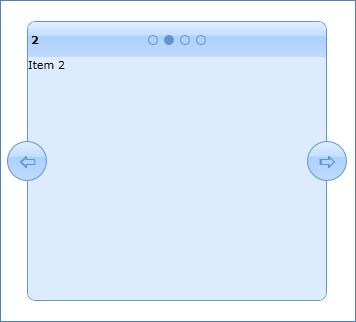

::: {style="DISPLAY: none"}
{#d2h_url_template}{#d2h_package_url style="WIDTH: 0px; DISPLAY: none; HEIGHT: 0px"}
:::

::::: {.d2h_secondary_topic style="PADDING-BOTTOM: 10pt; MARGIN: 0pt; PADDING-LEFT: 0pt; PADDING-RIGHT: 0pt; PADDING-TOP: 0pt"}
##### XML binding {#xml-binding style="TEXT-INDENT: -18pt; MARGIN-LEFT: 36pt; tab-stops: 36.0pt"}

 

 

Observable Collection

 

+------------------------------------------------------------------------------------------------------------------------------------------------------------------------------------------------------------------------------------------------------------------------------------------------------------------------------------------------------------------------------------------------------------------------+
| **XAML**                                                                                                                                                                                                                                                                                                                                                                                                               |
|                                                                                                                                                                                                                                                                                                                                                                                                                        |
|                                                                                                                                                                                                                                                                                                                                                                                                                        |
|                                                                                                                                                                                                                                                                                                                                                                                                                        |
| [\<]{style="FONT-FAMILY: Consolas; COLOR: blue"}[syncfusion]{style="FONT-FAMILY: Consolas; COLOR: #a31515"}[:]{style="FONT-FAMILY: Consolas; COLOR: blue"}[TabNavigationControl]{style="FONT-FAMILY: Consolas; COLOR: #a31515"}[ TransitionEffect]{style="FONT-FAMILY: Consolas; COLOR: red"}[=\"Slide\"]{style="FONT-FAMILY: Consolas; COLOR: blue"}[  ]{style="FONT-FAMILY: Consolas; COLOR: black"}                 |
|                                                                                                                                                                                                                                                                                                                                                                                                                        |
| [                                        ]{style="FONT-FAMILY: Consolas; COLOR: black"}[ ItemsSource]{style="FONT-FAMILY: Consolas; COLOR: red"}[=\"{]{style="FONT-FAMILY: Consolas; COLOR: blue"}[Binding]{style="FONT-FAMILY: Consolas; COLOR: #a31515"}[ MyCollection]{style="FONT-FAMILY: Consolas; COLOR: red"}[}\"\>]{style="FONT-FAMILY: Consolas; COLOR: blue"}[]{style="FONT-FAMILY: Consolas; COLOR: black"} |
|                                                                                                                                                                                                                                                                                                                                                                                                                        |
| []{style="FONT-FAMILY: Consolas; COLOR: black"}                                                                                                                                                                                                                                                                                                                                                                        |
|                                                                                                                                                                                                                                                                                                                                                                                                                        |
| [        ]{style="FONT-FAMILY: Consolas; COLOR: #a31515"}[\</]{style="FONT-FAMILY: Consolas; COLOR: blue"}[syncfusion]{style="FONT-FAMILY: Consolas; COLOR: #a31515"}[:]{style="FONT-FAMILY: Consolas; COLOR: blue"}[TabNavigationControl]{style="FONT-FAMILY: Consolas; COLOR: #a31515"}[\>]{style="FONT-FAMILY: Consolas; COLOR: blue"}[]{style="FONT-FAMILY: Consolas; COLOR: black"}                               |
|                                                                                                                                                                                                                                                                                                                                                                                                                        |
|                                                                                                                                                                                                                                                                                                                                                                                                                        |
+------------------------------------------------------------------------------------------------------------------------------------------------------------------------------------------------------------------------------------------------------------------------------------------------------------------------------------------------------------------------------------------------------------------------+

 

 

::: {style="BORDER-BOTTOM: windowtext 1pt solid; BORDER-LEFT: windowtext 1pt solid; PADDING-BOTTOM: 1pt; MARGIN-TOP: 0pt; PADDING-LEFT: 4pt; PADDING-RIGHT: 4pt; MARGIN-BOTTOM: 0pt; BACKGROUND: white; BORDER-TOP: windowtext 1pt solid; BORDER-RIGHT: windowtext 1pt solid; PADDING-TOP: 1pt"}
**C#**

[public]{style="FONT-FAMILY: Consolas; COLOR: blue"}[ ]{style="FONT-FAMILY: Consolas; COLOR: black"}[partial]{style="FONT-FAMILY: Consolas; COLOR: blue"}[ ]{style="FONT-FAMILY: Consolas; COLOR: black"}[class]{style="FONT-FAMILY: Consolas; COLOR: blue"}[ ]{style="FONT-FAMILY: Consolas; COLOR: black"}[MainPage]{style="FONT-FAMILY: Consolas; COLOR: #2b91af"}[ : ]{style="FONT-FAMILY: Consolas; COLOR: black"}[UserControl]{style="FONT-FAMILY: Consolas; COLOR: #2b91af"}[]{style="FONT-FAMILY: Consolas; COLOR: black"}

[    {]{style="FONT-FAMILY: Consolas; COLOR: black"}

[        ]{style="FONT-FAMILY: Consolas; COLOR: black"}[public]{style="FONT-FAMILY: Consolas; COLOR: blue"}[ MainPage()]{style="FONT-FAMILY: Consolas; COLOR: black"}

[        {]{style="FONT-FAMILY: Consolas; COLOR: black"}

[            InitializeComponent();]{style="FONT-FAMILY: Consolas; COLOR: black"}

[            MyCollection = ]{style="FONT-FAMILY: Consolas; COLOR: black"}[new]{style="FONT-FAMILY: Consolas; COLOR: blue"}[ ]{style="FONT-FAMILY: Consolas; COLOR: black"}[ObservableCollection]{style="FONT-FAMILY: Consolas; COLOR: #2b91af"}[\<]{style="FONT-FAMILY: Consolas; COLOR: black"}[string]{style="FONT-FAMILY: Consolas; COLOR: blue"}[\>();]{style="FONT-FAMILY: Consolas; COLOR: black"}

[            ]{style="FONT-FAMILY: Consolas; COLOR: black"}[for]{style="FONT-FAMILY: Consolas; COLOR: blue"}[ (]{style="FONT-FAMILY: Consolas; COLOR: black"}[int]{style="FONT-FAMILY: Consolas; COLOR: blue"}[ i = 0; i \< 10; i++)]{style="FONT-FAMILY: Consolas; COLOR: black"}

[            {]{style="FONT-FAMILY: Consolas; COLOR: black"}

[                MyCollection.Add(]{style="FONT-FAMILY: Consolas; COLOR: black"}[\"Item \"]{style="FONT-FAMILY: Consolas; COLOR: #a31515"}[+i.ToString());]{style="FONT-FAMILY: Consolas; COLOR: black"}

[            }]{style="FONT-FAMILY: Consolas; COLOR: black"}

[            LayoutRoot.DataContext = ]{style="FONT-FAMILY: Consolas; COLOR: black"}[this]{style="FONT-FAMILY: Consolas; COLOR: blue"}[;]{style="FONT-FAMILY: Consolas; COLOR: black"}

[        }]{style="FONT-FAMILY: Consolas; COLOR: black"}

[]{style="FONT-FAMILY: Consolas; COLOR: black"} 

[        ]{style="FONT-FAMILY: Consolas; COLOR: black"}[public]{style="FONT-FAMILY: Consolas; COLOR: blue"}[ ]{style="FONT-FAMILY: Consolas; COLOR: black"}[ObservableCollection]{style="FONT-FAMILY: Consolas; COLOR: #2b91af"}[\<]{style="FONT-FAMILY: Consolas; COLOR: black"}[string]{style="FONT-FAMILY: Consolas; COLOR: blue"}[\> MyCollection]{style="FONT-FAMILY: Consolas; COLOR: black"}

[        {]{style="FONT-FAMILY: Consolas; COLOR: black"}

[            ]{style="FONT-FAMILY: Consolas; COLOR: black"}[get]{style="FONT-FAMILY: Consolas; COLOR: blue"}[ { ]{style="FONT-FAMILY: Consolas; COLOR: black"}[return]{style="FONT-FAMILY: Consolas; COLOR: blue"}[ (]{style="FONT-FAMILY: Consolas; COLOR: black"}[ObservableCollection]{style="FONT-FAMILY: Consolas; COLOR: #2b91af"}[\<]{style="FONT-FAMILY: Consolas; COLOR: black"}[string]{style="FONT-FAMILY: Consolas; COLOR: blue"}[\>)GetValue(MyCollectionProperty); }]{style="FONT-FAMILY: Consolas; COLOR: black"}

[            ]{style="FONT-FAMILY: Consolas; COLOR: black"}[set]{style="FONT-FAMILY: Consolas; COLOR: blue"}[ { SetValue(MyCollectionProperty, ]{style="FONT-FAMILY: Consolas; COLOR: black"}[value]{style="FONT-FAMILY: Consolas; COLOR: blue"}[); }]{style="FONT-FAMILY: Consolas; COLOR: black"}

[        }]{style="FONT-FAMILY: Consolas; COLOR: black"}

[]{style="FONT-FAMILY: Consolas; COLOR: black"} 

[        ]{style="FONT-FAMILY: Consolas; COLOR: black"}[// Using a DependencyProperty as the backing store for MyCollection.  This enables animation, styling, binding and so on]{style="FONT-FAMILY: Consolas; COLOR: green"}[]{style="FONT-FAMILY: Consolas; COLOR: black"}

[        ]{style="FONT-FAMILY: Consolas; COLOR: black"}[public]{style="FONT-FAMILY: Consolas; COLOR: blue"}[ ]{style="FONT-FAMILY: Consolas; COLOR: black"}[static]{style="FONT-FAMILY: Consolas; COLOR: blue"}[ ]{style="FONT-FAMILY: Consolas; COLOR: black"}[readonly]{style="FONT-FAMILY: Consolas; COLOR: blue"}[ ]{style="FONT-FAMILY: Consolas; COLOR: black"}[DependencyProperty]{style="FONT-FAMILY: Consolas; COLOR: #2b91af"}[ MyCollectionProperty =]{style="FONT-FAMILY: Consolas; COLOR: black"}

[            ]{style="FONT-FAMILY: Consolas; COLOR: black"}[DependencyProperty]{style="FONT-FAMILY: Consolas; COLOR: #2b91af"}[.Register(]{style="FONT-FAMILY: Consolas; COLOR: black"}[\"MyCollection\"]{style="FONT-FAMILY: Consolas; COLOR: #a31515"}[, ]{style="FONT-FAMILY: Consolas; COLOR: black"}[typeof]{style="FONT-FAMILY: Consolas; COLOR: blue"}[(]{style="FONT-FAMILY: Consolas; COLOR: black"}[ObservableCollection]{style="FONT-FAMILY: Consolas; COLOR: #2b91af"}[\<]{style="FONT-FAMILY: Consolas; COLOR: black"}[string]{style="FONT-FAMILY: Consolas; COLOR: blue"}[\>), ]{style="FONT-FAMILY: Consolas; COLOR: black"}[typeof]{style="FONT-FAMILY: Consolas; COLOR: blue"}[(]{style="FONT-FAMILY: Consolas; COLOR: black"}[MainPage]{style="FONT-FAMILY: Consolas; COLOR: #2b91af"}[), ]{style="FONT-FAMILY: Consolas; COLOR: black"}[new]{style="FONT-FAMILY: Consolas; COLOR: blue"}[ ]{style="FONT-FAMILY: Consolas; COLOR: black"}[PropertyMetadata]{style="FONT-FAMILY: Consolas; COLOR: #2b91af"}[(]{style="FONT-FAMILY: Consolas; COLOR: black"}[null]{style="FONT-FAMILY: Consolas; COLOR: blue"}[));]{style="FONT-FAMILY: Consolas; COLOR: black"}

[]{style="FONT-FAMILY: Consolas; COLOR: black"} 

[    }]{style="FONT-FAMILY: Consolas; COLOR: black"}
:::

 

+----------------------------------------------------------------------------------------------------------------------------------------------------------------------------------------------------------------------------------------------------------------------------------------------+
| **VB**                                                                                                                                                                                                                                                                                       |
|                                                                                                                                                                                                                                                                                              |
| []{style="FONT-FAMILY: 'Courier New'; COLOR: #2e2e2e; FONT-SIZE: 9pt"}                                                                                                                                                                                                                       |
|                                                                                                                                                                                                                                                                                              |
| [Public Partial Class MainPage]{style="FONT-FAMILY: 'Courier New'; COLOR: #2e2e2e; FONT-SIZE: 9pt"}                                                                                                                                                                                          |
|                                                                                                                                                                                                                                                                                              |
| [         Inherits UserControl]{style="FONT-FAMILY: 'Courier New'; COLOR: #2e2e2e; FONT-SIZE: 9pt"}                                                                                                                                                                                          |
|                                                                                                                                                                                                                                                                                              |
| [         Public Sub New()]{style="FONT-FAMILY: 'Courier New'; COLOR: #2e2e2e; FONT-SIZE: 9pt"}                                                                                                                                                                                              |
|                                                                                                                                                                                                                                                                                              |
| [                 InitializeComponent()]{style="FONT-FAMILY: 'Courier New'; COLOR: #2e2e2e; FONT-SIZE: 9pt"}                                                                                                                                                                                 |
|                                                                                                                                                                                                                                                                                              |
| [                 MyCollection = New ObservableCollection(Of String)()]{style="FONT-FAMILY: 'Courier New'; COLOR: #2e2e2e; FONT-SIZE: 9pt"}                                                                                                                                                  |
|                                                                                                                                                                                                                                                                                              |
| [                 For i As Integer = 0 To 9]{style="FONT-FAMILY: 'Courier New'; COLOR: #2e2e2e; FONT-SIZE: 9pt"}                                                                                                                                                                             |
|                                                                                                                                                                                                                                                                                              |
| [                          MyCollection.Add(\"Item \" & i.ToString())]{style="FONT-FAMILY: 'Courier New'; COLOR: #2e2e2e; FONT-SIZE: 9pt"}                                                                                                                                                   |
|                                                                                                                                                                                                                                                                                              |
| [                 Next]{style="FONT-FAMILY: 'Courier New'; COLOR: #2e2e2e; FONT-SIZE: 9pt"}                                                                                                                                                                                                  |
|                                                                                                                                                                                                                                                                                              |
| [                 LayoutRoot.DataContext = Me]{style="FONT-FAMILY: 'Courier New'; COLOR: #2e2e2e; FONT-SIZE: 9pt"}                                                                                                                                                                           |
|                                                                                                                                                                                                                                                                                              |
| [         End Sub]{style="FONT-FAMILY: 'Courier New'; COLOR: #2e2e2e; FONT-SIZE: 9pt"}                                                                                                                                                                                                       |
|                                                                                                                                                                                                                                                                                              |
| []{style="FONT-FAMILY: 'Courier New'; COLOR: #2e2e2e; FONT-SIZE: 9pt"}                                                                                                                                                                                                                       |
|                                                                                                                                                                                                                                                                                              |
| [         Public Property MyCollection() As ObservableCollection(Of String)]{style="FONT-FAMILY: 'Courier New'; COLOR: #2e2e2e; FONT-SIZE: 9pt"}                                                                                                                                             |
|                                                                                                                                                                                                                                                                                              |
| [                 Get]{style="FONT-FAMILY: 'Courier New'; COLOR: #2e2e2e; FONT-SIZE: 9pt"}                                                                                                                                                                                                   |
|                                                                                                                                                                                                                                                                                              |
| [                          Return DirectCast(GetValue(MyCollectionProperty), ObservableCollection(Of String))]{style="FONT-FAMILY: 'Courier New'; COLOR: #2e2e2e; FONT-SIZE: 9pt"}                                                                                                           |
|                                                                                                                                                                                                                                                                                              |
| [                 End Get]{style="FONT-FAMILY: 'Courier New'; COLOR: #2e2e2e; FONT-SIZE: 9pt"}                                                                                                                                                                                               |
|                                                                                                                                                                                                                                                                                              |
| [                 Set]{style="FONT-FAMILY: 'Courier New'; COLOR: #2e2e2e; FONT-SIZE: 9pt"}                                                                                                                                                                                                   |
|                                                                                                                                                                                                                                                                                              |
| [                          SetValue(MyCollectionProperty, value)]{style="FONT-FAMILY: 'Courier New'; COLOR: #2e2e2e; FONT-SIZE: 9pt"}                                                                                                                                                        |
|                                                                                                                                                                                                                                                                                              |
| [                 End Set]{style="FONT-FAMILY: 'Courier New'; COLOR: #2e2e2e; FONT-SIZE: 9pt"}                                                                                                                                                                                               |
|                                                                                                                                                                                                                                                                                              |
| [         End Property]{style="FONT-FAMILY: 'Courier New'; COLOR: #2e2e2e; FONT-SIZE: 9pt"}                                                                                                                                                                                                  |
|                                                                                                                                                                                                                                                                                              |
| []{style="FONT-FAMILY: 'Courier New'; COLOR: #2e2e2e; FONT-SIZE: 9pt"}                                                                                                                                                                                                                       |
|                                                                                                                                                                                                                                                                                              |
| [         \' Using a DependencyProperty as the backing store for MyCollection.  This enables animation, styling, binding and so on]{style="FONT-FAMILY: 'Courier New'; COLOR: #2e2e2e; FONT-SIZE: 9pt"}                                                                                      |
|                                                                                                                                                                                                                                                                                              |
| [         Public Shared ReadOnly MyCollectionProperty As DependencyProperty = DependencyProperty.Register(\"MyCollection\", GetType(ObservableCollection(Of String)), GetType(MainPage), New PropertyMetadata(Nothing))]{style="FONT-FAMILY: 'Courier New'; COLOR: #2e2e2e; FONT-SIZE: 9pt"} |
|                                                                                                                                                                                                                                                                                              |
| []{style="FONT-FAMILY: 'Courier New'; COLOR: #2e2e2e; FONT-SIZE: 9pt"}                                                                                                                                                                                                                       |
|                                                                                                                                                                                                                                                                                              |
| [End Class]{style="FONT-FAMILY: 'Courier New'; COLOR: #2e2e2e; FONT-SIZE: 9pt"}                                                                                                                                                                                                              |
|                                                                                                                                                                                                                                                                                              |
| **[]{style="FONT-FAMILY: 'Courier New'"}**                                                                                                                                                                                                                                                   |
+----------------------------------------------------------------------------------------------------------------------------------------------------------------------------------------------------------------------------------------------------------------------------------------------+

 

ILIST Binding

 

+------------------------------------------------------------------------------------------------------------------------------------------------------------------------------------------------------------------------------------------------------------------------------------------------------------------------------------------------------------------------------------------------------------------------+
| **XAML**                                                                                                                                                                                                                                                                                                                                                                                                               |
|                                                                                                                                                                                                                                                                                                                                                                                                                        |
|                                                                                                                                                                                                                                                                                                                                                                                                                        |
|                                                                                                                                                                                                                                                                                                                                                                                                                        |
| [\<]{style="FONT-FAMILY: Consolas; COLOR: blue"}[syncfusion]{style="FONT-FAMILY: Consolas; COLOR: #a31515"}[:]{style="FONT-FAMILY: Consolas; COLOR: blue"}[TabNavigationControl]{style="FONT-FAMILY: Consolas; COLOR: #a31515"}[ TransitionEffect]{style="FONT-FAMILY: Consolas; COLOR: red"}[=\"Slide\"]{style="FONT-FAMILY: Consolas; COLOR: blue"}[  ]{style="FONT-FAMILY: Consolas; COLOR: black"}                 |
|                                                                                                                                                                                                                                                                                                                                                                                                                        |
| [                                        ]{style="FONT-FAMILY: Consolas; COLOR: black"}[ ItemsSource]{style="FONT-FAMILY: Consolas; COLOR: red"}[=\"{]{style="FONT-FAMILY: Consolas; COLOR: blue"}[Binding]{style="FONT-FAMILY: Consolas; COLOR: #a31515"}[ MyCollection]{style="FONT-FAMILY: Consolas; COLOR: red"}[}\"\>]{style="FONT-FAMILY: Consolas; COLOR: blue"}[]{style="FONT-FAMILY: Consolas; COLOR: black"} |
|                                                                                                                                                                                                                                                                                                                                                                                                                        |
| []{style="FONT-FAMILY: Consolas; COLOR: black"}                                                                                                                                                                                                                                                                                                                                                                        |
|                                                                                                                                                                                                                                                                                                                                                                                                                        |
| [        ]{style="FONT-FAMILY: Consolas; COLOR: #a31515"}[\</]{style="FONT-FAMILY: Consolas; COLOR: blue"}[syncfusion]{style="FONT-FAMILY: Consolas; COLOR: #a31515"}[:]{style="FONT-FAMILY: Consolas; COLOR: blue"}[TabNavigationControl]{style="FONT-FAMILY: Consolas; COLOR: #a31515"}[\>]{style="FONT-FAMILY: Consolas; COLOR: blue"}[]{style="FONT-FAMILY: Consolas; COLOR: black"}                               |
|                                                                                                                                                                                                                                                                                                                                                                                                                        |
|                                                                                                                                                                                                                                                                                                                                                                                                                        |
+------------------------------------------------------------------------------------------------------------------------------------------------------------------------------------------------------------------------------------------------------------------------------------------------------------------------------------------------------------------------------------------------------------------------+

 

 

::: {style="BORDER-BOTTOM: windowtext 1pt solid; BORDER-LEFT: windowtext 1pt solid; PADDING-BOTTOM: 1pt; MARGIN-TOP: 0pt; PADDING-LEFT: 4pt; PADDING-RIGHT: 4pt; MARGIN-BOTTOM: 0pt; BACKGROUND: white; BORDER-TOP: windowtext 1pt solid; BORDER-RIGHT: windowtext 1pt solid; PADDING-TOP: 1pt"}
**C#**

[public]{style="FONT-FAMILY: Consolas; COLOR: blue"}[ ]{style="FONT-FAMILY: Consolas; COLOR: black"}[partial]{style="FONT-FAMILY: Consolas; COLOR: blue"}[ ]{style="FONT-FAMILY: Consolas; COLOR: black"}[class]{style="FONT-FAMILY: Consolas; COLOR: blue"}[ ]{style="FONT-FAMILY: Consolas; COLOR: black"}[MainPage]{style="FONT-FAMILY: Consolas; COLOR: #2b91af"}[ : ]{style="FONT-FAMILY: Consolas; COLOR: black"}[UserControl]{style="FONT-FAMILY: Consolas; COLOR: #2b91af"}[]{style="FONT-FAMILY: Consolas; COLOR: black"}

[    {]{style="FONT-FAMILY: Consolas; COLOR: black"}

[        ]{style="FONT-FAMILY: Consolas; COLOR: black"}[public]{style="FONT-FAMILY: Consolas; COLOR: blue"}[ MainPage()]{style="FONT-FAMILY: Consolas; COLOR: black"}

[        {]{style="FONT-FAMILY: Consolas; COLOR: black"}

[            InitializeComponent();]{style="FONT-FAMILY: Consolas; COLOR: black"}

[            MyCollection = ]{style="FONT-FAMILY: Consolas; COLOR: black"}[new]{style="FONT-FAMILY: Consolas; COLOR: blue"}[ I]{style="FONT-FAMILY: Consolas; COLOR: black"}[List]{style="FONT-FAMILY: Consolas; COLOR: #2b91af"}[\<]{style="FONT-FAMILY: Consolas; COLOR: black"}[string]{style="FONT-FAMILY: Consolas; COLOR: blue"}[\>();]{style="FONT-FAMILY: Consolas; COLOR: black"}

[            ]{style="FONT-FAMILY: Consolas; COLOR: black"}[for]{style="FONT-FAMILY: Consolas; COLOR: blue"}[ (]{style="FONT-FAMILY: Consolas; COLOR: black"}[int]{style="FONT-FAMILY: Consolas; COLOR: blue"}[ i = 0; i \< 10; i++)]{style="FONT-FAMILY: Consolas; COLOR: black"}

[            {]{style="FONT-FAMILY: Consolas; COLOR: black"}

[                MyCollection.Add(]{style="FONT-FAMILY: Consolas; COLOR: black"}[\"Item \"]{style="FONT-FAMILY: Consolas; COLOR: #a31515"}[+i.ToString());]{style="FONT-FAMILY: Consolas; COLOR: black"}

[            }]{style="FONT-FAMILY: Consolas; COLOR: black"}

[            LayoutRoot.DataContext = ]{style="FONT-FAMILY: Consolas; COLOR: black"}[this]{style="FONT-FAMILY: Consolas; COLOR: blue"}[;]{style="FONT-FAMILY: Consolas; COLOR: black"}

[        }]{style="FONT-FAMILY: Consolas; COLOR: black"}

[]{style="FONT-FAMILY: Consolas; COLOR: black"} 

[        ]{style="FONT-FAMILY: Consolas; COLOR: black"}[public]{style="FONT-FAMILY: Consolas; COLOR: blue"}[ I]{style="FONT-FAMILY: Consolas; COLOR: black"}[List]{style="FONT-FAMILY: Consolas; COLOR: #2b91af"}[\<]{style="FONT-FAMILY: Consolas; COLOR: black"}[string]{style="FONT-FAMILY: Consolas; COLOR: blue"}[\> MyCollection]{style="FONT-FAMILY: Consolas; COLOR: black"}

[        {]{style="FONT-FAMILY: Consolas; COLOR: black"}

[            ]{style="FONT-FAMILY: Consolas; COLOR: black"}[get]{style="FONT-FAMILY: Consolas; COLOR: blue"}[ { ]{style="FONT-FAMILY: Consolas; COLOR: black"}[return]{style="FONT-FAMILY: Consolas; COLOR: blue"}[ (I]{style="FONT-FAMILY: Consolas; COLOR: black"}[List]{style="FONT-FAMILY: Consolas; COLOR: #2b91af"}[\<]{style="FONT-FAMILY: Consolas; COLOR: black"}[string]{style="FONT-FAMILY: Consolas; COLOR: blue"}[\>)GetValue(MyCollectionProperty); }]{style="FONT-FAMILY: Consolas; COLOR: black"}

[            ]{style="FONT-FAMILY: Consolas; COLOR: black"}[set]{style="FONT-FAMILY: Consolas; COLOR: blue"}[ { SetValue(MyCollectionProperty, ]{style="FONT-FAMILY: Consolas; COLOR: black"}[value]{style="FONT-FAMILY: Consolas; COLOR: blue"}[); }]{style="FONT-FAMILY: Consolas; COLOR: black"}

[        }]{style="FONT-FAMILY: Consolas; COLOR: black"}

[]{style="FONT-FAMILY: Consolas; COLOR: black"} 

[        ]{style="FONT-FAMILY: Consolas; COLOR: black"}[// Using a DependencyProperty as the backing store for MyCollection.  This enables animation, styling, binding and so on]{style="FONT-FAMILY: Consolas; COLOR: green"}[]{style="FONT-FAMILY: Consolas; COLOR: black"}

[        ]{style="FONT-FAMILY: Consolas; COLOR: black"}[public]{style="FONT-FAMILY: Consolas; COLOR: blue"}[ ]{style="FONT-FAMILY: Consolas; COLOR: black"}[static]{style="FONT-FAMILY: Consolas; COLOR: blue"}[ ]{style="FONT-FAMILY: Consolas; COLOR: black"}[readonly]{style="FONT-FAMILY: Consolas; COLOR: blue"}[ ]{style="FONT-FAMILY: Consolas; COLOR: black"}[DependencyProperty]{style="FONT-FAMILY: Consolas; COLOR: #2b91af"}[ MyCollectionProperty =]{style="FONT-FAMILY: Consolas; COLOR: black"}

[            ]{style="FONT-FAMILY: Consolas; COLOR: black"}[DependencyProperty]{style="FONT-FAMILY: Consolas; COLOR: #2b91af"}[.Register(]{style="FONT-FAMILY: Consolas; COLOR: black"}[\"MyCollection\"]{style="FONT-FAMILY: Consolas; COLOR: #a31515"}[, ]{style="FONT-FAMILY: Consolas; COLOR: black"}[typeof]{style="FONT-FAMILY: Consolas; COLOR: blue"}[(I]{style="FONT-FAMILY: Consolas; COLOR: black"}[List]{style="FONT-FAMILY: Consolas; COLOR: #2b91af"}[\<]{style="FONT-FAMILY: Consolas; COLOR: black"}[string]{style="FONT-FAMILY: Consolas; COLOR: blue"}[\>), ]{style="FONT-FAMILY: Consolas; COLOR: black"}[typeof]{style="FONT-FAMILY: Consolas; COLOR: blue"}[(]{style="FONT-FAMILY: Consolas; COLOR: black"}[MainPage]{style="FONT-FAMILY: Consolas; COLOR: #2b91af"}[), ]{style="FONT-FAMILY: Consolas; COLOR: black"}[new]{style="FONT-FAMILY: Consolas; COLOR: blue"}[ ]{style="FONT-FAMILY: Consolas; COLOR: black"}[PropertyMetadata]{style="FONT-FAMILY: Consolas; COLOR: #2b91af"}[(]{style="FONT-FAMILY: Consolas; COLOR: black"}[null]{style="FONT-FAMILY: Consolas; COLOR: blue"}[));]{style="FONT-FAMILY: Consolas; COLOR: black"}

[]{style="FONT-FAMILY: Consolas; COLOR: black"} 

[    }]{style="FONT-FAMILY: Consolas; COLOR: black"}
:::

 

+-------------------------------------------------------------------------------------------------------------------------------------------------------------------------------------------------------------------------------------------------------------------------------+
| **VB**                                                                                                                                                                                                                                                                        |
|                                                                                                                                                                                                                                                                               |
| []{style="FONT-FAMILY: 'Courier New'; COLOR: #2e2e2e; FONT-SIZE: 9pt"}                                                                                                                                                                                                        |
|                                                                                                                                                                                                                                                                               |
| [Public Partial Class MainPage]{style="FONT-FAMILY: 'Courier New'; COLOR: #2e2e2e; FONT-SIZE: 9pt"}                                                                                                                                                                           |
|                                                                                                                                                                                                                                                                               |
| [         Inherits UserControl]{style="FONT-FAMILY: 'Courier New'; COLOR: #2e2e2e; FONT-SIZE: 9pt"}                                                                                                                                                                           |
|                                                                                                                                                                                                                                                                               |
| [         Public Sub New()]{style="FONT-FAMILY: 'Courier New'; COLOR: #2e2e2e; FONT-SIZE: 9pt"}                                                                                                                                                                               |
|                                                                                                                                                                                                                                                                               |
| [                 InitializeComponent()]{style="FONT-FAMILY: 'Courier New'; COLOR: #2e2e2e; FONT-SIZE: 9pt"}                                                                                                                                                                  |
|                                                                                                                                                                                                                                                                               |
| [                 MyCollection = New IList(Of String)()]{style="FONT-FAMILY: 'Courier New'; COLOR: #2e2e2e; FONT-SIZE: 9pt"}                                                                                                                                                  |
|                                                                                                                                                                                                                                                                               |
| [                 For i As Integer = 0 To 9]{style="FONT-FAMILY: 'Courier New'; COLOR: #2e2e2e; FONT-SIZE: 9pt"}                                                                                                                                                              |
|                                                                                                                                                                                                                                                                               |
| [                          MyCollection.Add(\"Item \" & i.ToString())]{style="FONT-FAMILY: 'Courier New'; COLOR: #2e2e2e; FONT-SIZE: 9pt"}                                                                                                                                    |
|                                                                                                                                                                                                                                                                               |
| [                 Next]{style="FONT-FAMILY: 'Courier New'; COLOR: #2e2e2e; FONT-SIZE: 9pt"}                                                                                                                                                                                   |
|                                                                                                                                                                                                                                                                               |
| [                 LayoutRoot.DataContext = Me]{style="FONT-FAMILY: 'Courier New'; COLOR: #2e2e2e; FONT-SIZE: 9pt"}                                                                                                                                                            |
|                                                                                                                                                                                                                                                                               |
| [         End Sub]{style="FONT-FAMILY: 'Courier New'; COLOR: #2e2e2e; FONT-SIZE: 9pt"}                                                                                                                                                                                        |
|                                                                                                                                                                                                                                                                               |
| []{style="FONT-FAMILY: 'Courier New'; COLOR: #2e2e2e; FONT-SIZE: 9pt"}                                                                                                                                                                                                        |
|                                                                                                                                                                                                                                                                               |
| [         Public Property MyCollection() As IList(Of String)]{style="FONT-FAMILY: 'Courier New'; COLOR: #2e2e2e; FONT-SIZE: 9pt"}                                                                                                                                             |
|                                                                                                                                                                                                                                                                               |
| [                 Get]{style="FONT-FAMILY: 'Courier New'; COLOR: #2e2e2e; FONT-SIZE: 9pt"}                                                                                                                                                                                    |
|                                                                                                                                                                                                                                                                               |
| [                          Return DirectCast(GetValue(MyCollectionProperty), IList(Of String))]{style="FONT-FAMILY: 'Courier New'; COLOR: #2e2e2e; FONT-SIZE: 9pt"}                                                                                                           |
|                                                                                                                                                                                                                                                                               |
| [                 End Get]{style="FONT-FAMILY: 'Courier New'; COLOR: #2e2e2e; FONT-SIZE: 9pt"}                                                                                                                                                                                |
|                                                                                                                                                                                                                                                                               |
| [                 Set]{style="FONT-FAMILY: 'Courier New'; COLOR: #2e2e2e; FONT-SIZE: 9pt"}                                                                                                                                                                                    |
|                                                                                                                                                                                                                                                                               |
| [                          SetValue(MyCollectionProperty, value)]{style="FONT-FAMILY: 'Courier New'; COLOR: #2e2e2e; FONT-SIZE: 9pt"}                                                                                                                                         |
|                                                                                                                                                                                                                                                                               |
| [                 End Set]{style="FONT-FAMILY: 'Courier New'; COLOR: #2e2e2e; FONT-SIZE: 9pt"}                                                                                                                                                                                |
|                                                                                                                                                                                                                                                                               |
| [         End Property]{style="FONT-FAMILY: 'Courier New'; COLOR: #2e2e2e; FONT-SIZE: 9pt"}                                                                                                                                                                                   |
|                                                                                                                                                                                                                                                                               |
| []{style="FONT-FAMILY: 'Courier New'; COLOR: #2e2e2e; FONT-SIZE: 9pt"}                                                                                                                                                                                                        |
|                                                                                                                                                                                                                                                                               |
| [         \' Using a DependencyProperty as the backing store for MyCollection.  This enables animation, styling, binding and so on]{style="FONT-FAMILY: 'Courier New'; COLOR: #2e2e2e; FONT-SIZE: 9pt"}                                                                       |
|                                                                                                                                                                                                                                                                               |
| [         Public Shared ReadOnly MyCollectionProperty As DependencyProperty = DependencyProperty.Register(\"MyCollection\", GetType(IList(Of String)), GetType(MainPage), New PropertyMetadata(Nothing))]{style="FONT-FAMILY: 'Courier New'; COLOR: #2e2e2e; FONT-SIZE: 9pt"} |
|                                                                                                                                                                                                                                                                               |
| []{style="FONT-FAMILY: 'Courier New'; COLOR: #2e2e2e; FONT-SIZE: 9pt"}                                                                                                                                                                                                        |
|                                                                                                                                                                                                                                                                               |
| [End Class]{style="FONT-FAMILY: 'Courier New'; COLOR: #2e2e2e; FONT-SIZE: 9pt"}                                                                                                                                                                                               |
|                                                                                                                                                                                                                                                                               |
| **[]{style="FONT-FAMILY: 'Courier New'"}**                                                                                                                                                                                                                                    |
+-------------------------------------------------------------------------------------------------------------------------------------------------------------------------------------------------------------------------------------------------------------------------------+

 

XML Binding

To bind XML data to a TabNavigation control, convert the XML data to a collection like Observable collection or ILIST collection, and then bind the collection by using the **ItemsSource** property of the TabNavigation control.

 

{border="0"}

Figure 837: Output for Items added through Item Source

 

[]{#related-topics}
:::::
