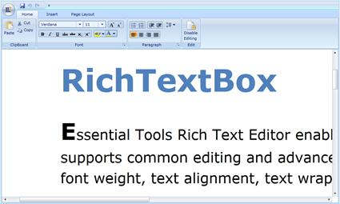

::: {style="DISPLAY: none"}
{#d2h_url_template}{#d2h_package_url style="WIDTH: 0px; DISPLAY: none; HEIGHT: 0px"}
:::

::: {.d2h_secondary_topic style="PADDING-BOTTOM: 10pt; MARGIN: 0pt; PADDING-LEFT: 0pt; PADDING-RIGHT: 0pt; PADDING-TOP: 0pt"}
#### Zooming and Printing

RichTextBoxAdv allows you to zoom the content of the document. Ctrl + Mouse wheel will zoom in and zoom out the content of RichTextBoxAdv.

 

{border="0"}

Figure 1181: RichTextBoxAdv after zooming

 

The Printing feature permits users to print the content of the document using the "PrintDocument()".

[We can also use "PrintDocumentCommand", which will execute the "PrintDocument" method whenever it is hooked to the Command Property.]{style="LINE-HEIGHT: 150%"}

[]{style="LINE-HEIGHT: 150%"} 

+--------------------------------------------------------------------------------------------------------------------+
| [\[ C# \]]{style="FONT-FAMILY: 'Courier New'"}                                                                     |
|                                                                                                                    |
| *[        ]{style="FONT-FAMILY: 'Courier New'"}*[RichTextBox.PrintDocument();]{style="FONT-FAMILY: 'Courier New'"} |
|                                                                                                                    |
|                                                                                                                    |
+--------------------------------------------------------------------------------------------------------------------+

[]{style="FONT-FAMILY: 'Trebuchet MS','sans-serif'; COLOR: #15428b; FONT-SIZE: 9pt"} 

Properties and Methods, Tables for Zooming and Printing

Properties

[]{style="FONT-FAMILY: 'Trebuchet MS','sans-serif'; COLOR: #15428b; FONT-SIZE: 9pt"} 

Table 85: Property/Properties Table

  --------------- ---------------------------------------------------------------------------- --------------------- ----------- -----------------
  Property        Description                                                                  Type                  Data Type   Reference links
  IsZoomEnabled   It decides whether the content of the RichTextBoxAdv can be zoomed or not.   Dependency Property   Boolean     NA
  --------------- ---------------------------------------------------------------------------- --------------------- ----------- -----------------

[]{style="FONT-FAMILY: 'Trebuchet MS','sans-serif'; COLOR: #15428b; FONT-SIZE: 9pt"} 

Methods

Table 86: Method/s Table

  Method            Description                                    Parameters   Type   Return Type   Reference links
  ----------------- ---------------------------------------------- ------------ ------ ------------- -----------------
  ResetZoomiing()   It resets the zooming                          NA           NA     Void          NA
  PrintDocument()   It prints the content of the RichTextBoxAdv.   NA           NA     Void          NA

 

**[Disable Editing]{style="COLOR: #4e84c4; FONT-SIZE: 13pt"}**

 

You can disable editing in **RichTextBoxAdv** by enabling the property called **IsReadOnly.** It will not allow the user to edit the content.

 

Properties

Table 87: Property/Properties Table

  ------------ ---------------------------------- --------------------- ----------- -----------------
  Property     Description                        Type                  Data Type   Reference links
  IsReadOnly   It enables/disables the editing.   Dependency Property   Boolean     NA
  ------------ ---------------------------------- --------------------- ----------- -----------------

 

[]{#related-topics}
:::
