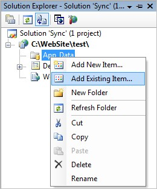
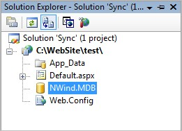
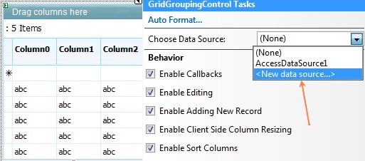
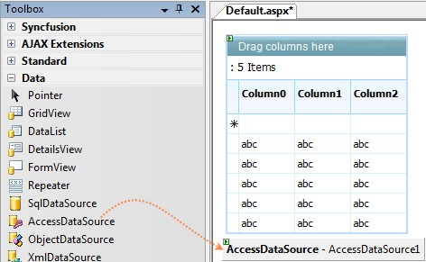
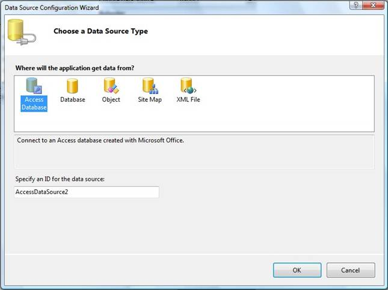
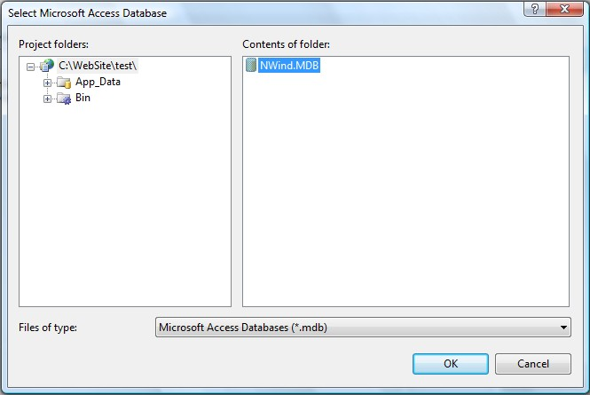
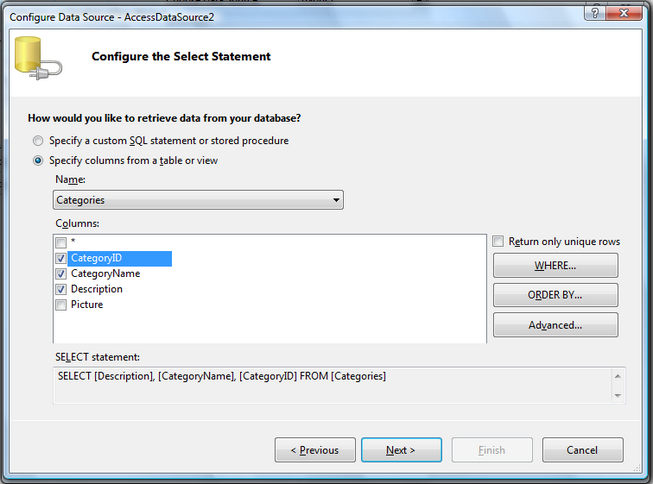
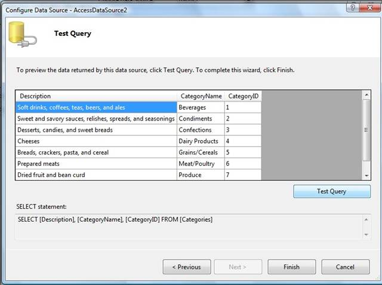
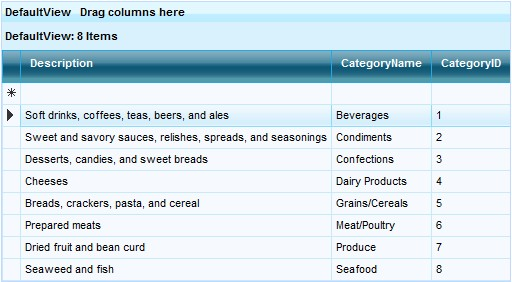

::: {style="DISPLAY: none"}
{#d2h_url_template}{#d2h_package_url style="WIDTH: 0px; DISPLAY: none; HEIGHT: 0px"}
:::

::::: {#nsbanner .d2h_main_nsbanner style="BORDER-BOTTOM: #999999 1px solid; POSITION: relative; PADDING-BOTTOM: 0px; BACKGROUND-COLOR: transparent; PADDING-LEFT: 0px; PADDING-RIGHT: 0px; DISPLAY: none; BORDER-TOP: #999999 1px solid; PADDING-TOP: 0px; LEFT: 0px"}
:::: {#TitleRow .d2h_main_titlerow style="PADDING-BOTTOM: 4px; BACKGROUND-COLOR: transparent; PADDING-LEFT: 22px; WIDTH: 100%; PADDING-RIGHT: 10px; DISPLAY: none; PADDING-TOP: 4px"}
::: {#ienav .d2h_main_ienav style="DISPLAY: none"}
{#D2HPrevious .D2HPreviousEnabled}  {#D2HNext .D2HNextEnabled}
:::
::::
:::::

:::: {#nstext .d2h_main_nstext style="PADDING-BOTTOM: 10px; BACKGROUND-COLOR: transparent; PADDING-LEFT: 22px; PADDING-RIGHT: 10px; HEIGHT: 100%; OVERFLOW: auto; PADDING-TOP: 5px" hasuserbackground="true" valign="bottom"}
::: {#d2h_breadcrumbs .d2h_breadcrumbs}
[Essential Studio User Guide Documentation](ms-xhelp:///?Id=12457748-09e3-4d74-a240-8e049cedf030){.d2h_breadcrumbsNormal}[ \> ]{.d2h_breadcrumbsLinkSeparator}[User Interface Edition](ms-xhelp:///?Id=c29296b7-531c-413b-a0ec-488ca1f7f669){.d2h_breadcrumbsNormal}[ \> ]{.d2h_breadcrumbsLinkSeparator}[Essential ASP.NET](ms-xhelp:///?Id=25c35330-c127-4dad-9a92-ed79dc7261a6){.d2h_breadcrumbsNormal}[ \> ]{.d2h_breadcrumbsLinkSeparator}[Essential Grid]{.d2h_breadcrumbsContentsOnly}[ \> ]{.d2h_breadcrumbsLinkSeparator}[Concepts and Features](ms-xhelp:///?Id=9e489974-524d-457c-9881-e458b1321685){.d2h_breadcrumbsNormal}[ \> ]{.d2h_breadcrumbsLinkSeparator}[Binding to Data Source](ms-xhelp:///?Id=9f4948d6-603b-4e92-bbae-433b84625acf){.d2h_breadcrumbsNormal}
:::

### Access Data Source {#access-data-source style="tab-stops: 0pt"}

[]{style="FONT-FAMILY: 'Trebuchet MS','sans-serif'; COLOR: #15428b; FONT-SIZE: 9pt"} 

Binding using Access Data Source

[]{style="FONT-FAMILY: 'Trebuchet MS','sans-serif'; COLOR: #4a5c8c; FONT-SIZE: 8pt"} 

Set up the DataSource control. In order to start data binding GGC, you need to set a DataSource control.

The example below demonstrates the resulting code for control setting.

[]{style="FONT-FAMILY: 'Trebuchet MS','sans-serif'; COLOR: #15428b; FONT-SIZE: 9pt"} 

+------------------------------------------------------------------------------------------------------------------------------------------------------------------------------------------------------------------------------------------------------------------------------------------------------------------------------------------------------------------------------------------------------------------------------------------------------------------------------------------------------------------+
| **[\[ASPX\]]{style="FONT-FAMILY: 'Courier New'; COLOR: black"}**                                                                                                                                                                                                                                                                                                                                                                                                                                                 |
|                                                                                                                                                                                                                                                                                                                                                                                                                                                                                                                  |
| []{style="FONT-FAMILY: 'Courier New'; COLOR: black"}                                                                                                                                                                                                                                                                                                                                                                                                                                                             |
|                                                                                                                                                                                                                                                                                                                                                                                                                                                                                                                  |
| [\<]{style="FONT-FAMILY: 'Courier New'; COLOR: blue"}[sfwg]{style="FONT-FAMILY: 'Courier New'; COLOR: #a31515"}[:]{style="FONT-FAMILY: 'Courier New'; COLOR: blue"}[GridGroupingControl]{style="FONT-FAMILY: 'Courier New'; COLOR: #a31515"}[ [ID]{style="COLOR: red"}[=\"GridGroupingControl1\"]{style="COLOR: blue"} [runat]{style="COLOR: red"}[=\"server\"\> ]{style="COLOR: blue"}]{style="FONT-FAMILY: 'Courier New'"}                                                                                     |
|                                                                                                                                                                                                                                                                                                                                                                                                                                                                                                                  |
| [\</]{style="FONT-FAMILY: 'Courier New'; COLOR: blue"}[sfwg]{style="FONT-FAMILY: 'Courier New'; COLOR: #a31515"}[:]{style="FONT-FAMILY: 'Courier New'; COLOR: blue"}[GridGroupingControl]{style="FONT-FAMILY: 'Courier New'; COLOR: #a31515"}[\>]{style="FONT-FAMILY: 'Courier New'; COLOR: blue"}                                                                                                                                                                                                               |
|                                                                                                                                                                                                                                                                                                                                                                                                                                                                                                                  |
| [\<]{style="FONT-FAMILY: 'Courier New'; COLOR: blue"}[asp]{style="FONT-FAMILY: 'Courier New'; COLOR: #a31515"}[:]{style="FONT-FAMILY: 'Courier New'; COLOR: blue"}[AccessDataSource]{style="FONT-FAMILY: 'Courier New'; COLOR: #a31515"}[ [ID]{style="COLOR: red"}[=\"AccessDataSource1\"]{style="COLOR: blue"} [runat]{style="COLOR: red"}[=\"server\" ]{style="COLOR: blue"}[SelectCommand]{style="COLOR: red"}[=\"SELECT \* FROM \[Customers\]\"\>]{style="COLOR: blue"}]{style="FONT-FAMILY: 'Courier New'"} |
|                                                                                                                                                                                                                                                                                                                                                                                                                                                                                                                  |
| [\</]{style="FONT-FAMILY: 'Courier New'; COLOR: blue"}[asp]{style="FONT-FAMILY: 'Courier New'; COLOR: #a31515"}[:]{style="FONT-FAMILY: 'Courier New'; COLOR: blue"}[AccessDataSource]{style="FONT-FAMILY: 'Courier New'; COLOR: #a31515"}[\>]{style="FONT-FAMILY: 'Courier New'; COLOR: blue"}                                                                                                                                                                                                                   |
+------------------------------------------------------------------------------------------------------------------------------------------------------------------------------------------------------------------------------------------------------------------------------------------------------------------------------------------------------------------------------------------------------------------------------------------------------------------------------------------------------------------+

[]{style="FONT-FAMILY: 'Trebuchet MS','sans-serif'; COLOR: red; FONT-SIZE: 9pt"} 

+-----------------------------------------------------------------------------------------------------------------------------------------------------------------------------------------------------------------------+
| **[\[C#\]]{style="FONT-FAMILY: 'Courier New'; COLOR: black"}**                                                                                                                                                        |
|                                                                                                                                                                                                                       |
| []{style="FONT-FAMILY: 'Courier New'; COLOR: black"}                                                                                                                                                                  |
|                                                                                                                                                                                                                       |
| [protected]{style="FONT-FAMILY: 'Courier New'; COLOR: blue"}[ [void]{style="COLOR: blue"} Page_Load([object]{style="COLOR: blue"} sender, [EventArgs]{style="COLOR: #2b91af"} e)]{style="FONT-FAMILY: 'Courier New'"} |
|                                                                                                                                                                                                                       |
| [{]{style="FONT-FAMILY: 'Courier New'"}                                                                                                                                                                               |
|                                                                                                                                                                                                                       |
| [AccessDataSource1.DataFile = Server.MapPath([@\"\~\\App_Data\\NWIND.MDB\"]{style="COLOR: #a31515"});]{style="FONT-FAMILY: 'Courier New'"}                                                                            |
|                                                                                                                                                                                                                       |
| [GridGroupingControl1.DataSource = AccessDataSource1;]{style="FONT-FAMILY: 'Courier New'"}                                                                                                                            |
|                                                                                                                                                                                                                       |
| [}]{style="FONT-FAMILY: 'Courier New'"}                                                                                                                                                                               |
+-----------------------------------------------------------------------------------------------------------------------------------------------------------------------------------------------------------------------+

[]{style="FONT-FAMILY: 'Trebuchet MS','sans-serif'; COLOR: red; FONT-SIZE: 9pt"} 

+----------------------------------------------------------------------------------------------------------------------------------------------------------------------------------------------------------------------------------------------------------------------------------------------------------+
| **[\[VB.NET\]]{style="FONT-FAMILY: 'Courier New'; COLOR: black"}**                                                                                                                                                                                                                                       |
|                                                                                                                                                                                                                                                                                                          |
| []{style="FONT-FAMILY: 'Courier New'; COLOR: black"}                                                                                                                                                                                                                                                     |
|                                                                                                                                                                                                                                                                                                          |
| [Protected]{style="FONT-FAMILY: 'Courier New'; COLOR: blue"}[ [Sub]{style="COLOR: blue"} Page_Load([ByVal]{style="COLOR: blue"} sender [As]{style="COLOR: blue"} [Object]{style="COLOR: blue"}, [ByVal]{style="COLOR: blue"} e [As]{style="COLOR: blue"} EventArgs)]{style="FONT-FAMILY: 'Courier New'"} |
|                                                                                                                                                                                                                                                                                                          |
| [AccessDataSource1.DataFile = Server.MapPath([\"\~\\App_Data\\NWIND.MDB\"]{style="COLOR: maroon"})]{style="FONT-FAMILY: 'Courier New'"}                                                                                                                                                                  |
|                                                                                                                                                                                                                                                                                                          |
| [GridGroupingControl1.DataSource = AccessDataSource1]{style="FONT-FAMILY: 'Courier New'"}                                                                                                                                                                                                                |
|                                                                                                                                                                                                                                                                                                          |
| [End]{style="FONT-FAMILY: 'Courier New'; COLOR: blue"}[ [Sub]{style="COLOR: blue"}]{style="FONT-FAMILY: 'Courier New'"}                                                                                                                                                                                  |
+----------------------------------------------------------------------------------------------------------------------------------------------------------------------------------------------------------------------------------------------------------------------------------------------------------+

[]{style="FONT-FAMILY: 'Trebuchet MS','sans-serif'; COLOR: red; FONT-SIZE: 8pt"} 

To Bind a MDB file with VS 2005

[]{style="FONT-FAMILY: 'Trebuchet MS','sans-serif'; COLOR: #4a5c8c; FONT-SIZE: 8pt"} 

Through Designer

[]{style="COLOR: red; FONT-SIZE: 8pt"} 

To Bind a MDB file with VS 2005, follow the steps given below.

[]{style="FONT-FAMILY: 'Trebuchet MS','sans-serif'; COLOR: #15428b; FONT-SIZE: 9pt"} 

1.   Create a new C# or VB.NET project using the ASP.NET Web application template.

2.   Select a project and right-click to add an MDB file as follows.

[]{style="FONT-FAMILY: 'Trebuchet MS','sans-serif'; COLOR: #15428b; FONT-SIZE: 9pt"} 

{border="0"}

Figure 30

[]{style="FONT-FAMILY: 'Trebuchet MS','sans-serif'; COLOR: #15428b; FONT-SIZE: 9pt"} 

[]{style="FONT-FAMILY: 'Trebuchet MS','sans-serif'; COLOR: #15428b; FONT-SIZE: 9pt"} 

3.   You can also add an existing MDB file from the following path:

***[]{style="FONT-FAMILY: 'Trebuchet MS','sans-serif'; COLOR: #15428b; FONT-SIZE: 9pt"}*** 

\[Install drive\]:\\Documents and Settings\\UserName\\My Documents\\Syncfusion\\ EssentialStudio\\VersionNumber\\Web\\Data\\NWIND.MDB.

[]{style="FONT-FAMILY: 'Trebuchet MS','sans-serif'; COLOR: #15428b; FONT-SIZE: 9pt"} 

The MDB file is now added to the project.

[]{style="FONT-FAMILY: 'Trebuchet MS','sans-serif'; COLOR: #15428b; FONT-SIZE: 9pt"} 

{border="0"}

Figure 31

[]{style="FONT-FAMILY: 'Trebuchet MS','sans-serif'; COLOR: #15428b; FONT-SIZE: 9pt"} 

4.   Drag-and-drop the GridGroupingControl from the toolbox and select **New Data Source** from the smart tag.

[]{style="FONT-FAMILY: 'Trebuchet MS','sans-serif'; COLOR: #15428b; FONT-SIZE: 9pt"} 

{border="0"}

Figure 32

[]{style="FONT-FAMILY: 'Trebuchet MS','sans-serif'; COLOR: #15428b; FONT-SIZE: 9pt"} 

or

[]{style="FONT-FAMILY: 'Trebuchet MS','sans-serif'; COLOR: #15428b; FONT-SIZE: 9pt"} 

You can also drag-and-drop the **AccessDataSource** component from the **Data** tab of the VS .NET toolbox and use its SmartTag option to bind the data source.

[]{style="FONT-FAMILY: 'Trebuchet MS','sans-serif'; COLOR: #15428b; FONT-SIZE: 9pt"} 

{border="0"}

Figure 33

[]{style="FONT-FAMILY: 'Trebuchet MS','sans-serif'; COLOR: #15428b; FONT-SIZE: 9pt"} 

5.   Select **Access Database** from the configuration wizard.

[]{style="FONT-FAMILY: 'Trebuchet MS','sans-serif'; COLOR: #15428b; FONT-SIZE: 9pt"} 

{border="0"}

Figure 34

[]{style="FONT-FAMILY: 'Trebuchet MS','sans-serif'; COLOR: #15428b; FONT-SIZE: 9pt"} 

6.   Select **NWIND.MDB** file as data source to the GridGroupingControl as follows.

[]{style="FONT-FAMILY: 'Trebuchet MS','sans-serif'; COLOR: #15428b; FONT-SIZE: 9pt"} 

{border="0"}

Figure 35

[]{style="FONT-FAMILY: 'Trebuchet MS','sans-serif'; COLOR: #15428b; FONT-SIZE: 9pt"} 

7.   Now, select the columns to be retrieved in the following wizard.

[]{style="FONT-FAMILY: 'Trebuchet MS','sans-serif'; COLOR: #15428b; FONT-SIZE: 9pt"} 

{border="0"}

[]{style="FONT-FAMILY: 'Trebuchet MS','sans-serif'; COLOR: #15428b; FONT-SIZE: 9pt"} 

8.   Select the query to be executed by using the **TestQuery** button, and finally press **Finish** button.

[]{style="FONT-FAMILY: 'Trebuchet MS','sans-serif'; COLOR: #15428b; FONT-SIZE: 9pt"} 

{border="0"}

Figure 36

[]{style="FONT-FAMILY: 'Trebuchet MS','sans-serif'; COLOR: #15428b; FONT-SIZE: 9pt"} 

9.   Now, make sure that the **DataSourceID** property of the grid is set to **AccessDataSource1**.

10.  Run the application. The output would be the following.

[]{style="FONT-FAMILY: 'Trebuchet MS','sans-serif'; COLOR: #15428b; FONT-SIZE: 9pt"} 

{border="0"}

Figure 37

[]{style="FONT-FAMILY: 'Trebuchet MS','sans-serif'; COLOR: #15428b; FONT-SIZE: 9pt"} 

To customize the appearance of the GridGroupingControl, refer Appearance section.

 

[]{#p23} 

 

[]{#related-topics}
::::
