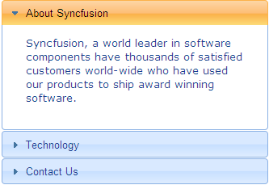

::: {style="DISPLAY: none"}
{#d2h_url_template}{#d2h_package_url style="WIDTH: 0px; DISPLAY: none; HEIGHT: 0px"}
:::

::::: {#nsbanner .d2h_main_nsbanner style="BORDER-BOTTOM: #999999 1px solid; POSITION: relative; PADDING-BOTTOM: 0px; BACKGROUND-COLOR: transparent; PADDING-LEFT: 0px; PADDING-RIGHT: 0px; DISPLAY: none; BORDER-TOP: #999999 1px solid; PADDING-TOP: 0px; LEFT: 0px"}
:::: {#TitleRow .d2h_main_titlerow style="PADDING-BOTTOM: 4px; BACKGROUND-COLOR: transparent; PADDING-LEFT: 22px; WIDTH: 100%; PADDING-RIGHT: 10px; DISPLAY: none; PADDING-TOP: 4px"}
::: {#ienav .d2h_main_ienav style="DISPLAY: none"}
{#D2HPrevious .D2HPreviousEnabled}  {#D2HNext .D2HNextEnabled}
:::
::::
:::::

:::: {#nstext .d2h_main_nstext style="PADDING-BOTTOM: 10px; BACKGROUND-COLOR: transparent; PADDING-LEFT: 22px; PADDING-RIGHT: 10px; HEIGHT: 100%; OVERFLOW: auto; PADDING-TOP: 5px" hasuserbackground="true" valign="bottom"}
::: {#d2h_breadcrumbs .d2h_breadcrumbs}
[Essential Studio User Guide Documentation](ms-xhelp:///?Id=12457748-09e3-4d74-a240-8e049cedf030){.d2h_breadcrumbsNormal}[ \> ]{.d2h_breadcrumbsLinkSeparator}[User Interface Edition](ms-xhelp:///?Id=c29296b7-531c-413b-a0ec-488ca1f7f669){.d2h_breadcrumbsNormal}[ \> ]{.d2h_breadcrumbsLinkSeparator}[Essential ASP.NET MVC](ms-xhelp:///?Id=4b14e7d1-65c4-4f67-b1aa-2c37709905a5){.d2h_breadcrumbsNormal}[ \> ]{.d2h_breadcrumbsLinkSeparator}[Essential Tools]{.d2h_breadcrumbsContentsOnly}[ \> ]{.d2h_breadcrumbsLinkSeparator}[Controls and Components](ms-xhelp:///?Id=f0af2fff-6f00-4ca4-85a6-54e41ac5dc96){.d2h_breadcrumbsNormal}
:::

## Accordion {#accordion style="tab-stops: 0pt"}

Essential Tools Accordion for MVC builds a dynamic interactive menu-driven interface from your content. The content can be text, graphics or HTML. Both Tab and Accordion controls are similar in functionality.

[]{style="FONT-FAMILY: 'Times New Roman','serif'; FONT-SIZE: 12pt"} 

{border="0"}

Figure 52: Accordion

 

Feature Summary

The following are the feature summary:

[·      ]{style="FONT-FAMILY: Symbol"}It offers support to customize the expand and collapse actions on click or mouse over events

[·      ]{style="FONT-FAMILY: Symbol"}Provides fourteen built-in themes apart from the sixteen jquery themes.

 

 

More:

[ ]{#related-topics}

[{border="0" align="absMiddle"}Elaborate Structure of Accordion](ms-xhelp:///?Id=287ec098-db31-46bd-96c5-2e14cd9a4947){style="TEXT-DECORATION: none"}

[{border="0" align="absMiddle"}Adding Accordion control to the MVC application](ms-xhelp:///?Id=68bc2227-aae9-4296-af52-07e49629afe3){style="TEXT-DECORATION: none"}

[{border="0" align="absMiddle"}Concepts and Features](ms-xhelp:///?Id=761a3e10-7b0d-4dbd-bbf0-9ffb8202a10a){style="TEXT-DECORATION: none"}
::::
