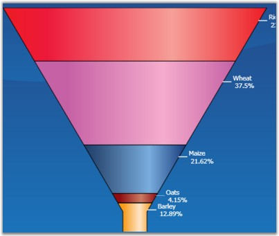
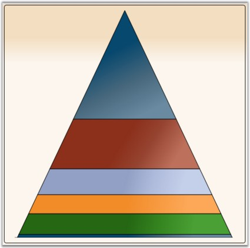

::: {style="DISPLAY: none"}
{#d2h_url_template}{#d2h_package_url style="WIDTH: 0px; DISPLAY: none; HEIGHT: 0px"}
:::

::::::::: {.d2h_secondary_topic style="PADDING-BOTTOM: 10pt; MARGIN: 0pt; PADDING-LEFT: 0pt; PADDING-RIGHT: 0pt; PADDING-TOP: 0pt"}
##### Accumulation Charts {#accumulation-charts style="tab-stops: 0pt"}

###### []{#p97}4.1.1.4.5.1 Funnel Chart {#funnel-chart style="tab-stops: 0pt"}

[]{style="FONT-FAMILY: 'Trebuchet MS','sans-serif'; COLOR: #15428b; FONT-SIZE: 9pt"} 

The Funnel chart is a single series chart representing the data as portions of 100%, and this chart does not use any axes. Funnel chart can be viewed as 2D or 3D.

 

Funnel charts are often used to represent stages in a sales process and show the amount of potential revenue for each stage. This type of chart can be useful also in identifying potential problem areas in an organization\'s sales processes, for example. A funnel chart is similar to a stacked percent bar chart.

 

{border="0"}

Figure 138: Funnel Chart

[]{style="FONT-FAMILY: 'Trebuchet MS','sans-serif'; COLOR: #15428b; FONT-SIZE: 9pt"} 

Data Requirements

[]{style="FONT-FAMILY: 'Trebuchet MS','sans-serif'; COLOR: #15428b; FONT-SIZE: 9pt"} 

Table 76: Data Requirement

::: {align="center"}
+------------------------------+-------------+
| Details                                    |
+------------------------------+-------------+
| Number of y values per point | one         |
+------------------------------+-------------+
| Number of points             | one or more |
+------------------------------+-------------+
| Number of series             | one or more |
+------------------------------+-------------+
:::

[]{style="FONT-FAMILY: 'Trebuchet MS','sans-serif'; COLOR: #15428b; FONT-SIZE: 9pt"} 

FunnelType Properties

[]{style="FONT-FAMILY: 'Trebuchet MS','sans-serif'; COLOR: #15428b; FONT-SIZE: 9pt"} 

Table 77: FunnelType Property

::: {align="center"}
  ------------------------------- ----------------- ------------- ------------------------------------------------------
  Name                            Type              Container     Description
  ChartFunnelType.ExplodedIndex   int               ChartSeries   index of segment which should be leant out
  ChartFunnelType.GapRatio        double            ChartSeries   indicates relation of  inner interval to their width
  ChartFunnelType.FunnelMode      ChartFunnelMode   ChartSeries   method of data displaying
  ------------------------------- ----------------- ------------- ------------------------------------------------------
:::

[]{style="FONT-FAMILY: 'Trebuchet MS','sans-serif'; COLOR: #15428b; FONT-SIZE: 9pt"} 

 

Template

While setting template the following parameters can be used:

[]{style="FONT-FAMILY: 'Trebuchet MS','sans-serif'; COLOR: #15428b; FONT-SIZE: 9pt"} 

::: {align="center"}
  ---------------- ------------- -------------------------------------------------------
  Name             Type          Description
  GapRatio         double        indicates relation of  inner  interval to their width
  IsExploded       bool          *true* - if segment is leant out
  ExplodedOffset   double        displacement on which segment should be leant out
  MinWidth         double        minimal segment width
  Geometry         Geometry      segment geometry
  Interior         Brush         column color
  Series           ChartSeries   reference to series-owner
  ---------------- ------------- -------------------------------------------------------
:::

[]{style="FONT-FAMILY: 'Trebuchet MS','sans-serif'; COLOR: #15428b; FONT-SIZE: 9pt"} 

A sample which demonstrates Accumulation Chart Types is available in the following sample installation path.

 

***..My Documents\\Syncfusion\\EssentialStudio\\\<Version Number\>\\WPF\\Chart.WPF\\Samples\\3.5\\WindowsSamples\\Chart Gallery\\Accumulation Chart Demo***

 

See Also

[[Chart Types]{.UGHyperlink}](ms-xhelp:///?Id=e5e4a303-41f8-48d4-b03d-7dc28a40182c)[]{.UGHyperlink}

[]{#p98} 

###### 4.1.1.4.5.2 Pyramid Chart {#pyramid-chart style="tab-stops: 0pt"}

Pyramid chart is similar to the funnel chart. It is often used for geographical purposes. The Pyramid Chart type displays the data which when totalled will be 100%. This type of chart is a single series chart representing the data as portions of 100%, and this chart does not use any axes. Pyramid chart can be viewed as 2D or 3D.

[]{style="FONT-FAMILY: 'Trebuchet MS','sans-serif'; COLOR: #15428b; FONT-SIZE: 9pt"} 

The following images are some sample Pyramid Charts.

[]{style="FONT-FAMILY: 'Trebuchet MS','sans-serif'; COLOR: #15428b; FONT-SIZE: 9pt"} 

{border="0"}

Figure 139: Pyramid Chart

[]{style="FONT-FAMILY: 'Trebuchet MS','sans-serif'; COLOR: #15428b; FONT-SIZE: 9pt"} 

Data Requirements

[]{style="FONT-FAMILY: 'Trebuchet MS','sans-serif'; COLOR: #15428b; FONT-SIZE: 9pt"} 

Table 78: Data Requirement

::: {align="center"}
+------------------------------+-------------+
| Details                                    |
+------------------------------+-------------+
| Number of y values per point | one         |
+------------------------------+-------------+
| Number of points             | one or more |
+------------------------------+-------------+
| Number of series             | one or more |
+------------------------------+-------------+
:::

[]{style="FONT-FAMILY: 'Trebuchet MS','sans-serif'; COLOR: #15428b; FONT-SIZE: 9pt"} 

PyramidType Properties

[]{style="FONT-FAMILY: 'Trebuchet MS','sans-serif'; COLOR: #15428b; FONT-SIZE: 9pt"} 

Table 79: Property Table

::: {align="center"}
  -------------------------------- ------------------ ------------- ------------------------------------------------------
  Name                             Type               Container     Description
  ChartPyramidType.ExplodedIndex   int                ChartSeries   index of segment which should be leant out
  ChartPyramidType.GapRatio        double             ChartSeries   indicates relation of inner  interval to their width
  ChartPyramidType.PyramidMode     ChartPyramidMode   ChartSeries   method of data displaying
  -------------------------------- ------------------ ------------- ------------------------------------------------------
:::

[]{style="FONT-FAMILY: 'Trebuchet MS','sans-serif'; COLOR: #15428b; FONT-SIZE: 9pt"} 

Template

**[]{style="POSITION: relative; COLOR: #4a5c8c; FONT-SIZE: 9pt; TOP: 4.5pt"}** 

While setting template the following parameters can be used.

[]{style="FONT-FAMILY: 'Trebuchet MS','sans-serif'; COLOR: #15428b; FONT-SIZE: 9pt"} 

Table 80: Template Parameters

::: {align="center"}
  ---------------- ------------- ------------------------------------------------------
  Name             Type          Description
  GapRatio         double        indicates relation of inner interval to their  width
  IsExploded       bool          *true* - if segment is leant out
  ExplodedOffset   double        displacement on which segment should be leant out
  Geometry         Geometry      segment geometry
  Interior         Brush         column color
  Series           ChartSeries   reference to series-owner
  ---------------- ------------- ------------------------------------------------------
:::

[]{style="FONT-FAMILY: 'Trebuchet MS','sans-serif'; COLOR: #15428b; FONT-SIZE: 9pt"} 

A sample which demonstrates Accumulation Chart Types is available in the following sample installation path.

 

***..My Documents\\Syncfusion\\EssentialStudio\\\<Version Number\>\\WPF\\Chart.WPF\\Samples\\3.5\\WindowsSamples\\Chart Gallery\\Accumulation Chart Demo***

 

See Also

[[Chart Types]{.UGHyperlink}](ms-xhelp:///?Id=21b8eb08-0823-4f8b-9761-34ee211ba346)[]{.UGHyperlink}

[]{style="FONT-FAMILY: 'Trebuchet MS','sans-serif'; COLOR: #15428b; FONT-SIZE: 9pt"} 

 

 

[]{#related-topics}
:::::::::
