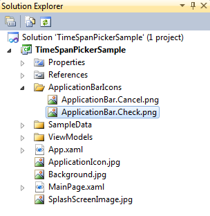
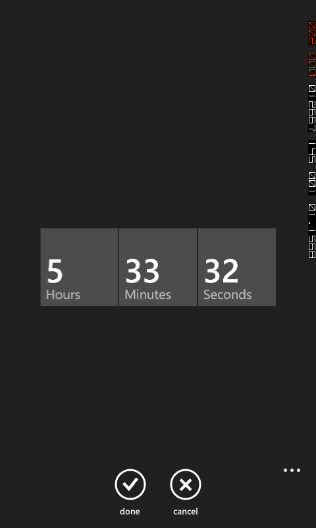

::: {style="DISPLAY: none"}
{#d2h_url_template}{#d2h_package_url style="WIDTH: 0px; DISPLAY: none; HEIGHT: 0px"}
:::

::: {.d2h_secondary_topic style="PADDING-BOTTOM: 10pt; MARGIN: 0pt; PADDING-LEFT: 0pt; PADDING-RIGHT: 0pt; PADDING-TOP: 0pt"}
#### Add Application Bar Icons to TimeSpan Picker page {#add-application-bar-icons-to-timespan-picker-page style="tab-stops: 0pt"}

You can add the ApplicationBar to the TimeSpan Picker Page. This consists of accept and cancel buttons.

 

The following are the steps to add the application bar icons to the time span picker page:

 

1.   Create a folder with the name **ApplicationBarIcons** in the root directory of the Application.

2.   Add the Application bar icons with the following naming convention:

[·      ]{style="FONT-FAMILY: Symbol"}**ApplicationBar.Cancel.png**

[·      ]{style="FONT-FAMILY: Symbol"}**ApplicationBar.Check.png**

 

{border="0"}

Figure 84: Adding Application Bar icons to the TimeSpan picker page

 

[1.    ]{style="FONT-FAMILY: 'Calibri','sans-serif'; FONT-SIZE: 11pt"}Set the property of the icons as **Content**.

[2.    ]{style="FONT-FAMILY: 'Calibri','sans-serif'; FONT-SIZE: 11pt"}Application Bar Icon will be added to the TimeSpan Picker page.

 

{border="0"}

Figure 85: TimeSpan Picker page with application bar icons

 

 

 

[]{#related-topics}
:::
