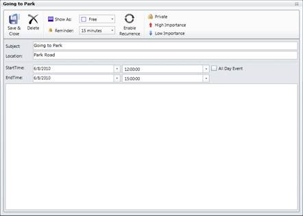

::: {style="DISPLAY: none"}
{#d2h_url_template}{#d2h_package_url style="WIDTH: 0px; DISPLAY: none; HEIGHT: 0px"}
:::

::: {.d2h_secondary_topic style="PADDING-BOTTOM: 10pt; MARGIN: 0pt; PADDING-LEFT: 0pt; PADDING-RIGHT: 0pt; PADDING-TOP: 0pt"}
#### Add Appointment {#add-appointment style="LINE-HEIGHT: 150%; tab-stops: 0pt"}

[·      ]{style="FONT-FAMILY: Symbol"}The **AllowAddNew** property lets you add appointments to the Schedule control. The Default value for this property is set to true.

[·      ]{style="FONT-FAMILY: Symbol"}You can add appointments directly to the Schedule control. The following code example illustrates how to do this.

+-------------------------------------------------------------------------------------------------------------------------------------------------------------------------------------------------------------------------------------------------------------------------------------------------------------------------------------------------------------------------------------------------------------------------------------------------------------------------------------------------------------------------------------------------------------------------------------------------------------------------------------------------------------------------------------------------------------------------------+
| **[\[XAML\]]{style="FONT-FAMILY: 'Courier New'"}[]{style="FONT-FAMILY: 'Courier New'; COLOR: blue"}**                                                                                                                                                                                                                                                                                                                                                                                                                                                                                                                                                                                                                         |
|                                                                                                                                                                                                                                                                                                                                                                                                                                                                                                                                                                                                                                                                                                                               |
| [\<]{style="FONT-FAMILY: 'Courier New'; COLOR: blue"}[schedule]{style="FONT-FAMILY: 'Courier New'; COLOR: #a31515"}[:]{style="FONT-FAMILY: 'Courier New'; COLOR: blue"}[Schedule.Appointments]{style="FONT-FAMILY: 'Courier New'; COLOR: #a31515"}[\>]{style="FONT-FAMILY: 'Courier New'; COLOR: blue"}                                                                                                                                                                                                                                                                                                                                                                                                                       |
|                                                                                                                                                                                                                                                                                                                                                                                                                                                                                                                                                                                                                                                                                                                               |
| [        ]{style="FONT-FAMILY: 'Courier New'; COLOR: #a31515"}[\<]{style="FONT-FAMILY: 'Courier New'; COLOR: blue"}[schedule]{style="FONT-FAMILY: 'Courier New'; COLOR: #a31515"}[:]{style="FONT-FAMILY: 'Courier New'; COLOR: blue"}[ScheduleAppointment]{style="FONT-FAMILY: 'Courier New'; COLOR: #a31515"}[ StartTime]{style="FONT-FAMILY: 'Courier New'; COLOR: red"}[=\"6/18/2010 08:00:00 AM\"]{style="FONT-FAMILY: 'Courier New'; COLOR: blue"}[ EndTime]{style="FONT-FAMILY: 'Courier New'; COLOR: red"}[=\"6/18/2010 09:00:00 AM\"]{style="FONT-FAMILY: 'Courier New'; COLOR: blue"}[ Subject]{style="FONT-FAMILY: 'Courier New'; COLOR: red"}[=\"Meet the doc\"]{style="FONT-FAMILY: 'Courier New'; COLOR: blue"}  |
|                                                                                                                                                                                                                                                                                                                                                                                                                                                                                                                                                                                                                                                                                                                               |
| [        Location]{style="FONT-FAMILY: 'Courier New'; COLOR: red"}[=\"Hutchison road\"]{style="FONT-FAMILY: 'Courier New'; COLOR: blue"}[ AllDay]{style="FONT-FAMILY: 'Courier New'; COLOR: red"}[=\"False\"/\>]{style="FONT-FAMILY: 'Courier New'; COLOR: blue"}                                                                                                                                                                                                                                                                                                                                                                                                                                                             |
|                                                                                                                                                                                                                                                                                                                                                                                                                                                                                                                                                                                                                                                                                                                               |
| [        ]{style="FONT-FAMILY: 'Courier New'; COLOR: #a31515"}[\<]{style="FONT-FAMILY: 'Courier New'; COLOR: blue"}[schedule]{style="FONT-FAMILY: 'Courier New'; COLOR: #a31515"}[:]{style="FONT-FAMILY: 'Courier New'; COLOR: blue"}[ScheduleAppointment]{style="FONT-FAMILY: 'Courier New'; COLOR: #a31515"}[ StartTime]{style="FONT-FAMILY: 'Courier New'; COLOR: red"}[=\"6/19/2010 11:00:00 AM\"]{style="FONT-FAMILY: 'Courier New'; COLOR: blue"}[ EndTime]{style="FONT-FAMILY: 'Courier New'; COLOR: red"}[=\"6/19/2010 12:30:00 PM\"]{style="FONT-FAMILY: 'Courier New'; COLOR: blue"}[ Subject]{style="FONT-FAMILY: 'Courier New'; COLOR: red"}[=\"Going to Park\"]{style="FONT-FAMILY: 'Courier New'; COLOR: blue"} |
|                                                                                                                                                                                                                                                                                                                                                                                                                                                                                                                                                                                                                                                                                                                               |
| [        Location]{style="FONT-FAMILY: 'Courier New'; COLOR: red"}[=\"Park road\"]{style="FONT-FAMILY: 'Courier New'; COLOR: blue"}[ AllDay]{style="FONT-FAMILY: 'Courier New'; COLOR: red"}[=\"False\"/\>]{style="FONT-FAMILY: 'Courier New'; COLOR: blue"}                                                                                                                                                                                                                                                                                                                                                                                                                                                                  |
|                                                                                                                                                                                                                                                                                                                                                                                                                                                                                                                                                                                                                                                                                                                               |
| [\</]{style="FONT-FAMILY: 'Courier New'; COLOR: blue"}[schedule]{style="FONT-FAMILY: 'Courier New'; COLOR: #a31515"}[:]{style="FONT-FAMILY: 'Courier New'; COLOR: blue"}[Schedule.Appointments]{style="FONT-FAMILY: 'Courier New'; COLOR: #a31515"}[\>]{style="FONT-FAMILY: 'Courier New'; COLOR: blue"}                                                                                                                                                                                                                                                                                                                                                                                                                      |
+-------------------------------------------------------------------------------------------------------------------------------------------------------------------------------------------------------------------------------------------------------------------------------------------------------------------------------------------------------------------------------------------------------------------------------------------------------------------------------------------------------------------------------------------------------------------------------------------------------------------------------------------------------------------------------------------------------------------------------+

[]{style="LINE-HEIGHT: 150%; FONT-FAMILY: 'Trebuchet MS','sans-serif'; COLOR: #15428b; FONT-SIZE: 9pt"} 

[·      ]{style="FONT-FAMILY: Symbol"}You can also add the appointments dynamically using the appointment window. Double-click  the schedule control and the appointment window opens. In the Appointment window, enter the details for the appointment. Then click **Save** in the Appointment window. The following figure shows the appointment window.

{border="0"}

Figure 5: Adding Appointment using Appointment Window

 

[]{#related-topics}
:::
