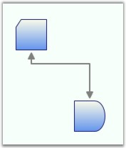

::: {style="DISPLAY: none"}
{#d2h_url_template}{#d2h_package_url style="WIDTH: 0px; DISPLAY: none; HEIGHT: 0px"}
:::

:::: {.d2h_secondary_topic style="PADDING-BOTTOM: 10pt; MARGIN: 0pt; PADDING-LEFT: 0pt; PADDING-RIGHT: 0pt; PADDING-TOP: 0pt"}
#### Add Connectors through a Model {#add-connectors-through-a-model style="tab-stops: 0pt"}

You can create connections between nodes through a model. The Line Connector class is used to create the connection. We need to specify the head node and the tail node for the connection.

[]{style="FONT-FAMILY: 'Calibri','sans-serif'; FONT-SIZE: 12pt"} 

+--------------------------------------------------------------------------------------------------------------------------------------------------------------------------------------+
| **[\[C#\]]{style="FONT-FAMILY: 'Courier New'; COLOR: black"}**                                                                                                                       |
|                                                                                                                                                                                      |
| []{style="FONT-FAMILY: 'Courier New'; COLOR: black"}                                                                                                                                 |
|                                                                                                                                                                                      |
| [Node]{style="FONT-FAMILY: 'Courier New'; COLOR: #2b91af"}[ n1 = [new]{style="COLOR: blue"} [Node]{style="COLOR: #2b91af"}();]{style="FONT-FAMILY: 'Courier New'"}                   |
|                                                                                                                                                                                      |
| [n1.Shape = [Shapes]{style="COLOR: #2b91af"}.FlowChart_Card;]{style="FONT-FAMILY: 'Courier New'"}                                                                                    |
|                                                                                                                                                                                      |
| [diagramModel.Nodes.Add(n1);]{style="FONT-FAMILY: 'Courier New'"}                                                                                                                    |
|                                                                                                                                                                                      |
| [n1.OffsetX = 50;]{style="FONT-FAMILY: 'Courier New'"}                                                                                                                               |
|                                                                                                                                                                                      |
| [n1.OffsetY = 50;]{style="FONT-FAMILY: 'Courier New'"}                                                                                                                               |
|                                                                                                                                                                                      |
| []{style="FONT-FAMILY: 'Courier New'"}                                                                                                                                               |
|                                                                                                                                                                                      |
| [Node]{style="FONT-FAMILY: 'Courier New'; COLOR: #2b91af"}[ n2 = [new]{style="COLOR: blue"} [Node]{style="COLOR: #2b91af"}();]{style="FONT-FAMILY: 'Courier New'"}                   |
|                                                                                                                                                                                      |
| [n2.Shape = [Shapes]{style="COLOR: #2b91af"}.FlowChart_Delay;]{style="FONT-FAMILY: 'Courier New'"}                                                                                   |
|                                                                                                                                                                                      |
| [diagramModel.Nodes.Add(n2);]{style="FONT-FAMILY: 'Courier New'"}                                                                                                                    |
|                                                                                                                                                                                      |
| [n2.OffsetX = 150;]{style="FONT-FAMILY: 'Courier New'"}                                                                                                                              |
|                                                                                                                                                                                      |
| [n2.OffsetY = 250;]{style="FONT-FAMILY: 'Courier New'"}                                                                                                                              |
|                                                                                                                                                                                      |
| []{style="FONT-FAMILY: 'Courier New'"}                                                                                                                                               |
|                                                                                                                                                                                      |
| [LineConnector]{style="FONT-FAMILY: 'Courier New'; COLOR: #2b91af"}[ l1 = [new]{style="COLOR: blue"} [LineConnector]{style="COLOR: #2b91af"}();]{style="FONT-FAMILY: 'Courier New'"} |
|                                                                                                                                                                                      |
| [l1.HeadNode = n1;]{style="FONT-FAMILY: 'Courier New'"}                                                                                                                              |
|                                                                                                                                                                                      |
| [l1.TailNode = n2;]{style="FONT-FAMILY: 'Courier New'"}                                                                                                                              |
|                                                                                                                                                                                      |
| [diagramModel.Connections.Add(l1);]{style="FONT-FAMILY: 'Courier New'"}                                                                                                              |
+--------------------------------------------------------------------------------------------------------------------------------------------------------------------------------------+

[]{style="FONT-FAMILY: 'Trebuchet MS','sans-serif'; COLOR: #15428b; FONT-SIZE: 9pt"} 

+------------------------------------------------------------------------------------------------------------------------------------------------------------------------------------------------+
| **[\[VB\]]{style="FONT-FAMILY: 'Courier New'; COLOR: black"}**                                                                                                                                 |
|                                                                                                                                                                                                |
| []{style="FONT-FAMILY: 'Courier New'; COLOR: black"}                                                                                                                                           |
|                                                                                                                                                                                                |
| [Dim]{style="FONT-FAMILY: 'Courier New'; COLOR: blue"}[ n1 [As]{style="COLOR: blue"} [New]{style="COLOR: blue"} [Node]{style="COLOR: #2b91af"}()]{style="FONT-FAMILY: 'Courier New'"}          |
|                                                                                                                                                                                                |
| [n1.Shape = Shapes.FlowChart_Card]{style="FONT-FAMILY: 'Courier New'"}                                                                                                                         |
|                                                                                                                                                                                                |
| [diagramModel.Nodes.Add(n1)]{style="FONT-FAMILY: 'Courier New'"}                                                                                                                               |
|                                                                                                                                                                                                |
| [n1.OffsetX = 50]{style="FONT-FAMILY: 'Courier New'"}                                                                                                                                          |
|                                                                                                                                                                                                |
| [n1.OffsetY = 50]{style="FONT-FAMILY: 'Courier New'"}                                                                                                                                          |
|                                                                                                                                                                                                |
| []{style="FONT-FAMILY: 'Courier New'"}                                                                                                                                                         |
|                                                                                                                                                                                                |
| [Dim]{style="FONT-FAMILY: 'Courier New'; COLOR: blue"}[ n2 [As]{style="COLOR: blue"} [New]{style="COLOR: blue"} [Node]{style="COLOR: #2b91af"}()]{style="FONT-FAMILY: 'Courier New'"}          |
|                                                                                                                                                                                                |
| [n2.Shape = Shapes.FlowChart_Delay]{style="FONT-FAMILY: 'Courier New'"}                                                                                                                        |
|                                                                                                                                                                                                |
| [diagramModel.Nodes.Add(n2)]{style="FONT-FAMILY: 'Courier New'"}                                                                                                                               |
|                                                                                                                                                                                                |
| [n2.OffsetX = 150]{style="FONT-FAMILY: 'Courier New'"}                                                                                                                                         |
|                                                                                                                                                                                                |
| [n2.OffsetY = 250]{style="FONT-FAMILY: 'Courier New'"}                                                                                                                                         |
|                                                                                                                                                                                                |
| []{style="FONT-FAMILY: 'Courier New'"}                                                                                                                                                         |
|                                                                                                                                                                                                |
| [Dim]{style="FONT-FAMILY: 'Courier New'; COLOR: blue"}[ l1 [As]{style="COLOR: blue"} [New]{style="COLOR: blue"} [LineConnector]{style="COLOR: #2b91af"}()]{style="FONT-FAMILY: 'Courier New'"} |
|                                                                                                                                                                                                |
| [l1.HeadNode = n1]{style="FONT-FAMILY: 'Courier New'"}                                                                                                                                         |
|                                                                                                                                                                                                |
| [l1.TailNode = n2]{style="FONT-FAMILY: 'Courier New'"}                                                                                                                                         |
|                                                                                                                                                                                                |
| [diagramModel.Connections.Add(l1)]{style="FONT-FAMILY: 'Courier New'"}[]{style="FONT-FAMILY: 'Courier New'"}                                                                                   |
+------------------------------------------------------------------------------------------------------------------------------------------------------------------------------------------------+

[]{style="FONT-FAMILY: 'Trebuchet MS','sans-serif'; COLOR: #15428b; FONT-SIZE: 9pt"} 

This creates a connection between the two specified nodes.

[]{style="FONT-FAMILY: 'Trebuchet MS','sans-serif'; COLOR: #15428b; FONT-SIZE: 9pt"} 

{border="0"}

Figure 58: LineConnector

[]{style="FONT-FAMILY: 'Trebuchet MS','sans-serif'; COLOR: #15428b; FONT-SIZE: 9pt"} 

::: {style="BORDER-BOTTOM: windowtext 1pt solid; BORDER-LEFT: medium none; PADDING-BOTTOM: 1pt; MARGIN-TOP: 9pt; PADDING-LEFT: 0pt; PADDING-RIGHT: 0pt; MARGIN-BOTTOM: 9pt; BORDER-TOP: windowtext 1pt solid; BORDER-RIGHT: medium none; PADDING-TOP: 1pt"}
 

{border="0"}Note: For orthogonal and Bezier connectors, the connection always happens at the center of the node\'s edge.
:::

 

For straight line connectors, the connection happens at the intersection point of the edge and the line connector.

 

[]{#related-topics}
::::
