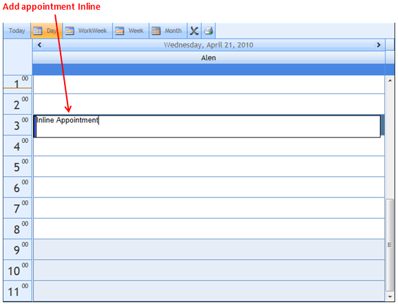
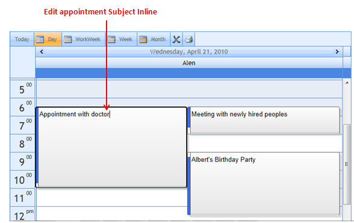

::: {style="DISPLAY: none"}
{#d2h_url_template}{#d2h_package_url style="WIDTH: 0px; DISPLAY: none; HEIGHT: 0px"}
:::

::::: {#nsbanner .d2h_main_nsbanner style="BORDER-BOTTOM: #999999 1px solid; POSITION: relative; PADDING-BOTTOM: 0px; BACKGROUND-COLOR: transparent; PADDING-LEFT: 0px; PADDING-RIGHT: 0px; DISPLAY: none; BORDER-TOP: #999999 1px solid; PADDING-TOP: 0px; LEFT: 0px"}
:::: {#TitleRow .d2h_main_titlerow style="PADDING-BOTTOM: 4px; BACKGROUND-COLOR: transparent; PADDING-LEFT: 22px; WIDTH: 100%; PADDING-RIGHT: 10px; DISPLAY: none; PADDING-TOP: 4px"}
::: {#ienav .d2h_main_ienav style="DISPLAY: none"}
{#D2HPrevious .D2HPreviousEnabled}  {#D2HNext .D2HNextEnabled}
:::
::::
:::::

:::: {#nstext .d2h_main_nstext style="PADDING-BOTTOM: 10px; BACKGROUND-COLOR: transparent; PADDING-LEFT: 22px; PADDING-RIGHT: 10px; HEIGHT: 100%; OVERFLOW: auto; PADDING-TOP: 5px" hasuserbackground="true" valign="bottom"}
::: {#d2h_breadcrumbs .d2h_breadcrumbs}
[Essential Studio User Guide Documentation](ms-xhelp:///?Id=12457748-09e3-4d74-a240-8e049cedf030){.d2h_breadcrumbsNormal}[ \> ]{.d2h_breadcrumbsLinkSeparator}[User Interface Edition](ms-xhelp:///?Id=c29296b7-531c-413b-a0ec-488ca1f7f669){.d2h_breadcrumbsNormal}[ \> ]{.d2h_breadcrumbsLinkSeparator}[Essential ASP.NET](ms-xhelp:///?Id=25c35330-c127-4dad-9a92-ed79dc7261a6){.d2h_breadcrumbsNormal}[ \> ]{.d2h_breadcrumbsLinkSeparator}[Essential Schedule]{.d2h_breadcrumbsContentsOnly}[ \> ]{.d2h_breadcrumbsLinkSeparator}[Concepts and Features](ms-xhelp:///?Id=64869483-f57f-4838-b322-b1a3d1ce8e40){.d2h_breadcrumbsNormal}[ \> ]{.d2h_breadcrumbsLinkSeparator}[Appointments](ms-xhelp:///?Id=8545e8cf-5b26-43a2-932f-f0087c9a1e0a){.d2h_breadcrumbsNormal}
:::

### Add/edit appointments Inline {#addedit-appointments-inline style="tab-stops: 0pt"}

Introduction

 This feature enables you to add and edit appointments inline, without opening the Add/Edit Dialog.

Appointments added inline will get automatically get the start and end time from the selected work cell. This feature allows you to add/edit appointments with ease.

 

Use Case Scenario

This feature allows you to add appointments quickly without having to go through the Add/Edit Dialog.

You can edit the subject of appointments by just clicking over the appointment's subject, and saving the changes by pressing the ENTER key.

Inline appointments hold a default ReminderValue of 15 minutes before the appointments start. This allows you to have reminders without you manually setting them.

 

Feature Summary

 

**To add a new appointment**:

Using this feature, you would just have to select the required work cell and press the ENTER key.

This will enable you to add a subject for the appointment in question. You will be able to save this appointment by pressing the ENTER key again.

+-----------------------------------+--------------------------------------------------------------------------------------------------------------------------------------------+
|                                   |                                                                                                                                            |
+-----------------------------------+--------------------------------------------------------------------------------------------------------------------------------------------+
|                                   | [ ]{style="Z-INDEX: 251659264; POSITION: absolute; LEFT: 0pt"}                                                                             |
|                                   |                                                                                                                                            |
|                                   | +----------------------------------------------------------------------------------------------------------------------------------------+ |
|                                   | | ::: {.shape style="PADDING-BOTTOM: 0pt; MARGIN-TOP: 0pt; PADDING-LEFT: 0pt; PADDING-RIGHT: 0pt; MARGIN-BOTTOM: 8pt; PADDING-TOP: 0pt"} | |
|                                   | | Figure 79: Adding Inline Appointments                                                                                                  | |
|                                   | | :::                                                                                                                                    | |
|                                   | +----------------------------------------------------------------------------------------------------------------------------------------+ |
|                                   |                                                                                                                                            |
|                                   |                                                                                                                                            |
+-----------------------------------+--------------------------------------------------------------------------------------------------------------------------------------------+

\
 \

**To edit an appointment inline**

Editing an appointment would require you to select a specific appointment, select its subject by clicking on it, making the necessary edit, and then pressing the ENTER key.

{border="0"}

Figure 83: Editing appointments inline

 

This makes editing and adding appointments much easier than having to go through the dialog box every time.

 

[]{#_Property_to_enable}Property to enable inline appointments

 

  ------------------------------------------------------------- ----------------------------------------------------------------- ------------------------------------- --------------------------------------- -----------------------------------------
  **[Property]{style="COLOR: black"}**                          **[Description]{style="COLOR: black"}**                           **[Type]{style="COLOR: black"}**      **[Data Type]{style="COLOR: black"}**   **[Dependency ]{style="COLOR: black"}**
  [AllowInline]{style="COLOR: black"}[]{style="COLOR: black"}   [Denotes the Inline Add/Edit Appointment]{style="COLOR: black"}   [Server-Side]{style="COLOR: black"}   [Boolean ]{style="COLOR: black"}        [NA]{style="COLOR: black"}
  ------------------------------------------------------------- ----------------------------------------------------------------- ------------------------------------- --------------------------------------- -----------------------------------------

[]{style="FONT-FAMILY: 'Calibri','sans-serif'; FONT-SIZE: 11pt"} 

 

More:

[ ]{#related-topics}

[{border="0" align="absMiddle"}Enabling Inline appointments](ms-xhelp:///?Id=057e59e7-80b5-4016-8412-3d412f48533e){style="TEXT-DECORATION: none"}

[{border="0" align="absMiddle"}Where do I find Installed samples?](ms-xhelp:///?Id=b7551665-19b5-4e1f-a136-414805ddaac4){style="TEXT-DECORATION: none"}
::::
