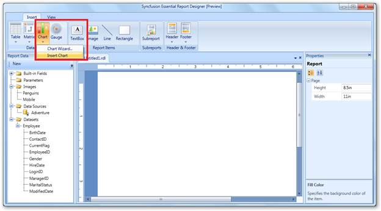
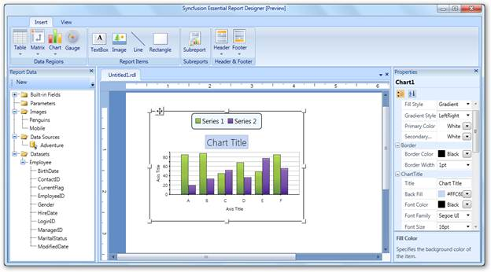
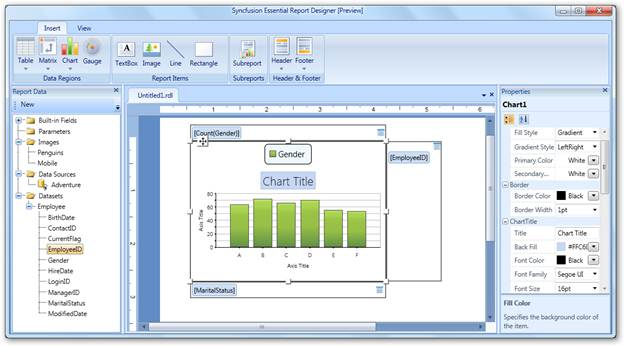

::: {style="DISPLAY: none"}
{#d2h_url_template}{#d2h_package_url style="WIDTH: 0px; DISPLAY: none; HEIGHT: 0px"}
:::

::::: {#nsbanner .d2h_main_nsbanner style="BORDER-BOTTOM: #999999 1px solid; POSITION: relative; PADDING-BOTTOM: 0px; BACKGROUND-COLOR: transparent; PADDING-LEFT: 0px; PADDING-RIGHT: 0px; DISPLAY: none; BORDER-TOP: #999999 1px solid; PADDING-TOP: 0px; LEFT: 0px"}
:::: {#TitleRow .d2h_main_titlerow style="PADDING-BOTTOM: 4px; BACKGROUND-COLOR: transparent; PADDING-LEFT: 22px; WIDTH: 100%; PADDING-RIGHT: 10px; DISPLAY: none; PADDING-TOP: 4px"}
::: {#ienav .d2h_main_ienav style="DISPLAY: none"}
{#D2HPrevious .D2HPreviousEnabled}  {#D2HNext .D2HNextEnabled}
:::
::::
:::::

::: {#nstext .d2h_main_nstext style="PADDING-BOTTOM: 10px; BACKGROUND-COLOR: transparent; PADDING-LEFT: 22px; PADDING-RIGHT: 10px; HEIGHT: 100%; OVERFLOW: auto; PADDING-TOP: 5px" hasuserbackground="true" valign="bottom"}
## Adding a Chart to Report Designer {#adding-a-chart-to-report-designer style="tab-stops: 0pt"}

You can add a chart to the Syncfusion Report Designer using the following steps.

 

1.   Add a dataset to the Report Designer.

2.   In the **Insert** tab, click **Chart** and click and drag **Insert Chart** to the Report Designer.

 

{border="0"}

Figure 52: Adding a Chart

 

3.   A chart will appear in the Report Designer window.

{border="0"}

Figure 53: Default  Chart in Report Designer

 

4.   To view the value axis, category axis, and series axis panels double-click on the chart area.

5.   Drag a data field to the category axis panel and the value axis panel. After setting the data field, it will look like the following illustration.

 

{border="0"}

Figure 54: Adding a Data Field to a Chart

 

More:

[ ]{#related-topics}

[{border="0" align="absMiddle"}Applying Styles to the Chart](ms-xhelp:///?Id=9fac6e71-b7c9-4f6c-8d0b-336b4ce48ab2){style="TEXT-DECORATION: none"}
:::
