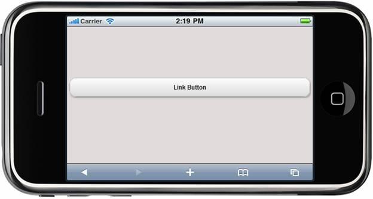

::: {style="DISPLAY: none"}
{#d2h_url_template} {#d2h_package_url style="WIDTH: 0px; DISPLAY: none; HEIGHT: 0px"}
:::

::: {.d2h_secondary_topic style="PADDING-BOTTOM: 10pt; MARGIN: 0pt; PADDING-LEFT: 0pt; PADDING-RIGHT: 0pt; PADDING-TOP: 0pt"}
#### Adding ActionLink Button Control to a Mobile MVC Application {#adding-actionlink-button-control-to-a-mobile-mvc-application style="tab-stops: 0pt"}

 

In the [Getting Started]{.UGHyperlink} section, we discussed how to [create a Mobile MVC application]{.UGHyperlink} and how to [add the Tools package to the application]{.UGHyperlink}. This section guides you to add the ActionLink Button control to an application.

 

1.   In the **view**, invoke the **ActionLink Button** helper with the text of the button as the first argument.

 

+----------------------------------------------------------------------------------------------------------------------------------------------------------------------------------------------------------------------------------------------------------------------------------------------------------------------------------------------------------------------------------------------------------------------------------------------------------------------------------------------------------------------+
| **[\[ASPX\]]{style="FONT-FAMILY: 'Courier New'"}**                                                                                                                                                                                                                                                                                                                                                                                                                                                                   |
|                                                                                                                                                                                                                                                                                                                                                                                                                                                                                                                      |
| [        [\<%]{style="BACKGROUND: yellow"}[=]{style="COLOR: blue"} Html.MobSyncfusion()]{style="FONT-FAMILY: 'Courier New'"} [.ActionLink([\"Link Button\"]{style="COLOR: #a31515"}, [\"ActionLink\"]{style="COLOR: #a31515"}, [\"Button\"]{style="COLOR: #a31515"}).AutoFormat([MobSkins]{style="COLOR: #2b91af"}.Spinach)]{style="FONT-FAMILY: 'Courier New'"}                                                                                                                                                     |
|                                                                                                                                                                                                                                                                                                                                                                                                                                                                                                                      |
| [ ]{style="FONT-FAMILY: 'Courier New'"} [       ]{style="FONT-FAMILY: 'Courier New'"} [%\>]{style="FONT-FAMILY: 'Courier New'; BACKGROUND: yellow"}                                                                                                                                                                                                                                                                                                                                                                  |
|                                                                                                                                                                                                                                                                                                                                                                                                                                                                                                                      |
| **[\[Razor\]]{style="FONT-FAMILY: 'Courier New'"}**                                                                                                                                                                                                                                                                                                                                                                                                                                                                  |
|                                                                                                                                                                                                                                                                                                                                                                                                                                                                                                                      |
| [        ]{style="FONT-FAMILY: 'Courier New'; COLOR: blue"} [\@{]{style="FONT-FAMILY: 'Courier New'; BACKGROUND: yellow"} []{style="FONT-FAMILY: 'Courier New'"} [Html.MobSyncfusion()]{style="FONT-FAMILY: 'Courier New'"} [.ActionLink([\"Link Button\"]{style="COLOR: #a31515"}, [\"ActionLink\"]{style="COLOR: #a31515"}, [\"Button\"]{style="COLOR: #a31515"}).AutoFormat([MobSkins]{style="COLOR: #2b91af"}.Spinach).]{style="FONT-FAMILY: 'Courier New'"} [Render(); ]{style="FONT-FAMILY: 'Courier New'"} [\ |
|         [}]{style="BACKGROUND: yellow"}]{style="FONT-FAMILY: 'Courier New'"}                                                                                                                                                                                                                                                                                                                                                                                                                                         |
+----------------------------------------------------------------------------------------------------------------------------------------------------------------------------------------------------------------------------------------------------------------------------------------------------------------------------------------------------------------------------------------------------------------------------------------------------------------------------------------------------------------------+

 

2.   Run the application.\
\

The output is shown in the following screenshot.

 

{border="0"}

Figure 205: ActionLink Button Sample

 

A sample which demonstrates a basic ActionLink Button control can be downloaded from the following links.\
\
[ASPX Sample](../../../../../../../thivyak/Desktop/ActionLink%20-%20ASPX.zip)

\
[Razor Sample](../../../../../../../thivyak/Desktop/AcionLink%20-%20Razor.zip)

 

{border="0"}Note: The version number for the assemblies has been set to 10.104.0.43 in the **Web.config** file of the attached sample. Change the version number to the appropriate version in the **Web-2008.config** or **Web-2010.config** files (available in root directory) and they will automatically be updated in the **Web.config** file.

 

More:

[ ]{#related-topics}

[{border="0" align="absMiddle"}Use Case Scenarios](ms-xhelp:///?Id=eaf85271-50d6-4b44-80f2-1f460dbc3067){style="TEXT-DECORATION: none"}
:::
