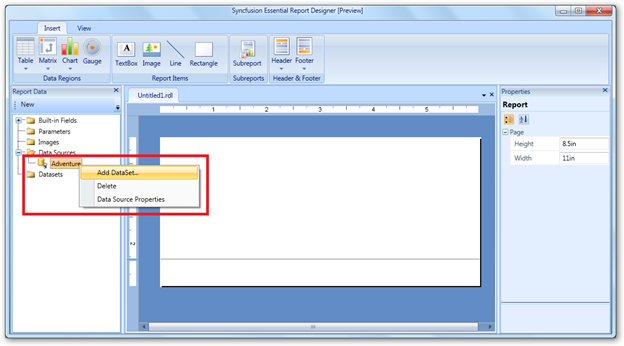
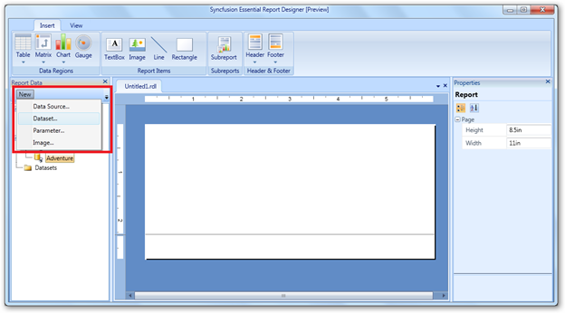
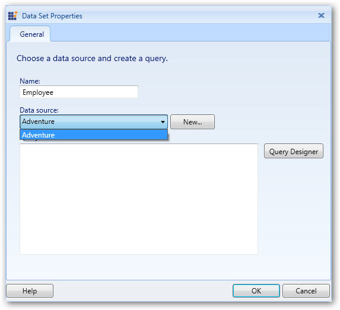
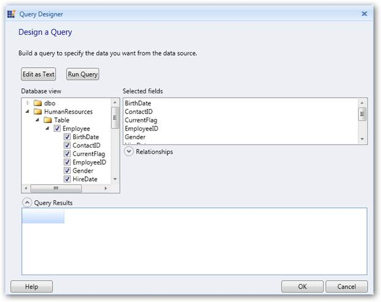
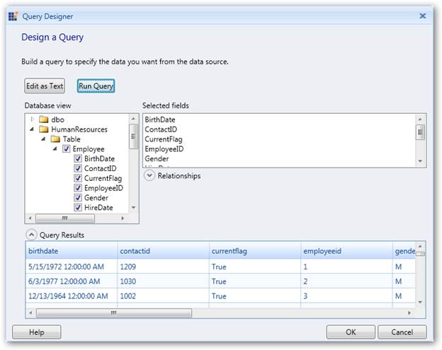
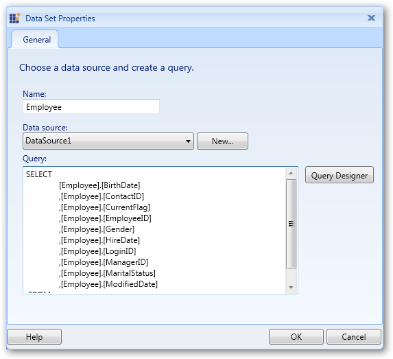
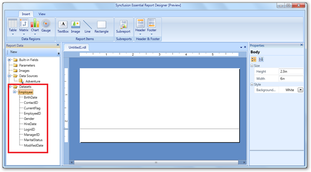

::: {style="DISPLAY: none"}
{#d2h_url_template}{#d2h_package_url style="WIDTH: 0px; DISPLAY: none; HEIGHT: 0px"}
:::

::::: {#nsbanner .d2h_main_nsbanner style="BORDER-BOTTOM: #999999 1px solid; POSITION: relative; PADDING-BOTTOM: 0px; BACKGROUND-COLOR: transparent; PADDING-LEFT: 0px; PADDING-RIGHT: 0px; DISPLAY: none; BORDER-TOP: #999999 1px solid; PADDING-TOP: 0px; LEFT: 0px"}
:::: {#TitleRow .d2h_main_titlerow style="PADDING-BOTTOM: 4px; BACKGROUND-COLOR: transparent; PADDING-LEFT: 22px; WIDTH: 100%; PADDING-RIGHT: 10px; DISPLAY: none; PADDING-TOP: 4px"}
::: {#ienav .d2h_main_ienav style="DISPLAY: none"}
{#D2HPrevious .D2HPreviousEnabled}  {#D2HNext .D2HNextEnabled}
:::
::::
:::::

::::: {#nstext .d2h_main_nstext style="PADDING-BOTTOM: 10px; BACKGROUND-COLOR: transparent; PADDING-LEFT: 22px; PADDING-RIGHT: 10px; HEIGHT: 100%; OVERFLOW: auto; PADDING-TOP: 5px" hasuserbackground="true" valign="bottom"}
## Adding a Data Set to Report Designer {#adding-a-data-set-to-report-designer style="tab-stops: 0pt"}

Data set is a collection of data fields. You can add the data set to the corresponding data source in the Report Designer using the following steps.

 

1.   Right-click on the added data source (Adventure) and click **Add DataSet**.[]{style="FONT-FAMILY: 'Calibri','sans-serif'"}

[]{style="FONT-FAMILY: 'Calibri','sans-serif'"} 

{border="0"}

Figure 13: Add DataSet

 

::: {style="BORDER-BOTTOM: windowtext 1pt solid; BORDER-LEFT: medium none; PADDING-BOTTOM: 1pt; MARGIN-TOP: 9pt; PADDING-LEFT: 0pt; PADDING-RIGHT: 0pt; MARGIN-BOTTOM: 9pt; BORDER-TOP: windowtext 1pt solid; BORDER-RIGHT: medium none; PADDING-TOP: 1pt"}
{border="0"}Note: You can also open the Data Set Properties dialog by clicking New \> Data Set.

 
:::

{border="0"}

Figure 14: Adding a Dataset using New tab[]{style="FONT-FAMILY: 'Calibri','sans-serif'"}

 

 

2.   Once the **Data Set Properties** dialog opens, enter a name for the data set in **Name** field.

 

{border="0"}

Figure 15: Data Set Properties

 

3.   To select the fields manually from the database, click **Query Designer**. The **Query Designer** dialog will open.

 

{border="0"}

Figure 16: Query Designer

 

4.   Click **Edit as Text** to manually write the query to retrieve fields from the database. You can test the query by clicking **Run Query**.

 

{border="0"}

Figure 17: Edit as Text

 

5.   Click **OK** to add the query in the **Query** field.

 

{border="0"}

Figure 18: Query Field

 

::: {style="BORDER-BOTTOM: windowtext 1pt solid; BORDER-LEFT: medium none; PADDING-BOTTOM: 1pt; MARGIN-TOP: 9pt; PADDING-LEFT: 0pt; PADDING-RIGHT: 0pt; MARGIN-BOTTOM: 9pt; BORDER-TOP: windowtext 1pt solid; BORDER-RIGHT: medium none; PADDING-TOP: 1pt"}
{border="0"}Note: Now, the added data fields will be appeared under the data set.

 
:::

[{border="0"}]{style="FONT-FAMILY: 'Calibri','sans-serif'"}

Figure 19: Data Set with Data Fields

 

[]{#related-topics}
:::::
