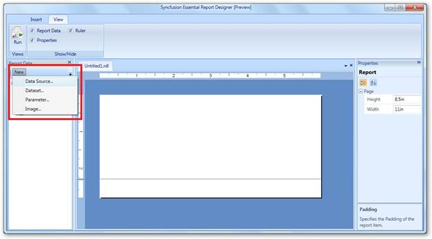
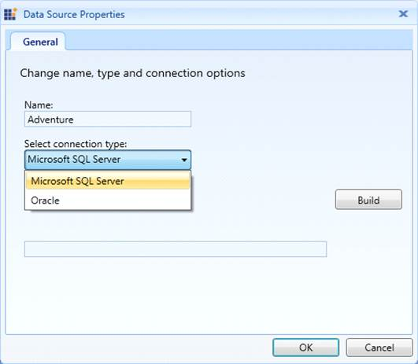
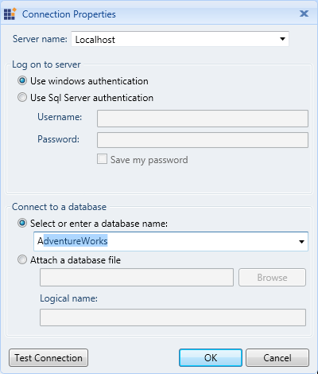
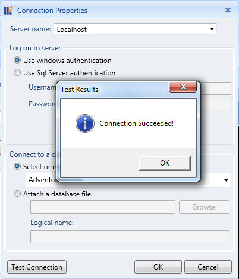
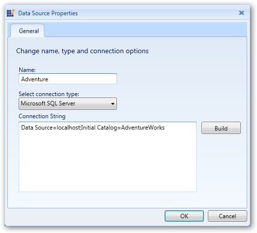
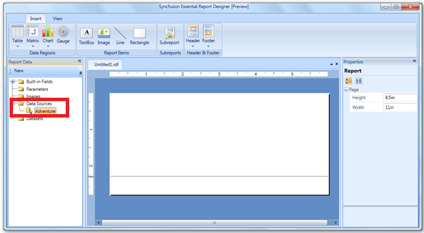

::: {style="DISPLAY: none"}
{#d2h_url_template}{#d2h_package_url style="WIDTH: 0px; DISPLAY: none; HEIGHT: 0px"}
:::

::::: {#nsbanner .d2h_main_nsbanner style="BORDER-BOTTOM: #999999 1px solid; POSITION: relative; PADDING-BOTTOM: 0px; BACKGROUND-COLOR: transparent; PADDING-LEFT: 0px; PADDING-RIGHT: 0px; DISPLAY: none; BORDER-TOP: #999999 1px solid; PADDING-TOP: 0px; LEFT: 0px"}
:::: {#TitleRow .d2h_main_titlerow style="PADDING-BOTTOM: 4px; BACKGROUND-COLOR: transparent; PADDING-LEFT: 22px; WIDTH: 100%; PADDING-RIGHT: 10px; DISPLAY: none; PADDING-TOP: 4px"}
::: {#ienav .d2h_main_ienav style="DISPLAY: none"}
{#D2HPrevious .D2HPreviousEnabled}  {#D2HNext .D2HNextEnabled}
:::
::::
:::::

:::: {#nstext .d2h_main_nstext style="PADDING-BOTTOM: 10px; BACKGROUND-COLOR: transparent; PADDING-LEFT: 22px; PADDING-RIGHT: 10px; HEIGHT: 100%; OVERFLOW: auto; PADDING-TOP: 5px" hasuserbackground="true" valign="bottom"}
## Adding a Data Source to Report Designer {#adding-a-data-source-to-report-designer style="tab-stops: 0pt"}

This feature allows users to add a data source to the Report Designer. It will bind the database from the server. The following steps are used to add the data source to the Report Designer.

 

1.   In **Report Data** group, click **New**, and then click **Data Source**.**[]{style="FONT-FAMILY: 'Cambria','serif'; COLOR: #4f81bd; FONT-SIZE: 13pt"}**

**[]{style="FONT-FAMILY: 'Cambria','serif'; COLOR: #4f81bd; FONT-SIZE: 13pt"}** 

{border="0"}

Figure 7: Essential Report Designer

[]{style="FONT-FAMILY: 'Calibri','sans-serif'"} 

2.   Enter the data source name in the **Name** field, and then select the needed connection type from **Select connection type** drop-down.

 

{border="0"}

Figure 8: Data Source Properties

[]{style="FONT-FAMILY: 'Calibri','sans-serif'"} 

3.   Click **Build.** The **Connection Properties** dialog will open.

[]{style="FONT-FAMILY: 'Calibri','sans-serif'"} 

{border="0"}

Figure 9: Connection Properties

 

4.   Enter the server name in **Server name** field, and then select or enter a database name in the **Select or enter a database name** drop-down combo box.

[]{style="FONT-FAMILY: 'Calibri','sans-serif'"} 

5.   Click **Test Connection** to check the server connection. The **Test Results** dialog box will be displayed after completing the connection check.

 

{border="0"}

Figure 10: Successful Connection Test

[]{style="FONT-FAMILY: 'Calibri','sans-serif'"} 

6.   Click **OK.** It will provide a connection string for the data source.

 

{border="0"}

Figure 11: Connection String

[]{style="FONT-FAMILY: 'Calibri','sans-serif'"} 

7.   Click **OK**. The data source (Adventure) will appear in the **Report Data** panel.

::: {style="BORDER-BOTTOM: windowtext 1pt solid; BORDER-LEFT: medium none; PADDING-BOTTOM: 1pt; MARGIN-TOP: 9pt; PADDING-LEFT: 0pt; PADDING-RIGHT: 0pt; MARGIN-BOTTOM: 9pt; BORDER-TOP: windowtext 1pt solid; BORDER-RIGHT: medium none; PADDING-TOP: 1pt"}
 
:::

{border="0"}

Figure 12: Data Source in Report Designer

[]{style="FONT-FAMILY: 'Calibri','sans-serif'"} 

[]{#related-topics}
::::
