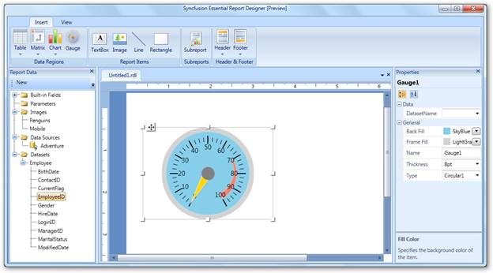
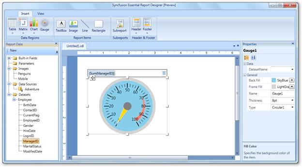

::: {style="DISPLAY: none"}
{#d2h_url_template}{#d2h_package_url style="WIDTH: 0px; DISPLAY: none; HEIGHT: 0px"}
:::

::::: {#nsbanner .d2h_main_nsbanner style="BORDER-BOTTOM: #999999 1px solid; POSITION: relative; PADDING-BOTTOM: 0px; BACKGROUND-COLOR: transparent; PADDING-LEFT: 0px; PADDING-RIGHT: 0px; DISPLAY: none; BORDER-TOP: #999999 1px solid; PADDING-TOP: 0px; LEFT: 0px"}
:::: {#TitleRow .d2h_main_titlerow style="PADDING-BOTTOM: 4px; BACKGROUND-COLOR: transparent; PADDING-LEFT: 22px; WIDTH: 100%; PADDING-RIGHT: 10px; DISPLAY: none; PADDING-TOP: 4px"}
::: {#ienav .d2h_main_ienav style="DISPLAY: none"}
{#D2HPrevious .D2HPreviousEnabled}  {#D2HNext .D2HNextEnabled}
:::
::::
:::::

::: {#nstext .d2h_main_nstext style="PADDING-BOTTOM: 10px; BACKGROUND-COLOR: transparent; PADDING-LEFT: 22px; PADDING-RIGHT: 10px; HEIGHT: 100%; OVERFLOW: auto; PADDING-TOP: 5px" hasuserbackground="true" valign="bottom"}
## Adding a Gauge to Report Designer {#adding-a-gauge-to-report-designer style="tab-stops: 0pt"}

You can follow these steps to add a gauge to the Syncfusion Report Designer.

1.   In the **Insert** tab, select and drag **Gauge** to the Report Designer. A gauge will appear on the Report Designer window.

 

{border="0"}

Figure 71: Adding Gauge

 

2.   To add data fields to the gauge, drag a data field from the **Report Data** to the radial gauge panel.

 

{border="0"}

Figure 72: Adding Data Fields to Gauge

 

More:

[ ]{#related-topics}

[{border="0" align="absMiddle"}Applying Styles to the Gauge](ms-xhelp:///?Id=8e781dac-965a-49d6-b98d-fa6776456a1c){style="TEXT-DECORATION: none"}
:::
