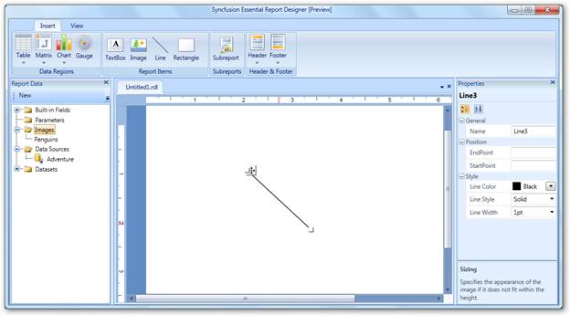
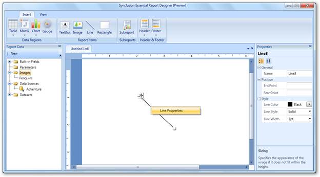
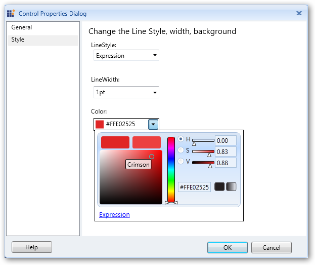
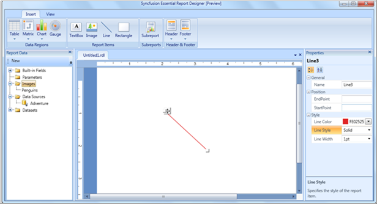
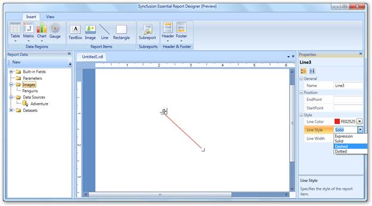
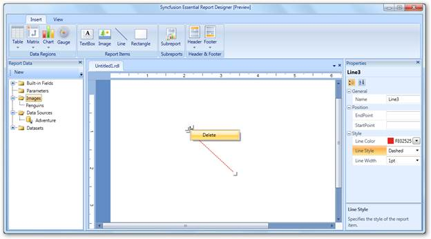

::: {style="DISPLAY: none"}
{#d2h_url_template}{#d2h_package_url style="WIDTH: 0px; DISPLAY: none; HEIGHT: 0px"}
:::

::::: {#nsbanner .d2h_main_nsbanner style="BORDER-BOTTOM: #999999 1px solid; POSITION: relative; PADDING-BOTTOM: 0px; BACKGROUND-COLOR: transparent; PADDING-LEFT: 0px; PADDING-RIGHT: 0px; DISPLAY: none; BORDER-TOP: #999999 1px solid; PADDING-TOP: 0px; LEFT: 0px"}
:::: {#TitleRow .d2h_main_titlerow style="PADDING-BOTTOM: 4px; BACKGROUND-COLOR: transparent; PADDING-LEFT: 22px; WIDTH: 100%; PADDING-RIGHT: 10px; DISPLAY: none; PADDING-TOP: 4px"}
::: {#ienav .d2h_main_ienav style="DISPLAY: none"}
{#D2HPrevious .D2HPreviousEnabled}  {#D2HNext .D2HNextEnabled}
:::
::::
:::::

:::: {#nstext .d2h_main_nstext style="PADDING-BOTTOM: 10px; BACKGROUND-COLOR: transparent; PADDING-LEFT: 22px; PADDING-RIGHT: 10px; HEIGHT: 100%; OVERFLOW: auto; PADDING-TOP: 5px" hasuserbackground="true" valign="bottom"}
## Adding a Line to Report Designer {#adding-a-line-to-report-designer style="tab-stops: 0pt"}

To add a line to the Report Designer, select **Line** from the **Insert** tab and drag it to the Report Designer. A line will appear on the Report Designer window.

 

{border="0"}

Figure 42: Adding a Line to Report Designer

 

Applying Styles to the Line

To apply styles to the line:

1.   Right-click on the added line and select **Line Properties**.

 

{border="0"}

Figure 43: Line Properties

 

2.   In the **Control Properties Dialog**, select **Style** to set the width, background color, and style of the line.

 

{border="0"}

Figure 44: Control Properties Dialog

 

3.   Click **OK**. It will display the line with applied styles.

 

{border="0"}

Figure 45: Line Styled with Color

 

::: {style="BORDER-BOTTOM: windowtext 1pt solid; BORDER-LEFT: medium none; PADDING-BOTTOM: 1pt; MARGIN-TOP: 9pt; PADDING-LEFT: 0pt; PADDING-RIGHT: 0pt; MARGIN-BOTTOM: 9pt; BORDER-TOP: windowtext 1pt solid; BORDER-RIGHT: medium none; PADDING-TOP: 1pt"}
{border="0"}Note: You can also set styles to the line using the Properties grid at the right of Report Designer.
:::

 

{border="0"}

Figure 46: Styling Line through Properties Grid

 

Deleting Lines

To delete the lines from the Report Designer, right-click on the line that you want to delete and click **Delete**.

 

{border="0"}

Figure 47: Deleting a Line

[]{#related-topics}
::::
