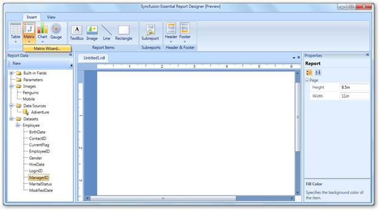
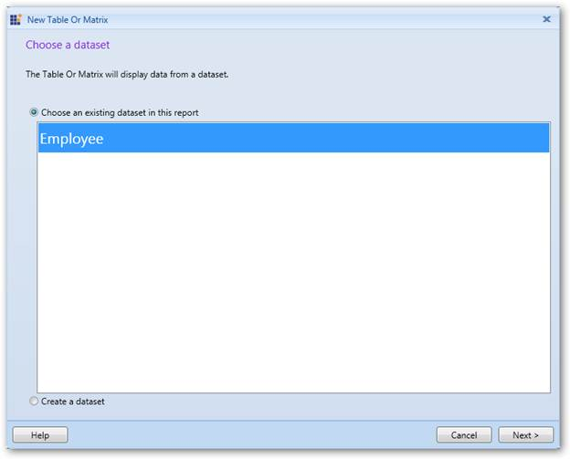
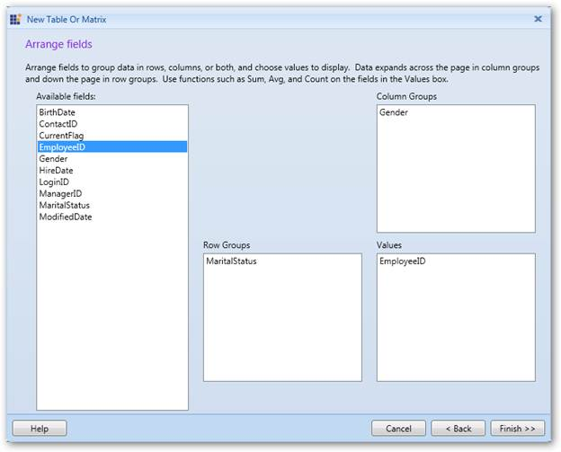
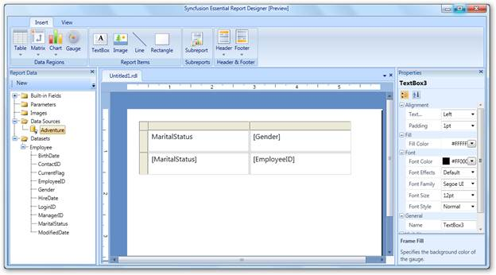

::: {style="DISPLAY: none"}
{#d2h_url_template}{#d2h_package_url style="WIDTH: 0px; DISPLAY: none; HEIGHT: 0px"}
:::

::::: {#nsbanner .d2h_main_nsbanner style="BORDER-BOTTOM: #999999 1px solid; POSITION: relative; PADDING-BOTTOM: 0px; BACKGROUND-COLOR: transparent; PADDING-LEFT: 0px; PADDING-RIGHT: 0px; DISPLAY: none; BORDER-TOP: #999999 1px solid; PADDING-TOP: 0px; LEFT: 0px"}
:::: {#TitleRow .d2h_main_titlerow style="PADDING-BOTTOM: 4px; BACKGROUND-COLOR: transparent; PADDING-LEFT: 22px; WIDTH: 100%; PADDING-RIGHT: 10px; DISPLAY: none; PADDING-TOP: 4px"}
::: {#ienav .d2h_main_ienav style="DISPLAY: none"}
{#D2HPrevious .D2HPreviousEnabled}  {#D2HNext .D2HNextEnabled}
:::
::::
:::::

::: {#nstext .d2h_main_nstext style="PADDING-BOTTOM: 10px; BACKGROUND-COLOR: transparent; PADDING-LEFT: 22px; PADDING-RIGHT: 10px; HEIGHT: 100%; OVERFLOW: auto; PADDING-TOP: 5px" hasuserbackground="true" valign="bottom"}
## Adding a Matrix to Report Designer {#adding-a-matrix-to-report-designer style="tab-stops: 0pt"}

To add a matrix to the Syncfusion Report Designer:

1.   Add a data set to the Report Designer.

2.   In the **Insert** tab, click **Matrix** and select **Matrix Wizard**.

 

{border="0"}

Figure 82: Adding Matrix

 

3.   The **New Table or Matrix** dialog will open with the added data set. Click **Next**.

 

{border="0"}

Figure 83: Added Data Set

[]{style="FONT-FAMILY: 'Arial','sans-serif'"} 

4.   Drag the required fields from the **Available fields** to **Row Groups**, **Column Groups**, and **Values** fields.

 

{border="0"}

Figure 84: Choosing Data Fields for a Matrix

 

5.   Click **Finish**. A matrix will be added to the Report Designer with the selected data fields.

 

{border="0"}

Figure 85: Matrix in Report Designer

 

 

[]{#related-topics}
:::
